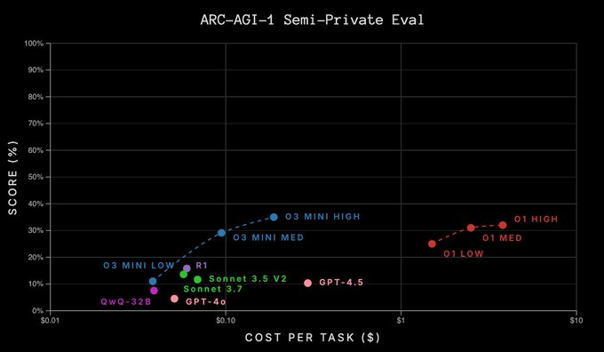
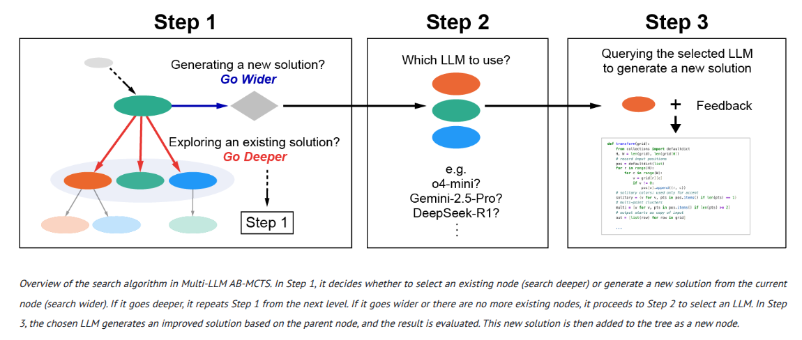
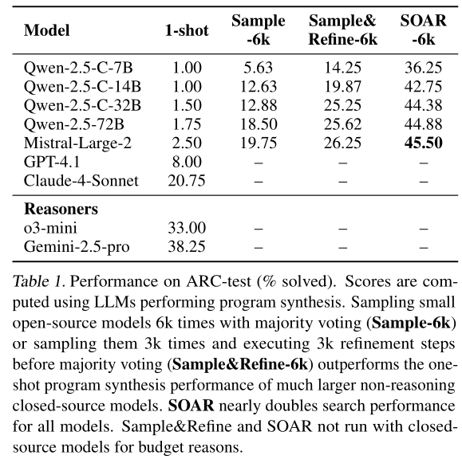

# State of the art

<!--- --->

I'm going to recap all the learnings from the previous [ARC24 challenge](https://www.kaggle.com/competitions/arc-prize-2024).

## Summary of all the learnings

- Reasoning models trained with RL like `o3` can solve ARC-AGI-1, but they need a lot of compute. That is around [x40000 times](https://x.com/guille_bar/status/1870479630383329472) the compute allowed in the competition ($8 vs $340k). However on ARC-AGI-2 they seem to be scoring below 5%.
- Test-time training is crucial to improve the accuracy of transduction models. In my case the score improves from 11 to 33.
- Frontier LLMs can generate code that solves more than half of the semi-private ARC set.
- Induction and transduction are complementary approaches. It would have sense to first try with induction (which has higher guarantees) and use transduction only if induction fails.
- LLMs struggle with tasks that have big grids, however the fact that `o3` can solve ARC might hint that a 2d representation for the grid is not needed.

## [OpenAI solved the ARC challenge with a tuned version of `o3`](https://arcprize.org/blog/oai-o3-pub-breakthrough)

Details are not public, but it is very likely that `o3` is trained just with reinforcement learning like `r1`. When [o1 was announced](https://openai.com/index/learning-to-reason-with-llms/) they said:

> Our large-scale reinforcement learning algorithm teaches the model how to think productively using its chain of thought in a highly data-efficient training process.

This sounds very similar to the training process described in the [`r1` paper](https://arxiv.org/abs/2501.12948).
The only different thing is that in the table with the results there is a `samples` field that is 6 for low compute and 1024 for high compute. If we compare the numbers it seems that it is the number of times each task was tried to be solved. So there must be an aggregation mechanism to combine the responses from all the runs. It could be as simple as a voting mechanism and as complex as the model receiving as input the responses and choosing.

On average it uses 55k tokens per run. For 100 tasks that would be 5.5M output tokens if each task is run only once. If we are allowed 12 hours for the submission that would require an output speed of 127 token/second. That might be possible for a model like [Qwen2.5 1.5B](https://qwen.readthedocs.io/en/latest/benchmark/speed_benchmark.html), probably not for a model like Llama3 8B.

So in theory we could take a reasoning model such as [deepseek-ai/DeepSeek-R1-Distill-Qwen-1.5B](https://huggingface.co/deepseek-ai/DeepSeek-R1-Distill-Qwen-1.5B) and fine-tune it to do ARC tasks using RL. We could reward the model for creating shorter and correct answers. OpenAI also offers a [service](https://openai.com/form/rft-research-program/) to do "Reinforcement Fine-tuning". 

Notice that OpenAI has decided [not to release `o3`](https://techcrunch.com/2025/02/12/openai-cancels-its-o3-ai-model-in-favor-of-a-unified-next-gen-release/), so we don't know how necessary the tuning for ARC was needed.

Mikel Bobel-Irizar did an [awesome analysis](https://anokas.substack.com/p/llms-struggle-with-perception-not-reasoning-arcagi) of the effect of task length on the accuracy of `o3`. We could
use upscaling as data augmentation so the model learns to work with bigger images. There is also another [blogpost](https://anokas.substack.com/p/o3-and-arc-agi-the-unsolved-tasks) with the unsolved evaluation tasks.

### Other reasoning models

Other reasoning models such as `r1` and Sonnet 3.7 but none of them achieve as high results as OpenAI's model. That does not happen in other fields such as mathematics, so probably OpenAI is using some 2d data for its RL training.

Interestingly in the [results](https://arcprize.org/blog/r1-zero-r1-results-analysis) we can see that `r1` uses 6-11k tokens to solve each task. That is between 5 and 10 times less than `o3`.

## Test-time training (TTT)

Test-time training was arguably the biggest discovery of ARC24 challenge. In retrospective it is clear that if intelligence is all about adaptation to novelty, then we should not keep the models frozen but let them adapt to do new tasks. The MindsAI team found this approach but they decided not to make their solution public.

Probably the best implementation and description was done by [the Architects](https://arxiv.org/abs/2411.07279). There is also a paper named [The Surprising Effectiveness of Test-Time Training for Abstract Reasoning](https://arxiv.org/abs/2411.07279) and my own [solution](https://ironbar.github.io/arc24/05_Solution_Summary/) also used TTT.

Update: The MindsAI team has published [a paper](https://github.com/MohamedOsman1998/deep-learning-for-arc/blob/main/deep_learning_for_arc.pdf) describing their approach.

## Code generation (Search)

Different attempts have tried using LLMs to generate python code to solve the ARC tasks. This induction approach has the advantage that the functions can be verified, whereas output grids from the transduction approach cannot be verified.
This allows to generate thousands of candidate solutions and filter all those that do not generate correct outputs
for the training samples. The main differences between this methods is how the model is prompted to generate the responses.

- [Summary of the progress in the public leaderboard in 2024](https://arcprize.org/blog/2024-progress-arc-agi-pub)
- [Jeremy Berman](https://jeremyberman.substack.com/p/how-i-got-a-record-536-on-arc-agi) uses an approach similar to [FunSearch](https://deepmind.google/discover/blog/funsearch-making-new-discoveries-in-mathematical-sciences-using-large-language-models/)
- [Ryan Greenblatt](https://redwoodresearch.substack.com/p/getting-50-sota-on-arc-agi-with-gpt) was the first to show that this approach could work and how it scaled with the number of predictions.

### [Inference-Time Scaling and Collective Intelligence for Frontier AI](https://sakana.ai/ab-mcts/)

> Recent advances demonstrate that increasing inference-time computation can significantly boost the reasoning capabilities of large language models (LLMs). Although repeated sampling (i.e., generating multiple candidate outputs) is a highly effective strategy, it does not leverage external feedback signals for refinement, which are often available in tasks like coding. In this work, we propose Adaptive Branching Monte Carlo Tree Search (AB-MCTS), a novel inference-time framework that generalizes repeated sampling with principled multi-turn exploration and exploitation. At each node in the search tree, AB-MCTS dynamically decides whether to "go wider" by expanding new candidate responses or "go deeper" by revisiting existing ones based on external feedback signals. We evaluate our method on complex coding and engineering tasks using frontier models. Empirical results show that AB-MCTS consistently outperforms both repeated sampling and standard MCTS, underscoring the importance of combining the response diversity of LLMs with multi-turn solution refinement for effective inference-time scaling.

This paper is interesting because clearly explains the challenges of search: go wider or deeper?
Their search strategy learns to decide which LLM to use and wether to go wider or deeper for each ARC problem.

One worrying thing is that even when generating code, they pass@250 of 30% goes down to 19% when doing pass@2. I thought that selecting the correct code was more or less trivial, but does not seem to be the case.

## [Transduction and induction](https://arxiv.org/abs/2411.02272)

This paper defined the terms transduction (generating the output grid directly) and induction (writing code to solve the tasks) and showed they were complimentary. Additionally they generated 400k new tasks using LLMs, showing that is possible to augment the data.

The [code](https://github.com/xu3kev/BARC) is open-source and I should take a look at it, it could serve as inspiration for creating the DSL.

Notice that they are able to generate new tasks using LLMs because they work directly with code, not with the grid images. So they switch the modality from image to text
and that way are able to harness the power of LLMs. They used gpt-4o-mini for generation, so today we could use more powerful models for more diverse and complex tasks.

## [ARC-AGI without pretraining](https://iliao2345.github.io/blog_posts/arc_agi_without_pretraining/arc_agi_without_pretraining.html)

This novel approach does not use any training data! Scores 4.17 on ARC-AGI-2.

> We propose that lossless information compression can serve as an effective framework for solving ARC-AGI puzzles. A more efficient (i.e., lower-bit) compression of a puzzle correlates with a more accurate solution.

I don't understand the method well but it seems to be trying to create a compressed representation of the task, that is used to generate the output for the test sample.

## Reasoning, code and RL

### [Self-Improving Language Models for Evolutionary Program Synthesis: A Case Study on ARC-AGI](https://icml.cc/virtual/2025/poster/43499)

> Many program synthesis tasks prove too challenging for even state-of-the-art language models to solve in single attempts. Search-based evolutionary methods offer a promising alternative by exploring solution spaces iteratively, but their effectiveness remain limited by the fixed capabilities of the underlying generative model. We propose SOAR, a method that learns program synthesis by integrating language models into a self-improving evolutionary loop. SOAR alternates between an evolutionary search that uses an LLM to sample and refine candidate solutions, and a hindsight learning phase that converts search attempts into valid problem-solution pairs used to fine-tune the LLM's sampling and refinement capabilities—enabling increasingly effective search in subsequent iterations. On the challenging ARC-AGI benchmark, SOAR achieves significant performance gains across model scales and iterations, leveraging positive transfer between the sampling and refinement finetuning tasks. These improvements carry over to test-time adaptation, enabling SOAR to solve 52\% of the public test set.

- It does not use a DSL, writes all the python code directly. I believe that the DSL allows for shorter programs, enabling faster and easier exploration. Maybe we can give the interface of the DSL functions as input to the model.
- Search is mostly independent, they do 3k samples in the first place and then try to refine those. I believe it is more efficient to have a more global view when searching.
- One thing that worries me is that the improvement of test-time training is small, just 3-5%. There is no table that makes this explicit
- It seems that no data augmentation was used, this could improve the results slightly but won't be game-changer
- It is beneficial to use data from all the models, diversity is crucial
- Bigger models get better scores
- Remember that closed frontier models could score higher than 50% just with search
- They use [sglang](https://github.com/sgl-project/sglang) for inference
- By looking at the code it seems that they use `temperature=1.0` for inference

I believe this paper is in the right direction. It uses code, hindsight relabelling and combines search and learning. Why it does not solve ARC?

- Maybe a tighter integration between search and learning is needed, a more integral approach.
- Using a DSL could also have a big effect, but probably not enough to solve ARC

### [CodeIt: Self-Improving Language Models with Prioritized Hindsight Replay](https://arxiv.org/abs/2402.04858)

This is a very interesting paper that uses code and hindsight experience replay. They use [Hodel's DSL](https://github.com/michaelhodel/re-arc) as a start point but they apply mutation to augment the tasks.

This paper shows that it's possible to learn from the test set using hindsight replay. How can we improve it?

- Using a bigger and better model, they use a small 220M LLM, we could be using a 7B parameter model
- Fine-tune the model individually for each task
- Do the search first on the training tasks to generate more training data
- More data augmentation
- Use a more simple and minimal DSL

### [RLEF: Grounding Code LLMs in Execution Feedback with Reinforcement Learning](https://arxiv.org/abs/2410.02089)

In this paper they train the models to use effectively the feedback from code execution by using reinforcement learning. 

- They train on 13k problems, an order of magnitude higher than ARC. The model is updated 12k times, each update is done with a batch size of 256. 
- The model is given 3 attempts to solve the tasks. 
- Only the final response is considered to compute the reward
- Trained took 5700 A100 GPU hours (20*288), that is around $10k. If I can work an order of magnitude below I would be fine. 
- The 70B model roughly doubles the performance of the 8B model. 
- Their implementation of SFT does not match the results from RL (This contradicts the R1 paper)

### [DeepSeek-R1: Incentivizing Reasoning Capability in LLMs via Reinforcement Learning](https://arxiv.org/abs/2501.12948)

They show that the model can develop capabilities such as self-verification, reflection  just with RL, without the need of SFT.

One interesting finding is that the reasoning patterns of larger models can be distilled into smaller models, resulting in better performance compared to the reasoning patterns discovered through RL on small models.

### [Improving Multi-Turn Tool Use with Reinforcement Learning](https://www.bespokelabs.ai/blog/improving-multi-turn-tool-use-with-reinforcement-learning)

Bespoke Labs employed Group Relative Policy Optimization (GRPO) to train Qwen2.5-7B-Instruct on just 100 examples from the BFCL benchmark, enhancing multi-turn tool use performance by 23% without relying on human or teacher demonstrations. This approach enabled the agent to learn complex tool orchestration—such as sequencing API calls for tasks like flight booking—through reinforcement learning guided solely by outcome-based rewards.

They trained for around 15 hours on 4xH200s. [source](https://x.com/RichardZ412/status/1917621469871251943)

### [ReTool: Reinforcement Learning for Strategic Tool Use in LLMs](https://arxiv.org/abs/2504.11536)

**ReTool** is a reinforcement learning framework that equips LLMs with the ability to strategically invoke tools through multi-turn code execution during reasoning. By integrating real-time code execution into the learning loop, ReTool not only improves performance on complex tasks like the AIME math benchmark but also achieves significantly more efficient training compared to text-only RL methods. The model autonomously learns when and how to use code, resulting in concise, accurate reasoning and emergent behaviors such as code self-correction.

### [Does Reinforcement Learning Really Incentivize Reasoning Capacity in LLMs Beyond the Base Model?](https://natolambert.substack.com/p/does-reinforcement-learning-really)

This paper shows that if we look at `pass@k` metric the base model outperform RL fine-tuned models when we use big `k` values. This shows that the base model has higher variance than the fine-tuned one, so if we sample long enough we will eventually get some correct answer.

The advantage of RL is that it increases the `pass@1` metric, which is arguably much more important than the `pass@256` metric. If we don't have a reliable method to select the correct answer there is no value in generating a correct answer among a lot of incorrect ones.

It is likely that in the future better exploration methods during RL might change these results. Otherwise the models will be constrained by the goodness of the base model.

### [Absolute Zero Reinforced Self-play Reasoning with Zero Data](https://arxiv.org/abs/2505.03335)

This paper shows that it is possible to train with reinforcement learning a model to both propose and solve tasks if we have access to an external verifier such a python interpreter.
The goal of the proposer is to generate tasks that are neither too easy or too hard, maximizing learnability.
One interesting thing is that they have triplets of inputs, outputs and program, and they teach the model to predict any of the elements of the triplet, in a very similar way to my omni-arc approach. So they do induction (program), deduction (output) and abduction (inputs).

Although they train for 500 steps, it seems that the biggest improvement is due to the first 100 steps.

Bigger models benefit more from this technique. Probably they can generate more diverse training samples. This agrees with the findings in the DeepSeek R1 paper: use RL on a big model and distill to smaller models.

They check for program safety and determinism, I should also do that.

### [LLMs for Engineering: Teaching Models to Design High Powered Rockets](https://arxiv.org/abs/2504.19394)

Very cool paper that shows how test-time RL can help an LLM to optimize rocket designs given access to a simulation environment and a continuous reward.

Similar to AlphaEvolve in spirit, but using a much smaller LLM that evolves over time.

Is there room for a platform that helps users do this kind of things?

### Learning from sparse and binary rewards

1. Reward shaping
2. Curiosity: Intrinsic motivation
3. Hindsight Experience Replay
4. Curriculum learning
5. Imitation learning

This search for methods that allow learning from sparse and binary rewards hasn't thrown
anything new. I was already aware of HER. Curriculum learning might naturally arise in ARC because the model will likely solve easier tasks first, train on them and then solve more complex tasks. Imitation learning is the basis of the training of an LLM. 

**Reward shaping** might be achieved by defining a metric function that isn't binary. However I'm afraid that simple pixel accuracy is not enough: there might be some program that is on the correct direction but has lower accuracy than a program that is in the wrong direction.

Curiosity might be used during training, or during search for node exploration. However again it's difficult to write a metric for curiosity.

- [ChatGPT Deep Research](https://chatgpt.com/share/68765887-ca40-8012-b400-0a46ffd0be8b)
- [Gemini Deep Research](https://g.co/gemini/share/5d2672835546)

## Other

### [Searching Latent Program Spaces](https://arxiv.org/abs/2411.08706)

They use an autoencoder to learn the space of programs. At inference the encoder gives a good starting point, but the gradient is used to find a better task representation. The idea is interesting but the performance is very weak, will have to wait if they are able to make it work at [Ndea](https://ndea.com/).

### [A 2D nGPT Model for Arc Prize](https://github.com/jfpuget/ARC-AGI-Challenge-2024/blob/main/arc.pdf)

Interesting because it uses a 2d transformer, not 1d as most of the other solutions.