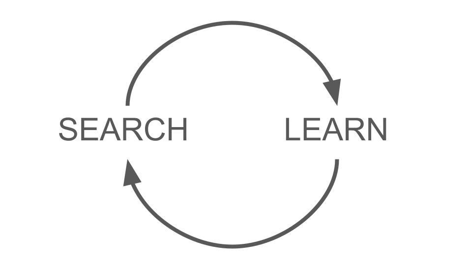
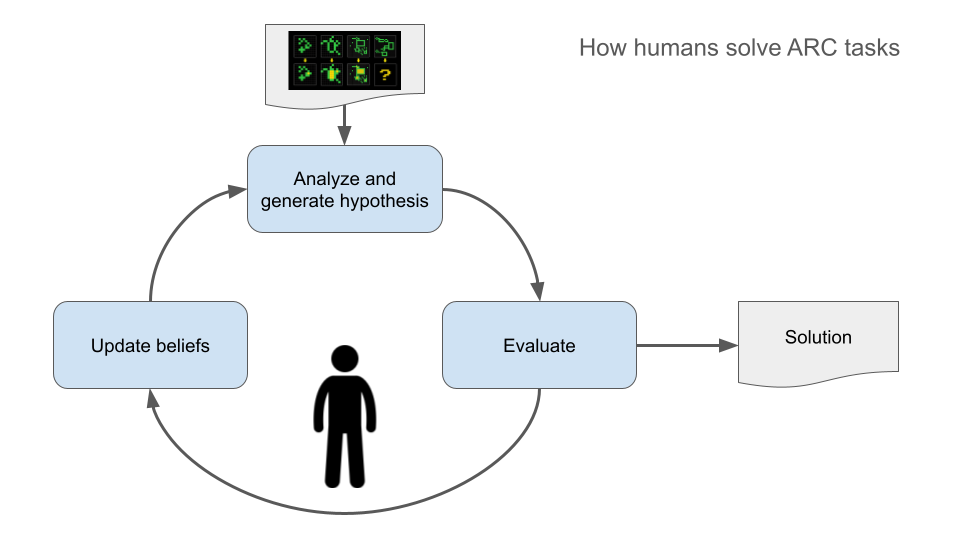
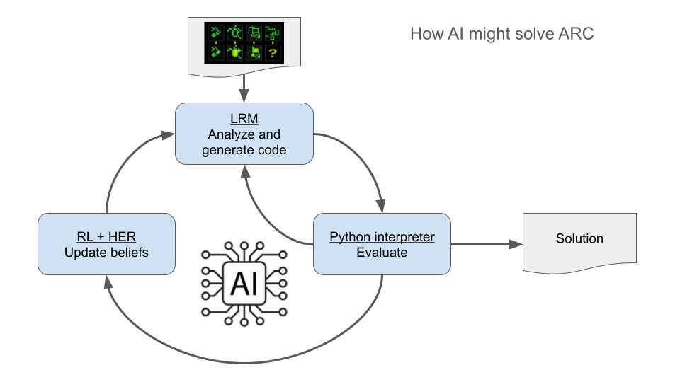
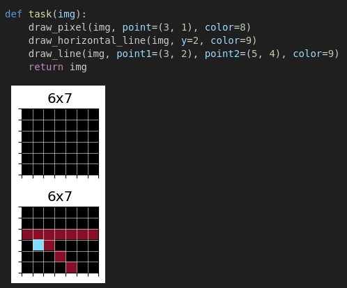
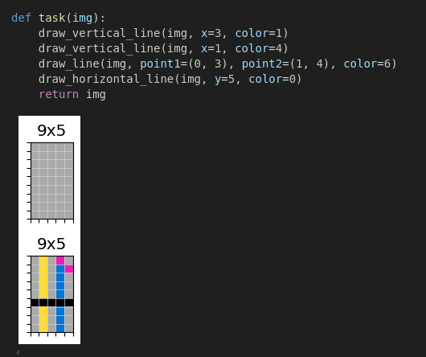
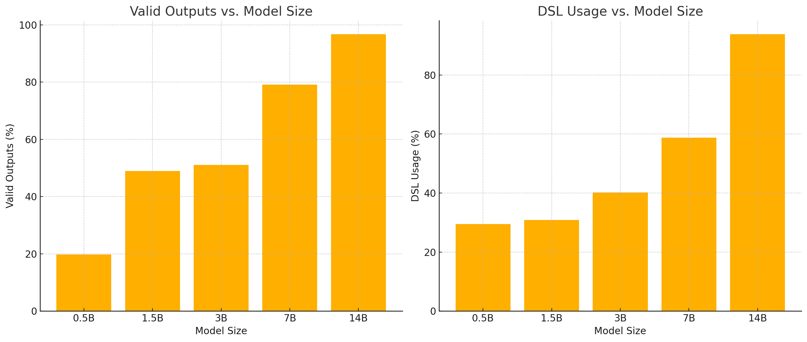
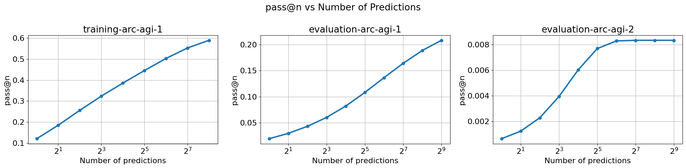
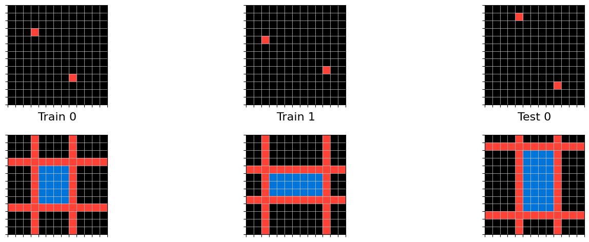

# Solution Summary
<!--
https://www.kaggle.com/wiki/WinningModelDocumentationTemplate
https://www.kaggle.com/solution-write-up-documentation

<center></center>
--->

## Abstract

This is a technical report of the work and research done by Guillermo Barbadillo for the ARC25 challenge.
Most of the research was oriented towards a deep-learning-guided program synthesis system that searches program space and adapts at test time with test-time training via hindsight relabeling, in a tight search-and-learn loop. Evidence was obtained that search and learn outperforms pure search approaches for the same number of predictions per task. However that effort is not yet complete and clearly pieces and ideas are
missing because it does not solve any of the private test tasks from ARC-AGI-2. The best result in
the leaderboard was obtained with minor adaptations of last year's test-time training with transduction approach.

## Table of contents

- [Abstract](#abstract)
- [Table of contents](#table-of-contents)
- [Introduction](#introduction)
- [Vision: Search and learn](#vision-search-and-learn)
  - [Four paths to arrive at that vision](#four-paths-to-arrive-at-that-vision)
    - [Path 1. Search and learn](#path-1-search-and-learn)
    - [Path 2. Combine the best approaches from ARC24: test-time training and program synthesis](#path-2-combine-the-best-approaches-from-arc24-test-time-training-and-program-synthesis)
    - [Path 3. Imitate how humans solve ARC](#path-3-imitate-how-humans-solve-arc)
      - [How humans solve ARC](#how-humans-solve-arc)
      - [How AI might solve ARC](#how-ai-might-solve-arc)
    - [Path 4. Frame ARC as a game and solve it with RL](#path-4-frame-arc-as-a-game-and-solve-it-with-rl)
  - [Why it will beat the other approaches](#why-it-will-beat-the-other-approaches)
    - [Transduction and test-time training](#transduction-and-test-time-training)
    - [Natural language program search (o3)](#natural-language-program-search-o3)
    - [Program search with frontier models](#program-search-with-frontier-models)
- [Content](#content)
  - [1. How does test-time training compares against o3?](#1-how-does-test-time-training-compares-against-o3)
  - [2. Does hindsight relabeling works for program synthesis on toy tasks?](#2-does-hindsight-relabeling-works-for-program-synthesis-on-toy-tasks)
  - [3. Does hindsight relabeling works for program synthesis on ARC tasks?](#3-does-hindsight-relabeling-works-for-program-synthesis-on-arc-tasks)
    - [3.1 Try to train my own models](#31-try-to-train-my-own-models)
    - [3.2 Experiment with base models](#32-experiment-with-base-models)
    - [3.3 Experiment with BARC induction model](#33-experiment-with-barc-induction-model)
      - [3.3.1 Replicate results from BARC paper](#331-replicate-results-from-barc-paper)
      - [3.3.2 Hindsight relabeling and BARC induction model](#332-hindsight-relabeling-and-barc-induction-model)
  - [4. Can we get a stronger base model with reinforcement learning?](#4-can-we-get-a-stronger-base-model-with-reinforcement-learning)
  - [5. Can we improve the search accuracy by doing prediction refinement?](#5-can-we-improve-the-search-accuracy-by-doing-prediction-refinement)
    - [5.1 Can the BARC induction model refine its predictions?](#51-can-the-barc-induction-model-refine-its-predictions)
    - [5.1 Can the BARC induction model learn to refine its predictions using RL?](#51-can-the-barc-induction-model-learn-to-refine-its-predictions-using-rl)
- [Conclusions](#conclusions)
- [Acknowledgements](#acknowledgements)

## Introduction

<!-- what is intelligence --->
François Chollet defined intelligence as **skill-acquisition intelligence** in the paper [On the Measure of Intelligence](https://arxiv.org/abs/1911.01547) back in 2019.

<!-- intelligence vs skill --->
Humans (and that include many AI researches) tend to confuse skill with intelligence. This happens because
when a person shows a great level of skill, for example at chess, we can be very certain that the person is intelligent. Skill and intelligence are very correlated in humans because humans do not know chess at birth, they have to learn how to play it. Thus if a person is able to achieve a great level of skill at chess, it's because
it has been able to acquire that skill more efficiently than other persons.
However in the case of machines that correlation is totally broken. Given some task like play chess, it is possible
to achieve an arbitrary level of skill by using unlimited priors, training data and compute. But that machine
would only be capable of playing chess and nothing more, its adaptation capacity is very limited and thus its intelligence is very limited as well.

<!-- ARC --->
> The intelligence of a system is a measure of its skill-acquisition efficiency over a scope of tasks, with respect to priors, experience, and generalization difficulty.

Based on this definition Chollet created the Abstraction and Reasoning Corpus (ARC). ARC is a collection of visual intelligence tasks that only require core knowledge priors, each task has only a few examples to understand it, and all the evaluation tasks are novel and different to the training tasks. The image below shows a sample of the images used in the ARC tasks.


<!-- Why ARC is important --->
ARC is important because currently is the only benchmark that is measuring intelligence. All the other benchmarks just measure skill (math skills, coding skills, general knowledge...). If we want to make progress towards AGI, ARC is the north star metric that we should follow.

## Vision: Search and learn

**ARC will be solved first by deep-learning-guided program synthesis that searches program space and adapts at test time with test-time training via hindsight relabeling, in a tight search-and-learn loop.**

### Four paths to arrive at that vision

There are at least four different paths to arrive at that vision.

#### Path 1. Search and learn

There are only two methods to adapt to novelty: search and learn.

All the top scoring solutions from ARC24 relied on learn: they used test-time training to adapt the
model to the new tasks.

In the other hand the solutions for the semi-private evaluation relied on search. o3 and other reasoning
models search the space of natural language programs to find solutions for novel tasks. Other methods
pioneered by Greenblatt searched the space of python programs.

Humans use both methods, when we approach a new task we try different approaches to try to solve it and
we learn from the failures. When trying subsequent approaches we do not repeat the mistakes, we try
new approaches that take into account the information obtained with the failing trials. So we search,
learn from our mistakes and start the cycle again until we eventually find the solution. For the
harder problems (like solving ARC) this cycle can take many years.

I believe that a system that will solve ARC will very likely combine search and learn as well. All my
work during the ARC25 challenge has gone in that direction.

<center></center>

#### Path 2. Combine the best approaches from ARC24: test-time training and program synthesis

Last year's competition showed that test-time training allowed the models to adapt to the novel tasks. At the same time in the semi-private dataset we saw that frontier models could generate code to solve more than half of the tasks.

Using code is a more promising approach because:

1. It is verifiable
2. Enables to iteratively refine the solution by comparing the outputs with the ground truth. I would argue that this is similar to reasoning.

My hypothesis is that we can use [hindsight experience replay (HER)](https://arxiv.org/abs/1707.01495) at test time to update the beliefs of the model and find the right solution more efficiently. Instead of sampling thousands of programs, sample a few and learn from the mistakes. **That is the way to combine induction and test-time training.**

We can treat the failed code attempts that run as new tasks, and train the model on those tasks. Those tasks will be in the neighborhood of the task that we want to solve.

We already know that HER enables faster learning, specially in very sparse reward environments.


Additionally we could define a continuous metric such as the number of correct pixels and use it with reinforcement learning to modify the model towards solutions
that score higher.

#### Path 3. Imitate how humans solve ARC

##### How humans solve ARC



When humans try to solve ARC tasks we draw some hypothesis and test it in our heads, if it is not correct we update our beliefs and refine the hypothesis. What modules are needed to do this process?

- **Policy.** What action do I have to do to achieve the goal? Learned with hindsight
- **World model.** What happens if do this action? Learned with past experiences
- **Judgment.** Is the solution correct? Learned with human feedback or by comparison
- **Learning.** In difficult problems we are able to learn from our errors and modify our initial beliefs about the problem.

Reasoning is an iterative process, as shown in the loop diagram in the image.

##### How AI might solve ARC

Focusing on efficiency the best configuration for ARC might be the following:



- **Policy**: a Large Reasoning Model.
- **World model**: python interpreter
- **Judgment**: metric function
- **Learning**: reinforcement learning and hindsight experience replay

That way we only have to learn the policy and parametrize the learning, all the other modules are guaranteed to work perfectly.

#### Path 4. Frame ARC as a game and solve it with RL

The idea is to frame ARC as a reinforcement learning problem. The system is given a new task and it needs to learn it as efficiently as possible. It is like playing a game, but instead of hitting the buttons it has to write code to play.
The code generates an output that is evaluated against the ground truth and returns an score.

Finding the right program is equivalent to finding the right trajectory to solve a game.
Instead of actions we write code, but the problem is exactly the same. When we want to solve a new task in ARC is the same as wanting to solve a new game. We can frame the problem as a Reinforcement learning game, with a very sparse reward.

The challenge of ARC tasks is that the reward is very sparse, and standard RL methods do not work
well in that setting. When rewards are very sparse we need to add some tricks like: hindsight experience replay, curiosity to promote exploration or having access to human demonstrations.

### Why it will beat the other approaches

ARC can be solved (and will be solved) with many different approaches, but in this section I will
argue why search and learn will be the first approach to solve it.

#### Transduction and test-time training

Although it was the dominant approach in the ARC24 prize and very likely one of the dominant approaches
in ARC25, I don't believe it is the best bet to solve ARC-AGI-2 because:

- Transduction does not seem to be the best way to solve the complex tasks from [ARC-AGI-2](https://arcprize.org/arc-agi/2/) that have multiple interacting rules. In the other hand code allows to express any combination of rules.
- Predictions generated with transduction do not have any guarantee to be correct. In the other hand, code can be tested with the training samples of each task, and this allows to reject incorrect programs.
- The models used for transduction are black boxes. In the other hand, when doing program synthesis we can interpret the generated code and make a better diagnose of the failures.

The advantage of transduction is that the signal when doing test-time training is much better and direct than the one that can be obtained when doing test-time training with hindsight relabeling.
Transduction can solve ARC, but I don't believe is the easiest way to do it. Using more data for pretraining, an architecture with better inductive priors (that will better represent the logic of the tasks) and improvements in the test-time training setup, it would be possible to solve ARC-AGI-2 (but it is easier to do it with induction).

#### Natural language program search (o3)

Although OpenAI did not share any details of how a fine-tuned version of o3 was able to solve ARC-AGI-1,
it is believed that it used natural language program search. For each task o3 described the task using
natural language, then transformed the grids conditioned on that description and analyzed the outputs
to find errors and refine the description of the task. However:

- Any natural language description of a task can be implemented using python code. And it could be expressed
  in a short program if a good domain specific language (DSL) is available. Thus I don't see a clear
  advantage of using natural language over python code.
- All deep learning models are fallible. Even if the model finds the correct description of the task,
  it might fail to transform the grids accordingly. In the other hand, the python interpreter is a deterministic executor: once a correct program is found, it will always produce the correct output.

#### Program search with frontier models

Public approaches with frontier LLMs like the ones by [Ryan Greenblatt](https://redwoodresearch.substack.com/p/getting-50-sota-on-arc-agi-with-gpt)
and [Jeremy Berman](https://jeremyberman.substack.com/p/how-i-got-a-record-536-on-arc-agi) achieve
state of the art accuracy on ARC by generating python code and refining the code using feedback from
execution.

My guess is that a frozen model, no matter how big, won't be able to generalize when the generalization jump is big.
I hypothesize that search and learn will beat a pure search approach.

## Content

### 1. How does test-time training compares against o3?

At the start of ARC25 challenge I was curious to see how well test-time training
compared against o3. A custom version of o3 was presented in December 2024 and reported to have solved 87.5% of the semi-private test set of ARC-AGI-1. However with the release
of ARC-AGI-2 o3 was solving less than 5% of the semi-private test set. It was not
the exact same version of o3, but the change was so dramatic.

To my surprise I was able to score [11.94 on the leaderboard](https://www.kaggle.com/code/ironbar/the-architects-single-task-ttt?scriptVersionId=234515350), doubling the score of o3
and being the [first team to score above 10% in the challenge](https://x.com/guille_bar/status/1910307180093354427).

To achieve this I simply took the solution for ARC24 from the Architects and made
a few small modifications.

- Apply test-time training to each task individually, instead of training for a group of tasks together
- Modify it to work efficiently on 4 GPUs
- Hyperparameter tuning

This results showed the power of test-time training, being able to beat the mighty o3 and establishing a strong baseline for the rest of the challenge.

!!! tip "Learning"

    Test-time training with the model for ARC24 from the Architects was able to score 11.94% on the leaderboard while o3 scored less than 5%.

Please go to iterations [1](modeling/Iteration_01_architects_baseline.md), [2](modeling/Iteration_02_8_fold.md) and [3](modeling/Iteration_03_ideal_test_time_training.md) for more information.

### 2. Does hindsight relabeling works for program synthesis on toy tasks?

Before starting to work with ARC tasks, I wanted to validate that hindsight relabeling was helpful
for program synthesis on toy tasks. Instead of training a model to learn to use dozens of primitive functions, I decided to train a model to learn to draw. Thus the model only had access to a minimal DSL (Domain Specific Language) with just a few primitives like `draw_pixel`, `draw_line` and `draw_rectangle`.

The training data was generated by doing random drawings with up to 5 function calls on each drawing. Each task started from an initial grid (that could be blank or randomly initialized) and up to 5 new elements were added (points, lines or rectangles). When training the model was shown the input and output grid, and
was taught to answer with the code that created the drawing. See some training examples below:

<center>


</center>

As expected, when we tested the model with out-of-distribution tasks (tasks with more than 5 drawings), the performance of the model dropped drastically.


Then I started doing the first experiments with hindsight relabeling. I manually created tasks that
were so far from the training distribution that the model was unable to solve them. For example
below you can see a task with 25 squares of different colors. The first visualization shows the
best prediction for each epoch, the second shows how the accuracy distribution evolved during the epochs.
Notice how on the first epoch the prediction is very poor, and the accuracy distribution shows that no
matter how many predictions are generated with the base model, it will be impossible to solve the task.


The initial algorithm used was very simple:

1. Given the inputs and outputs the model generates n predictions (for example n=256)
2. The predictions are run to generate outputs images.
3. Remove duplicates: keep only one prediction per output
4. Validate the predicted code (remove lines of the code that do not affect the output)
5. Create new tasks using hindsight relabeling. We use the original output, the output generated when running the code and the predicted code. The model will be trained to predict the code that generated the output.
6. Sort the tasks by ascending order using the pixel accuracy of the prediction. Worst predictions come first.
7. Fine-tune the model on these new hindsight relabeled tasks
8. Repeat all the steps above until a perfect solution is achieved or the maximum number of epochs is reached.

One interesting thing is that this method still works even if we don't sort the tasks by accuracy. This implies that no reward function is needed.

After a few tweaks and hyperparameter tuning I probed that the model was capable of learning to draw anything using test-time training on hindsight relabeled tasks. It was able to solve tasks with 100 squares and complex drawing with multiple elements, like the chick below.


!!! tip "Learning"

    Hindsight relabeling allowed a model trained to draw to generalize outside its training distribution.
    The model was train to draw up to 5 elements and by doing test-time training with hindsight relabeling
    it was able to solve tasks with more than 100 drew elements.

For more information go to iterations [4](modeling/Iteration_04_first_steps_with_code.md), [5](modeling/Iteration_05_test_time_training_with_code_HER.md), [6](modeling/Iteration_06_reinforcement_learning.md), [8](modeling/Iteration_08_improve_HER.md) and [9](modeling/Iteration_09_improve_training_script.md).

### 3. Does hindsight relabeling works for program synthesis on ARC tasks?

After validating that test-time training on hindsight-relabeled tasks allowed to solve toy tasks, it was time to see if we could validate the approach on ARC tasks that were much more complex.

#### 3.1 Try to train my own models

On a first step I tried to continue the approach taken for the toy drawing tasks. I defined a small
set of primitive functions (~40), and I implemented task generators that created random tasks to teach
how to use the primitive functions.

However, the models trained on those synthetic tasks were unable to solve any of the real ARC tasks.
Despite being able to generate an infinite number of synthetic tasks, the diversity of those tasks
was limited. I implemented 32 tasks generators, but they likely had bias and the model
was unable to learn something that generalize from that data distribution. Furthermore the diversity
of the predictions from the model was very small, so the search space of solutions was not fully explored.

!!! tip "Learning"

    Infinite synthetic data is not enough if the diversity of the data is low.

For more information go to iterations [10](modeling/Iteration_10_solve_arc_tasks.md), [12](modeling/Iteration_12_solve_a_few_arc_tasks.md), [13](modeling/Iteration_13_reflections.md), [14](modeling/Iteration_14_optimize_inference.md) and [15](modeling/Iteration_15_the_path_forward.md).

#### 3.2 Experiment with base models

After learning that creating synthetic tasks to teach a model to learn a DSL was very hard, I decided
to try open-weight models. The idea was to prompt the models with a list of the available DSL functions and their signatures so the model could use them to generate a solution. I decided to use the [BARC DSL](https://github.com/xu3kev/BARC) on these experiments.

I decided to try the Qwen2.5-Coder family of models because there were many different model sizes. The plot below
shows that bigger models generate valid outputs more frequently and use the dsl more frequently as well. The results are for the ARC-AGI-1 training set.



The plot below shows how the solved tasks rate changes with number of predictions for the 7B Qwen2.5-Coder model. However it also shows that the number of unique outputs decreases very fast, showing a lack of diversity in the predictions.


A surprising finding was that I tried different prompting techniques to increase the output diversity, but
all my attempts produced worse results than simply asking the model to solve the task. For example I 
tried giving already generated solutions by the model in the prompt and requesting to do something new and different, but the obtained effect was the opposite. In many cases instead of doing something new the model
simply copied the code given in the prompt. It seems that "small" LLMs lack some capabilities that
frontier models have.

!!! tip "Learning"

    Small open-weights models with access to a DSL can solve some ARC tasks by writing python code

For more information go to iterations [16](modeling/Iteration_16_search_with_base_models.md) and [17](modeling/Iteration_17_increase_search_diversity.md).

#### 3.3 Experiment with BARC induction model

After seeing that open-weights models with access to the [BARC DSL](https://github.com/xu3kev/BARC) were able to solve ARC tasks, I decided
to use the BARC induction model directly. This model already knew to use the DSL, so I didn't have to
provide the signature of the DSL functions in the prompt. One brilliant aspect of the [BARC paper](https://arxiv.org/abs/2411.02272) is that they implement generators and solvers for 162 ARC-AGI-1 training tasks and they use
that code as seed for LLMs to generate new tasks. By doing that they move the problem domain from the ARC grids to code, and they can leverage the code capabilities of LLMs to generate new tasks. Asking an LLM to generate
new tasks in the grid domain will very likely yield poor results. They train the BARC induction model on hundreds of thousands LLM-generated tasks and this overcomes the problems I saw on the previous [3.1 section](#31-try-to-train-my-own-models) where I could not generate training data with enough diversity to train my own models.

##### 3.3.1 Replicate results from BARC paper

On a first step I validated that I could get similar results to the numbers reported in the paper. Direct comparison is not possible because their last numbers are obtained doing 20k predictions per task and I only did around 500 predictions due to the constraints imposed by the Kaggle submission (with the current hardware I don't think is possible to make much more than 512 predictions per task with an 7B model).

In the paper there is a plot that shows a solve rate slightly below 15% for 500 submissions, and I got around 22% for the same number of submissions. The differences are probably explained because the plot in the paper is
very likely obtained with a model trained with less data (not the final model) and also maybe due to using
data augmentation at inference.



<details>
  <summary>Click to see examples of solved tasks</summary>


```python
from common import *

import numpy as np
from typing import *

# concepts:
# scaling, color transformation

# description:
# In the input, you will see a 3x3 sprite with gray pixels scattered randomly. 
# To create the output grid, you should first scale the sprite by a factor of 2, 
# then replace all gray pixels with a pattern of alternating colors (blue and red).
# The scaled sprite should maintain the original size, and the pattern should cover the gray pixels only.

def transform(input_grid):
    # Step 1: Detect the gray pixels in the input grid
    gray_positions = np.argwhere(input_grid == Color.GRAY)

    # Step 2: Create a new output grid with the same size as the scaled sprite
    scale_factor = 2
    output_height = input_grid.shape[0] * scale_factor
    output_width = input_grid.shape[1] * scale_factor
    output_grid = np.full((output_height, output_width), Color.BLACK)

    # Step 3: Scale the input grid by the scale factor and place it in the output grid
    for i in range(input_grid.shape[0]):
        for j in range(input_grid.shape[1]):
            if input_grid[i, j] != Color.BLACK:
                # Blit the original color in the scaled position
                blit_sprite(output_grid, np.full((scale_factor, scale_factor), input_grid[i, j]), 
                            x=i*scale_factor, y=j*scale_factor)

    # Step 4: Replace gray pixels in the scaled grid with the alternating pattern
    for x, y in gray_positions:
        scaled_x, scaled_y = x * scale_factor, y * scale_factor
        # Create a 2x2 alternating pattern of blue and red
        pattern = np.array([[Color.BLUE, Color.RED],
                            [Color.RED, Color.BLUE]])
        blit_sprite(output_grid, pattern, scaled_x, scaled_y)

    return output_grid
```

---



```python
from common import *

import numpy as np
from typing import *

# concepts:
# pattern generation, lines

# description:
# In the input you will see two red pixels. 
# To make the output, you should create a pattern of blue squares and red lines that connect the two red pixels.
# The pattern consists of blue squares filling the area between the two red pixels, 
# and the red lines should extend vertically and horizontally from the red pixels to the edges of the canvas.

def transform(input_grid):
    # Find the positions of the two red pixels
    red_positions = np.argwhere(input_grid == Color.RED)
    if len(red_positions) != 2:
        raise ValueError("Input grid must contain exactly two red pixels.")

    (x1, y1), (x2, y2) = red_positions

    # Determine the bounding box for the blue squares
    min_x, max_x = min(x1, x2), max(x1, x2)
    min_y, max_y = min(y1, y2), max(y1, y2)

    # Create blue squares in the bounding box
    output_grid = np.zeros_like(input_grid)
    output_grid[min_x:max_x + 1, min_y:max_y + 1] = Color.BLUE

    # Draw red lines from the red pixels to the edges of the canvas
    draw_line(output_grid, x1, y1, color=Color.RED, direction=(1, 0))  # Right from first red pixel
    draw_line(output_grid, x1, y1, color=Color.RED, direction=(-1, 0)) # Left from first red pixel
    draw_line(output_grid, x1, y1, color=Color.RED, direction=(0, 1))  # Down from first red pixel
    draw_line(output_grid, x1, y1, color=Color.RED, direction=(0, -1)) # Up from first red pixel

    draw_line(output_grid, x2, y2, color=Color.RED, direction=(1, 0))  # Right from second red pixel
    draw_line(output_grid, x2, y2, color=Color.RED, direction=(-1, 0)) # Left from second red pixel
    draw_line(output_grid, x2, y2, color=Color.RED, direction=(0, 1))  # Down from second red pixel
    draw_line(output_grid, x2, y2, color=Color.RED, direction=(0, -1)) # Up from second red pixel

    return output_grid
```

---


```python
from common import *

import numpy as np
from typing import *

# concepts:
# circle detection, color transformation

# description:
# In the input, you will see a grid with random colored pixels on it. 
# To make the output, you should find all circular shapes (of any color) 
# with a diameter greater than or equal to 3 pixels and change their color to yellow.

def transform(input_grid: np.ndarray) -> np.ndarray:
    # Plan:
    # 1. Detect circular shapes in the grid
    # 2. Change their color to yellow if they meet the size criteria

    output_grid = np.copy(input_grid)

    # Iterate over the grid to find circular shapes
    for x in range(len(input_grid)):
        for y in range(len(input_grid[0])):
            # Check if the pixel is not background
            if input_grid[x, y] != Color.BLACK:
                # Check for circle shape using a simple heuristic
                # We will consider a circle if it has a certain diameter
                diameter = 1
                while True:
                    # Check the pixels in the current diameter
                    if (x + diameter < len(input_grid) and
                        y + diameter < len(input_grid[0]) and
                        np.all(input_grid[x:x + diameter + 1, y:y + diameter + 1] == input_grid[x, y])):
                        diameter += 1
                    else:
                        # We found the maximum diameter
                        diameter -= 1
                        break
                
                # If the diameter is 2 or more, we consider it a circle
                if diameter >= 3:
                    output_grid[x:x + diameter + 1, y:y + diameter + 1] = Color.YELLOW

    return output_grid
```

</details>

!!! tip "Learning"

    BARC induction model is able to solve around 22% of the ARC-AGI-1 evaluation tasks with a budget
    of 512 predictions, however it only solves 0.8% of the ARC-AGI-2 evaluation set.

For more information go to iterations [19](modeling/Iteration_19_search_with_BARC.md), [20](modeling/Iteration_20_data_augmentation_with_BARC.md) and [21](modeling/Iteration_21_fix_bug_with_data.md).

##### 3.3.2 Hindsight relabeling and BARC induction model

To verify if it was possible to do test-time training on hindsight relabeling tasks for program synthesis
on ARC tasks I designed the following experiments: all the experiments have the same inference budget
of 512 predictions. The only differences between experiments are wether test-time training with hindsight relabeling is used and its configuration.


- Orange lines are the baseline, I repeated the experiment 3 times to measure the variability.
- Green line does 256 predictions, learns and does other 256 predictions. Notice how the green line starts to deviate from the orange lines only after prediction 256.
- Blue line learns every 128 predictions. Notice how the blue line deviates from the orange line after
  prediction 128.

The table below summarizes the experiment and the results.

| initial predictions | epochs | predictions per epoch | pass@n    |
|---------------------|--------|-----------------------|-----------|
| 512                 | 0      | 0                     | 23.3%     |
| 256                 | 1      | 256                   | 26.0%     |
| 128                 | 3      | 128                   | **28.3%** |

We get an improvement of 5% with the best configuration. It is not a huge improvement like the one
observed on ARC24 with transduction and test-time training where I was able to [improve from 11% to 33%](https://ironbar.github.io/arc24/05_Solution_Summary/#approach). But it validates the idea of **search and learn**.

I would argue that the effect will be bigger if we had an inference budget bigger than 512 predictions,
but we are constrained by the Kaggle submission hardware and time.

On this initial implementation the model is fine-tuned independently for each task, and all the predictions
that generated valid outputs are used for training. A more compute-efficient implementation would only
use the best predictions for training.

!!! tip "Learning"

    We have validated that the search and learn approach works. By doing test-time training with hindsight
    relabeling on the BARC induction model we were able to solve 28.3% of the ARC-AGI-1 evaluation tasks
    compared to the 23.3% of the baseline model without test-time training.

For more information go to iterations [22](modeling/Iteration_22_ttt_BARC.md) and [23](modeling/Iteration_23_ttt_BARC_v2.md).

### 4. Can we get a stronger base model with reinforcement learning?

After validating that the search and learn approach could work, I realized that I need a stronger
base model to be able to beat ARC-AGI-2. The BARC induction model only solves 22% and 0.8% of the
evaluation taks of ARC-AGI-1 and ARC-AGI-2 respectively.

I thought that giving a try to reinforcement learning could be a good idea. As an outsider it seems
that all the advances in math and coding abilities of the LLMs from the last year come from using RL.
I had experience with RL in different competitions ([Animal AI Olympics](https://www.goodai.com/animal-ai-olympics-results/), [Lux AI](https://www.kaggle.com/competitions/lux-ai-2021) and [Hungry Geese](https://www.kaggle.com/competitions/hungry-geese)), but not with LLMs so I though it was a good
idea to give it a try.

TODO: ONGOING RL works, but training collapses and I still haven't found the cause.

!!! tip "Learning"

    TODO

For more information go to iterations [24](modeling/Iteration_24_RL_BARC.md), [25](modeling/Iteration_25_debug_parallel_code_execution.md), [29](modeling/Iteration_29_multi-gpu-rl.md), [30](modeling/Iteration_30_solve_RL_collapse.md), [33](modeling/Iteration_33_rl_barc.md)

### 5. Can we improve the search accuracy by doing prediction refinement?

#### 5.1 Can the BARC induction model refine its predictions?

Currently I have been doing independent predictions with the BARC induction model. Each prediction
is independent of the other predictions. This is very different from how humans solve tasks, we have
in our memory the history of the search: what have we tried, how well it worked...

One way to achieve this with LLMs is by asking to refine some incorrect solution. Given some prediction
from the model, we can execute the code, add the outputs to the prompt along some metrics and request
the model to analyze the problems of the generated code and created a refined version of it. Public approaches
with frontier LLMs by [Ryan Greenblatt](https://redwoodresearch.substack.com/p/getting-50-sota-on-arc-agi-with-gpt)
and [Jeremy Berman](https://jeremyberman.substack.com/p/how-i-got-a-record-536-on-arc-agi) rely in this ability of frontier models
to refine code given feedback from execution.

However when I tried to refine predictions with the BARC induction model I found that the model
didn't have that ability. I made a comparison of a run doing 128 independent predictions per task,
versus doing 64 independent predictions, select the best 8 predictions and try to refine those.
I didn't found any significative difference in accuracy.

!!! tip "Learning"

    Frontier model have the ability to refine its predictions given feedback from execution, but
    this 8B LLama model finetuned on ARC tasks does not have that ability.

For more information go to iteration [28](modeling/Iteration_28_refine_predictions.md).

#### 5.1 Can the BARC induction model learn to refine its predictions using RL?

TODO: ONGOING

!!! tip "Learning"

    TODO

For more information go to iteration [34](modeling/Iteration_34_multi-turn_rl.md).

## Conclusions

TODO: ONGOING

## Acknowledgements

- Thanks to my wife for taking care of our children many times so I could do research without small AGIs disturbing my attention.
- Thanks to [Veridas](https://veridas.com/en/) for allowing me to do research on ARC during part of my job time and providing me access to its compute cluster.
- Thanks to [Strong Compute](https://strongcompute.com/) for providing compute for some of the RL experiments.
