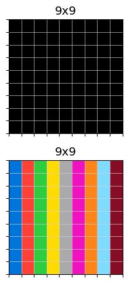

# Iteration 5. Test-time training with code. Hindsight Experience Replay (HER)

_04-05-2025_

<!---
The work is done using short iterations. Each iteration needs to have a very
clear goal. This allows to gain greater knowledge of the problem on each iteration.
--->

## Goal

Explore if Hindsight Experience Replay (HER) can help to solve new tasks with code.

## Motivation

My idea is to pick a simple case that the model is not able to solve, for example: all vertical lines with all the colors. I first have to verify that the model is unable to solve it. Then check if using HER helps to solve the task.

## Development

### Design OOD tasks

I have prepared 3 simple but OOD tasks where the model is not able to find a solution despite being
sampled 256 times.

  

```bash
# vertical lines
mean_correct_pixels: 65.32%
max_correct_pixels: 88.89%

# squares
mean_correct_pixels: 64.55%
max_correct_pixels: 81.48%

# overlapping squares
mean_correct_pixels: 62.66%
max_correct_pixels: 93.00%
```

My guess is that the first two tasks are not solved due to requiring 9 draws (the model was trained with up to 5).
The last one might be difficult due to the overlapping squares.

¿Could test-time training allow the model to solve this tasks?

### Inference throughput with transformers library

| batch size | inference time(s) | throughput (preds/s) |
|------------|-------------------|----------------------|
| 1          | 6.4               | 0.2                  |
| 4          | 7.4               | 0.5                  |
| 16         | 8.5               | 1.9                  |
| 64         | 9                 | 7.1                  |
| 128        | 10.9              | 11.7                 |
| 256        | 15.3              | 16.7                 |
| 512        | 30.1              | 17.0                 |

A batch size of 256 might be the sweet spot. It takes just twice as making two predictions with batch size 1.

This shows that the batch size is very important when using the transformers library for inference.

### Algorithm

1. Given the inputs and outputs the model generates 256 code predictions with a temperature of 0.5
2. The predictions are run to generate outputs images.
3. Keep only one prediction per output
4. Validate the predicted code (remove code that does not affect the output)
5. Create new tasks using the predicted code
6. Sort the tasks by ascending order using the pixel accuracy of the prediction. Worst predictions come first.
7. Fine-tune the model on these new tasks
8. Repeat all the steps above until a perfect solution is achieved or the maximum number of epochs is reached.

## Results

### HER allows to solve tasks with 25 squares

HER allows to solve tasks with 25 squares for a model that was trained with just up to 5 objects.


The model starts with a maximum accuracy of less than 50% and in 6 epochs is able to achieve perfect accuracy.
This took 900 seconds on a single 3090 GPU without any optimization.

### Weaker models

If we use weaker models (models trained for a smaller number of iterations) they can still benefit from HER.
Their start point is worse, and they cannot solve new tasks as complex as the stronger models but nonetheless HER allows adaptation to novel tasks.

For example a model trained for 400 steps can solve a task with 9 vertical lines, but cannot solve a task with 12 squares. A model trained for 800 steps can solve the 12 squares task, and before we have seen that the strongest model (trained for 3200 steps) can solve tasks with 25 squares.

### Is the reward necessary?

On my first implementation I have used the accuracy of the predictions to sort the new tasks. When fine-tuning the model
it first uses the worst predictions and sees the best predictions at the end of the training. This was designed
with the goal to avoid catastrophical forgetting on the best predictions.

If we shuffle the tasks it would mean that we are no longer using rewards for learning. That would be a quite
interesting algorithm.

I have verified that the algorithm is able to solve tasks with 20 and 25 squares without using any reward information.

## Conclusion

We have probed that Hindsight Experience Replay (HER) is a technique that allows the model to adapt
to new tasks. A model trained to draw up to 5 objects, was able to do a task requiring to draw 25 objects.
That is quite a generalization gap, although arguably we will see bigger gaps in the ARC challenge.

One interesting thing about the HER technique is that it does not require any reward function. On my first implementation I used
the accuracy to sort the tasks, but I have probed that the algorithm works fine with random order.

## Next steps

- It would probably be better to use different temperatures for the predictions, having a balance between
  exploration and explotation. However it seems that transformers library does not allow that.

## TODO

- [x] Find a simple task that the model is not able to solve
- [x] Does Hindsight experience replay helps to learn to do the task?
- [x] Colab pro: https://www.kaggle.com/docs/notebooks#increase-gpu-compute-with-colab-pro, Now I have 45 hours per week at Kaggle!