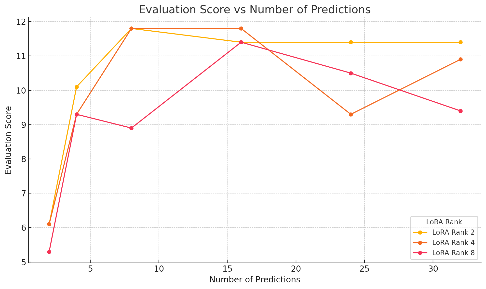

# Iteration 7. Optimize TTT on the evaluation set

_10-05-2025_

## Goal

Optimize the hyperparameters of TTT on the evaluation set, and then make submissions to the test set.

## Motivation

On previous iterations I have seen that there is variability on LB scores. There could be changes up to 3.5 points
between submissions of the same configuration. My current best LB score is probably luck.

Previously I had the problem that evaluations took around 5 hours, and Kaggle only allows 15 hours per
week for the 4xL4 machine. So at max I could do 3 evaluations per week which is very limited.

By analyzing all the evaluation set evaluations I have found that only 22 tasks were solved once. Thus
I could use just those tasks instead of the whole 120 tasks to speedup evaluation. Moreover I have
linked Google Colab Plus to Kaggle and now I have 22 hours per week. This means that now I could do around
22 evaluations per week, and that opens the door to optimize the hyperparameters on the evaluation set.

## Development

## Results

### Lora rank and learning rate

[Google sheet](https://docs.google.com/spreadsheets/d/1NmmCZA7gPOyoBypwvpw_JhYdjcvqNFHibX_WahwTHIM/edit?gid=0#gid=0&range=A113)

The best learning rate seems to be around 2e-4, there is no evidence that lora 32 is better.

### Number of predictions

Let's study if increasing the number of predictions has a significative effect on the accuracy.

There is no evidence suggesting that using more than 8 predictions is beneficial. Using 2 or 4 predictions is clearly not enough. 8 seems to be the sweet spot.

### min_prob

TODO:

### max_seq_length

TODO:

## Conclusion

## Next steps

## TODO

- [ ]
