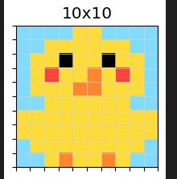

# Iteration 8. Improve HER

_10-05-2025_

## Goal

Can I optimize HER to draw a chick?



## Motivation

I have already probed that HER can solve a task with 25 squares, but can it solve arbitrary images?

The idea is to optimize the algorithm and the parameters so it is able to draw the chick of the image above. If I can do that I will be confident to the next step that will be extend the DSL.

## Development

I will be working on this notebook [006_HER_v2](../../notebooks/006_HER_v2.ipynb)

### Train a more powerful base model

#### Debug gpu usage

I believe I can speedup the training just by using a bigger batch size per device.

```bash
python finetuning.py --output-dir /mnt/hdd0/Kaggle/arc25/trainings/20250511_optimize_GPU_sage/random_seed_5_no_dora --device-map auto --random-seed 5 --max-steps 50 --n-gpus 1 --per-device-train-batch-size 1 --batch-size 16 --max-seq-len 4096
python finetuning.py --output-dir /mnt/hdd0/Kaggle/arc25/trainings/20250511_optimize_GPU_sage/per-device-batch-size-8 --device-map auto --random-seed 5 --max-steps 20 --n-gpus 1 --per-device-train-batch-size 8 --batch-size 16 --max-seq-len 4096

python finetuning.py --output-dir /mnt/hdd0/Kaggle/arc25/trainings/20250511_optimize_GPU_sage/per-device-batch-size-4_2gpus --device-map auto --random-seed 5 --max-steps 20 --n-gpus 2 --per-device-train-batch-size 8 --batch-size 16 --max-seq-len 4096

# https://ironbar.github.io/arc24/modeling/Iteration_50_last_trainings/#steps-to-train-the-model

accelerate launch --num_processes 2 --num_machines 1 --mixed_precision bf16 --multi_gpu \
finetuning.py --output-dir /mnt/hdd0/Kaggle/arc25/trainings/20250511_optimize_GPU_sage/per-device-batch-size-8_2gpus_accelerate --device-map None --random-seed 5 --max-steps 40 --n-gpus 2 --per-device-train-batch-size 8 --batch-size 16 --max-seq-len 512


# one gpu
per-device-batch train_samples/s
1 6.15
2 10.1
4 16
8 17

# two gpus (not working yet)
```

#### Training command

Previously I trained the longest model for 6k steps, that would take just 1h15 with the new setup. So 16k would be around 3 hours and 32k would be around 6 hours.

I'm using the same LoRA configuration as the previous trainings.

```bash
export CUDA_VISIBLE_DEVICES=0
python finetuning.py --output-dir /mnt/hdd0/Kaggle/arc25/trainings/20250511_longer_trainings/32k_steps \
--device-map auto \
--max-steps 32000 \
--n-gpus 1 \
--per-device-train-batch-size 8 \
--batch-size 16 \
--max-seq-len 512 \
--logging-steps 100 \
--save-steps 1000 \
--lora-r 32 \
--use-dora \
--use-rslora
```

## Results

## Conclusion

## Next steps

## TODO

- [ ] Make the script work with accelerate
- [ ] There might be a problem with the train dataset, the function is called 4-5 times. This might require to set random seed to None.
