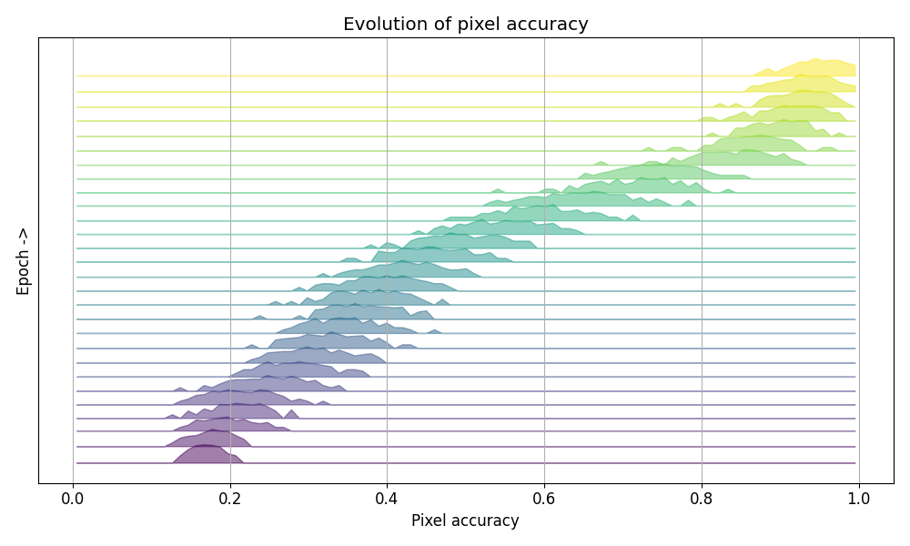
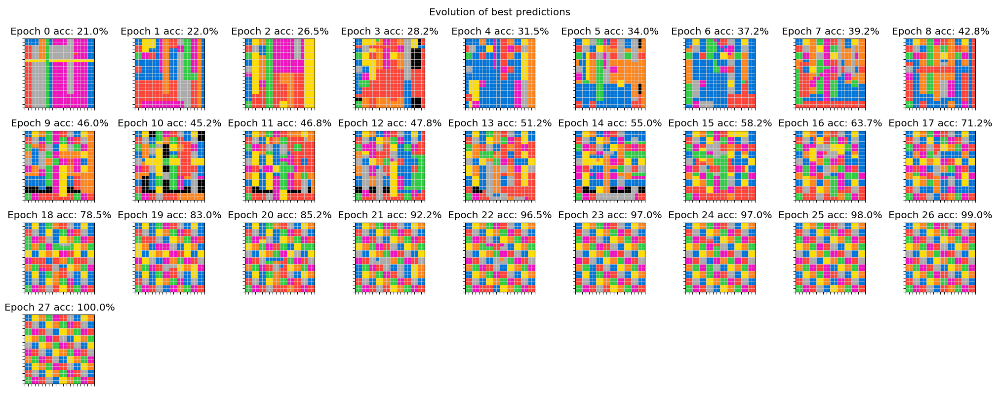

# Iteration 9. Improve training script

_14-05-2025_

## Goal

Improve the training script so I can start working towards solving real ARC tasks with code.

## Motivation

I have seen that Hindsight Experience Replay (HER) allows to generalize to novel tasks. Next step is
to probe that it can solve real ARC tasks, not just toy tasks. But previously I have to make some updates
to the training script. That will allow me to iterate faster on the next steps.

## Development

### Fix the problem with repeated calls to training generator

```bash
conda activate arc25
export CUDA_VISIBLE_DEVICES=0
python finetuning.py --output-dir /mnt/hdd0/Kaggle/arc25/trainings/20250514/debug_training_generator --device-map auto --random-seed 5 --max-steps 11 --n-gpus 1 --per-device-train-batch-size 1 --batch-size 16 --max-seq-len 1024 --no-log-to-wandb --no-resume-from-checkpoint
```

- [IterableDataset](https://huggingface.co/docs/datasets/v3.6.0/en/package_reference/main_classes#datasets.IterableDataset)
- [SFTTrainer](https://huggingface.co/docs/trl/en/sft_trainer#trl.SFTTrainer)

It seems that it is the expected behaviour, however I have modified the generator to just yield samples.
The setting of the random seed and printing the first sample is now outside.

### Make the script work with accelerate

```bash
accelerate launch --num_processes 2 --num_machines 1 --mixed_precision bf16 --multi_gpu \
finetuning.py --output-dir /mnt/hdd0/Kaggle/arc25/trainings/20250514/debug_accelerate --device-map None --random-seed 5 --max-steps 40 --n-gpus 2 --per-device-train-batch-size 8 --batch-size 16 --max-seq-len 512 --no-log-to-wandb --no-resume-from-checkpoint
```

I'm using the latest version of accelerate: `1.6.0`, the thing is that previously the `SFTConfig` class
had a `dispatch_batches=False` parameter that now is missing.

- https://huggingface.co/docs/accelerate/en/package_reference/accelerator
- https://huggingface.co/docs/accelerate/v1.6.0/en/package_reference/utilities#accelerate.DataLoaderConfiguration
- https://github.com/huggingface/transformers/issues/34699
- https://huggingface.co/docs/transformers/v4.51.3/en/main_classes/trainer#transformers.TrainingArguments

The solution was easy, but difficult to find: `accelerator_config=dict(dispatch_batches=False`

### Training speed test

By using 2 GPUs and the right batch size we can improve the training speed by a factor of 5.

| Number of GPUs | Per Device Batch Size | Train Samples per Second |
|----------------|------------------------|---------------------------|
| 2              | 8                      | 44.25                     |
| 1              | 8                      | 25.69                     |
| 1              | 4                      | 22.27                     |
| 1              | 2                      | 14.70                     |
| 1              | 1                      | 8.85                      |

```bash
accelerate launch --num_processes 2 --num_machines 1 --mixed_precision bf16 --multi_gpu \
finetuning.py --output-dir /mnt/hdd0/Kaggle/arc25/trainings/20250514/debug_accelerate --device-map None --random-seed 5 --max-steps 100 --n-gpus 2 --per-device-train-batch-size 8 --batch-size 16 --max-seq-len 512 --no-log-to-wandb --no-resume-from-checkpoint --save-steps 100
# {'train_runtime': 36.1583, 'train_samples_per_second': 44.25, 'train_steps_per_second': 2.766, 'train_loss': 0.2923687481880188, 'epoch': 1.0}
export CUDA_VISIBLE_DEVICES=0
accelerate launch --num_processes 1 --num_machines 1 --mixed_precision bf16 \
finetuning.py --output-dir /mnt/hdd0/Kaggle/arc25/trainings/20250514/debug_accelerate --device-map None --random-seed 5 --max-steps 100 --n-gpus 1 --per-device-train-batch-size 8 --batch-size 16 --max-seq-len 512 --no-log-to-wandb --no-resume-from-checkpoint --save-steps 100
# {'train_runtime': 63.3117, 'train_samples_per_second': 25.272, 'train_steps_per_second': 1.579, 'train_loss': 0.2931043267250061, 'epoch': 1.0}
python finetuning.py --output-dir /mnt/hdd0/Kaggle/arc25/trainings/20250514/debug_accelerate --device-map None --random-seed 5 --max-steps 100 --n-gpus 1 --per-device-train-batch-size 8 --batch-size 16 --max-seq-len 512 --no-log-to-wandb --no-resume-from-checkpoint --save-steps 100
# {'train_runtime': 62.2894, 'train_samples_per_second': 25.687, 'train_steps_per_second': 1.605, 'train_loss': 0.29407034754753114, 'epoch': 1.0}
python finetuning.py --output-dir /mnt/hdd0/Kaggle/arc25/trainings/20250514/debug_accelerate --device-map None --random-seed 5 --max-steps 100 --n-gpus 1 --per-device-train-batch-size 4 --batch-size 16 --max-seq-len 512 --no-log-to-wandb --no-resume-from-checkpoint --save-steps 100
#{'train_runtime': 71.8484, 'train_samples_per_second': 22.269, 'train_steps_per_second': 1.392, 'train_loss': 0.29404119253158567, 'epoch': 1.0}
python finetuning.py --output-dir /mnt/hdd0/Kaggle/arc25/trainings/20250514/debug_accelerate --device-map None --random-seed 5 --max-steps 100 --n-gpus 1 --per-device-train-batch-size 2 --batch-size 16 --max-seq-len 512 --no-log-to-wandb --no-resume-from-checkpoint --save-steps 100
#{'train_runtime': 108.8354, 'train_samples_per_second': 14.701, 'train_steps_per_second': 0.919, 'train_loss': 0.29236586928367614, 'epoch': 1.0}
python finetuning.py --output-dir /mnt/hdd0/Kaggle/arc25/trainings/20250514/debug_accelerate --device-map None --random-seed 5 --max-steps 100 --n-gpus 1 --per-device-train-batch-size 1 --batch-size 16 --max-seq-len 512 --no-log-to-wandb --no-resume-from-checkpoint --save-steps 100
# {'train_runtime': 180.7981, 'train_samples_per_second': 8.85, 'train_steps_per_second': 0.553, 'train_loss': 0.29323326468467714, 'epoch': 1.0}
```

### Training speed vs input size


Even after changing the per device batch size between experiments we can see a clear linear relation
between the input tokens and the training speed.

```bash
accelerate launch --num_processes 2 --num_machines 1 --mixed_precision bf16 --multi_gpu \
finetuning.py --output-dir /mnt/hdd0/Kaggle/arc25/trainings/20250514/speed_test --device-map None --random-seed 5 --max-steps 100 --n-gpus 2 --per-device-train-batch-size 8 --batch-size 16 --max-seq-len 512 --no-log-to-wandb --no-resume-from-checkpoint --save-steps 100
# 1x10x10 5 draws, 'train_samples_per_second': 43.004,
accelerate launch --num_processes 2 --num_machines 1 --mixed_precision bf16 --multi_gpu \
finetuning.py --output-dir /mnt/hdd0/Kaggle/arc25/trainings/20250514/speed_test --device-map None --random-seed 5 --max-steps 50 --n-gpus 2 --per-device-train-batch-size 4 --batch-size 16 --max-seq-len 1024 --no-log-to-wandb --no-resume-from-checkpoint --save-steps 100
# 2x10x10 5 draws, 'train_samples_per_second': 23.6
accelerate launch --num_processes 2 --num_machines 1 --mixed_precision bf16 --multi_gpu \
finetuning.py --output-dir /mnt/hdd0/Kaggle/arc25/trainings/20250514/speed_test --device-map None --random-seed 5 --max-steps 50 --n-gpus 2 --per-device-train-batch-size 2 --batch-size 16 --max-seq-len 2048 --no-log-to-wandb --no-resume-from-checkpoint --save-steps 100
# 4x10x10 5 draws, 'train_samples_per_second': 13.6
# 1x20x20 5 draws, 'train_samples_per_second': 16.0
accelerate launch --num_processes 2 --num_machines 1 --mixed_precision bf16 --multi_gpu \
finetuning.py --output-dir /mnt/hdd0/Kaggle/arc25/trainings/20250514/speed_test --device-map None --random-seed 5 --max-steps 25 --n-gpus 2 --per-device-train-batch-size 2 --batch-size 16 --max-seq-len 4096 --no-log-to-wandb --no-resume-from-checkpoint --save-steps 100
# 1x30x30 5 draws, 'train_samples_per_second': 9.607
# 2x20x20 5 draws, 'train_samples_per_second': 9.815
accelerate launch --num_processes 2 --num_machines 1 --mixed_precision bf16 --multi_gpu \
finetuning.py --output-dir /mnt/hdd0/Kaggle/arc25/trainings/20250514/speed_test --device-map None --random-seed 5 --max-steps 20 --n-gpus 2 --per-device-train-batch-size 1 --batch-size 16 --max-seq-len 8192 --no-log-to-wandb --no-resume-from-checkpoint --save-steps 100
# 3x20x20 5 draws,  'train_samples_per_second': 6.323
# 4x20x20 5 draws, 'train_samples_per_second': 5.014
# 2x30x30 5 draws, 'train_samples_per_second': 5.178
# 3x30x30 5 draws, 'train_samples_per_second': 3.234
# 5x20x20 5 draws, 'train_samples_per_second': 4.045
# 6x20x20 5 draws, 'train_samples_per_second': 3.293
# 4x30x30 5 draws, OOM
# 4x27x27 5 draws, OOM
# 4x26x26 5 draws, 'train_samples_per_second': 3.101
```

### Training speed vs output size

```bash
accelerate launch --num_processes 2 --num_machines 1 --mixed_precision bf16 --multi_gpu \
finetuning.py --output-dir /mnt/hdd0/Kaggle/arc25/trainings/20250514/speed_test --device-map None --random-seed 5 --max-steps 20 --n-gpus 2 --per-device-train-batch-size 1 --batch-size 16 --max-seq-len 8192 --no-log-to-wandb --no-resume-from-checkpoint --save-steps 100
# 3x20x20 1 draws, 'train_samples_per_second': 7.024
# 3x20x20 5 draws,  'train_samples_per_second': 6.323
# 3x20x20 10 draws,  'train_samples_per_second': 5.503
# 3x20x20 20 draws,  'train_samples_per_second': 3.885
```

A function with 20 drawings is around 400 tokens, so the same as a single 20x20 image. ChatGPT says
that the backpropagation step is 2-3 more expensive than the forward step, and that could explain the
changes in training speed that we are observing when using a longer output.

### Mixed-sizes training

#### First experiments

Let's see how the speed is affected when we mix different input sizes. I will be using a single sample and 5 draws for this experiment. I will only change the side of the image.

```bash
accelerate launch --num_processes 2 --num_machines 1 --mixed_precision bf16 --multi_gpu \
finetuning.py --output-dir /mnt/hdd0/Kaggle/arc25/trainings/20250514/speed_test --device-map None --random-seed 5 --max-steps 25 --n-gpus 2 --per-device-train-batch-size 2 --batch-size 16 --max-seq-len 4096 --no-log-to-wandb --no-resume-from-checkpoint --save-steps 100
# 30, 'train_samples_per_second': 8.809
# 5-30, 'train_samples_per_second': 13.018
# 5, 'train_samples_per_second': 22.967
accelerate launch --num_processes 2 --num_machines 1 --mixed_precision bf16 --multi_gpu \
finetuning.py --output-dir /mnt/hdd0/Kaggle/arc25/trainings/20250514/speed_test --device-map None --random-seed 5 --max-steps 25 --n-gpus 2 --per-device-train-batch-size 2 --batch-size 16 --max-seq-len 3072 --no-log-to-wandb --no-resume-from-checkpoint --save-steps 100
# Packing
# I should probably test this longer and check the loss
# 5-30, packing=True, 'train_samples_per_second': 6.87
# 5-30, packing=False, train_samples_per_second': 12.626
# liger-kernel
# 5-30, use_liger_kernel=True, 'train_samples_per_second': 9.95, 46% VRAM
# 5-30, use_liger_kernel=False, 'train_samples_per_second': 13.069, 86% VRAM
# 5-30, use_liger_kernel=True, x2 batch size, 'train_samples_per_second': 12.786, 63% VRAM
# 5-30, use_liger_kernel=True, x4 batch size, 'train_samples_per_second': 13.883, 80% VRAM
```

These initial experiments show that when training with mixed sizes the training is faster. On this 3090 GPU liger kernels do not seem to add speed, although they reduce GPU memory usage and that is something interesting.

I believe I need to do additional experiments with packing because in the [documentation](https://huggingface.co/docs/trl/en/sft_trainer#packing-dataset) says:

> Note that if you use a packed dataset and if you pass max_steps in the training arguments you will probably train your models for more than few epochs, depending on the way you have configured the packed dataset and the training protocol.

So maybe packing is slower but it is training with more data.

#### Packing experiment

```bash
accelerate launch --num_processes 2 --num_machines 1 --mixed_precision bf16 --multi_gpu \
finetuning.py --output-dir /mnt/hdd0/Kaggle/arc25/trainings/20250514/speed_test --device-map None --random-seed 5 --max-steps 25 --n-gpus 2 --per-device-train-batch-size 2 --batch-size 16 --max-seq-len 3072 --no-log-to-wandb --no-resume-from-checkpoint --save-steps 100 --no-packing --epochs 1
# 25 steps, 
# {'train_runtime': 24.6856, 'train_samples_per_second': 16.204, 'train_steps_per_second': 1.013, 'train_loss': 0.5946265602111817, 'num_tokens': 420352.0, 'mean_token_accuracy': 0.8707410991191864, 'epoch': 1.0}
accelerate launch --num_processes 2 --num_machines 1 --mixed_precision bf16 --multi_gpu \
finetuning.py --output-dir /mnt/hdd0/Kaggle/arc25/trainings/20250514/speed_test --device-map None --random-seed 5 --max-steps 25 --n-gpus 2 --per-device-train-batch-size 2 --batch-size 16 --max-seq-len 3072 --no-log-to-wandb --no-resume-from-checkpoint --save-steps 100 --packing --epochs 1
# 9 steps, there is an error on one sample, the training does not end
# 20.54s
```

The training is not ending, the speedup is not that large and it seems to be doing weird thing with the examples, so I won't recommend using packing.

### Shards in iterable dataset

To be able to use multiple workers, I have to add shards to the IterableDataset.

```bash
# Dataset
{'train_runtime': 198.5722, 'train_samples_per_second': 16.115, 'train_steps_per_second': 1.007, 'train_loss': 0.3144468629360199, 'epoch': 1.0}
100%|██████████████████████████████████████████████████████████████████████████████████████████████████████| 200/200 [03:18<00:00,  1.01it/s]
2025-05-15 15:54:47,738 - arc25.logging - INFO - wrapper - Executed fine_tuning_main in 218.9584 seconds
2025-05-15 15:54:47,739 - arc25.logging - INFO - wrapper - Executed fine_tuning_main in 219.0947 seconds

# IterableDataset
{'train_runtime': 219.8297, 'train_samples_per_second': 14.557, 'train_steps_per_second': 0.91, 'train_loss': 0.3229031562805176, 'epoch': 1.0}
100%|████████████████████████████████████████████████████████████████████████████████████████████████████████████████████████████████████████████████████████████████████████████████████████| 200/200 [03:39<00:00,  1.10s/it]
2025-05-15 15:48:18,818 - arc25.logging - INFO - wrapper - Executed fine_tuning_main in 222.6067 seconds
2025-05-15 15:48:18,818 - arc25.logging - INFO - wrapper - Executed fine_tuning_main in 222.9027 seconds

# With workers
{'train_runtime': 216.0631, 'train_samples_per_second': 14.81, 'train_steps_per_second': 0.926, 'train_loss': 0.31195030570030213, 'epoch': 1.0}
100%|██████████████████████████████████████████████████████████████████████████████████████████████████████████████████████████████████████████████████████| 200/200 [03:35<00:00,  1.08s/it]
2025-05-15 16:06:55,624 - arc25.logging - INFO - wrapper - Executed fine_tuning_main in 218.7438 seconds
2025-05-15 16:06:55,626 - arc25.logging - INFO - wrapper - Executed fine_tuning_main in 218.7610 seconds

# With shards and 4 workers
{'train_runtime': 203.6106, 'train_samples_per_second': 15.716, 'train_steps_per_second': 0.982, 'train_loss': 0.31994509100914004, 'epoch': 1.0}
100%|██████████████████████████████████████████████████████████████████████████████████████████████████████████████████████████████████████████████████████| 200/200 [03:23<00:00,  1.02s/it]
2025-05-15 17:30:28,515 - arc25.logging - INFO - wrapper - Executed fine_tuning_main in 206.2465 seconds
2025-05-15 17:30:28,526 - arc25.logging - INFO - wrapper - Executed fine_tuning_main in 206.3744 seconds
```

### Add validation dataset

I will simply sample from the same training distribution, but do it once at the start of the training and with a different random seed.

```bash
accelerate launch --num_processes 2 --num_machines 1 --mixed_precision bf16 --multi_gpu \
finetuning.py --output-dir /mnt/hdd0/Kaggle/arc25/trainings/20250514/add_validation --device-map None --random-seed 5 --max-steps 500 --n-gpus 2 --per-device-train-batch-size 2 --per-device-eval-batch-size 4 --batch-size 16 --max-seq-len 3072 --no-resume-from-checkpoint --save-steps 200 --no-packing --eval-steps 50 --no-log-to-wandb
```

### Train a model on multiple tasks

```bash
export K_STEPS=32
accelerate launch --num_processes 2 --num_machines 1 --mixed_precision bf16 --multi_gpu finetuning.py \
--output-dir /mnt/hdd0/Kaggle/arc25/trainings/20250515_baseline_painter/${K_STEPS}k_steps \
--random-seed 5 \
--device-map None \
--max-steps ${K_STEPS}000 \
--n-gpus 2 \
--per-device-train-batch-size 2 \
--per-device-eval-batch-size 4 \
--batch-size 16 \
--max-seq-len 3072 \
--logging-steps 100 \
--eval-steps 100 \
--save-steps 1000 \
--lora-r 32 \
--use-dora \
--use-rslora
```

### Train on the cluster

#### Docker image

I'm going to use the code from ARC24 as a start point.

References:

- <https://ironbar.github.io/arc24/modeling/Iteration_08_code_improvements/#scale-compute>
- <https://github.com/ironbar/arc24/tree/main/docker>

```
# relevant packages
# Name                    Version                   Build  Channel
cupy-cuda12x              13.4.1                   pypi_0    pypi
flash-attn                2.6.3                    pypi_0    pypi
liger-kernel              0.5.9                    pypi_0    pypi
llguidance                0.7.19                   pypi_0    pypi
llvmlite                  0.44.0                   pypi_0    pypi
numba                     0.61.2                   pypi_0    pypi
numpy                     2.2.5                    pypi_0    pypi
nvidia-cublas-cu12        12.4.5.8                 pypi_0    pypi
nvidia-cuda-cupti-cu12    12.4.127                 pypi_0    pypi
nvidia-cuda-nvrtc-cu12    12.4.127                 pypi_0    pypi
nvidia-cuda-runtime-cu12  12.4.127                 pypi_0    pypi
nvidia-cudnn-cu12         9.1.0.70                 pypi_0    pypi
nvidia-cufft-cu12         11.2.1.3                 pypi_0    pypi
nvidia-curand-cu12        10.3.5.147               pypi_0    pypi
nvidia-cusolver-cu12      11.6.1.9                 pypi_0    pypi
nvidia-cusparse-cu12      12.3.1.170               pypi_0    pypi
nvidia-cusparselt-cu12    0.6.2                    pypi_0    pypi
nvidia-ml-py3             7.352.0                  pypi_0    pypi
nvidia-nccl-cu12          2.21.5                   pypi_0    pypi
nvidia-nvjitlink-cu12     12.4.127                 pypi_0    pypi
nvidia-nvtx-cu12          12.4.127                 pypi_0    pypi
python                    3.10.16              he870216_1  
torch                     2.6.0                    pypi_0    pypi
torchaudio                2.6.0                    pypi_0    pypi
torchvision               0.21.0                   pypi_0    pypi
transformers              4.51.3                   pypi_0    pypi
triton                    3.2.0                    pypi_0    pypi
trl                       0.18.0.dev0              pypi_0    pypi
vllm                      0.8.5                    pypi_0    pypi
xformers                  0.0.29.post2             pypi_0    pypi
```

I'm going to create a new docker image with a more recent cuda version.

```bash
cd docker
docker build -t cuda-python:python3.10-cuda14.1 .
docker tag cuda-python:python3.10-cuda14.1 gbarbadillo/cuda-python:python3.10-cuda14.1
docker push gbarbadillo/cuda-python:python3.10-cuda14.1
```

#### Problems with pip

```bash
export BATCH_SIZE=4
condor_submit train.condor command="
accelerate launch --num_processes 1 --num_machines 1 --mixed_precision bf16 \
/mnt/scratch/users/gbarbadillo/arc25/arc25/scripts/finetuning.py \
--model_path /mnt/scratch/users/gbarbadillo/arc25/models/Qwen2.5-Coder-0.5B-Instruct/ \
--output-dir /mnt/scratch/users/gbarbadillo/arc25/trainings/2025-05-20-batch-size/batch-size-${BATCH_SIZE} \
--random-seed 5 \
--device-map None \
--max-steps 1000 \
--n-gpus 1 \
--per-device-train-batch-size ${BATCH_SIZE} \
--per-device-eval-batch-size 4 \
--batch-size 16 \
--max-seq-len 3072 \
--logging-steps 100 \
--eval-steps 100 \
--save-steps 1000 \
--lora-r 32 \
--use-dora \
--use-rslora"

export N_GPUS=2
condor_submit train.condor command="
accelerate launch --num_processes ${N_GPUS} --num_machines 1 --mixed_precision bf16 --multi_gpu \
/mnt/scratch/users/gbarbadillo/arc25/arc25/scripts/finetuning.py \
--model_path /mnt/scratch/users/gbarbadillo/arc25/models/Qwen2.5-Coder-0.5B-Instruct/ \
--output-dir /mnt/scratch/users/gbarbadillo/arc25/trainings/2025-05-20-batch-size/batch-size-4-GPUS${N_GPUS} \
--random-seed 5 \
--device-map None \
--max-steps 1000 \
--n-gpus ${N_GPUS} \
--per-device-train-batch-size 4 \
--per-device-eval-batch-size 8 \
--batch-size 16 \
--max-seq-len 3072 \
--logging-steps 100 \
--eval-steps 100 \
--save-steps 1000 \
--lora-r 32 \
--use-dora \
--use-rslora" -append request_gpus=${N_GPUS}

export N_GPUS=8
condor_submit train.condor command="
accelerate launch --num_processes ${N_GPUS} --num_machines 1 --mixed_precision bf16 --multi_gpu \
/mnt/scratch/users/gbarbadillo/arc25/arc25/scripts/finetuning.py \
--model_path /mnt/scratch/users/gbarbadillo/arc25/models/Qwen2.5-Coder-0.5B-Instruct/ \
--output-dir /mnt/scratch/users/gbarbadillo/arc25/trainings/2025-05-20-batch-size/batch-size-4-GPUS${N_GPUS} \
--random-seed 5 \
--device-map None \
--max-steps 500 \
--n-gpus ${N_GPUS} \
--per-device-train-batch-size 4 \
--per-device-eval-batch-size 8 \
--batch-size 32 \
--max-seq-len 3072 \
--logging-steps 50 \
--eval-steps 50 \
--save-steps 500 \
--lora-r 32 \
--use-dora \
--use-rslora" -append request_gpus=${N_GPUS} -append request_cpus=12
```

- I'm getting this error when running the training

```
ERROR: Can not perform a '--user' install. User site-packages are not visible in this virtualenv.
```

- Weirdly I have tried with last year's script and gives the same error
- Trying to create the environment inside the docker, but does not work.
- It seems that the --user flag is being used, I don't understand why.
- Maybe it is related to write permissions? https://stackoverflow.com/questions/79608713/getting-could-not-install-packages-due-to-an-oserror-when-installing-python-pa

Running the docker locally I have been able to reproduce the error by giving the `--user` flag. The weird
thing is that I'm not using that flag when running the training.

```
docker run -ti -u 1000:1000 gbarbadillo/cuda-python:python3.10-cuda14.1
python3 -m venv debug
source debug/bin/activate
pip3 install --upgrade pip --user
ERROR: Can not perform a '--user' install. User site-packages are not visible in this virtualenv.

[notice] A new release of pip is available: 23.0.1 -> 25.1.1
[notice] To update, run: pip install --upgrade pip
# this works
pip3 install --upgrade pip
```

After deleting `rm -r /mnt/scratch/users/gbarbadillo/.config/pip` problems with pip where solved. I found
that configuration running the command `pip config debug`, suggested on this [Github issue](https://github.com/pypa/pip/issues/11982)

#### Problems with flash-attn

It seems that it requires more than 64GB to create the environment and install flash-attn. The problem seems to be related to flash-attn installation. I'm trying to reproduce myself the problem locally.

I'm seeing that it takes around one hour to install flash-attn on my PC inside the docker and requires 60% of the CPU (20 cores) and between 20 and 30 GB of RAM. So it might be possible that in a more powerful machine in the cluster uses more threads and even more RAM.

> If your machine has less than 96GB of RAM and lots of CPU cores, ninja might run too many parallel compilation jobs that could exhaust the amount of RAM.

https://github.com/Dao-AILab/flash-attention

```bash
docker run -ti -u 1000:1000 gbarbadillo/cuda-python:python3.10-cuda14.1
python3 -m venv debug
source debug/bin/activate
pip3 install --upgrade pip
cat > requirements.txt <<EOF
...
EOF
pip3 install -r requirements.txt
MAX_JOBS=40 pip install flash-attn==2.6.3 --no-build-isolation
```

This required more than 128GB of RAM.

I have set `MAX_JOBS=2` on the cluster, and installation took around 5 hours. Seems that required less than 32GB of RAM.

### Scaling to multiple GPUs

#### Naive accelerate

| GPU      | n GPUs | batch size | training time | steps per second | speedup |
|----------|--------|------------|---------------|------------------|---------|
| A6000    | 1      | 1          | 62.7          | 0.27             | 0.47    |
| A6000    | 1      | 2          | 40.7          | 0.41             | 0.73    |
| A6000    | 1      | 4          | 29.6          | 0.56             | 1.00    |
| A6000    | 2      | 4          | 17.9          | 0.93             | 1.65    |
| RTX 3090 | 2      | 2          | 17.9          | 0.93             | 1.65    |
| A6000    | 4      | 4          | 13.6          | 1.23             | 2.18    |
| A6000    | 8      | 4          | 7.6           | 2.19             | 3.89    |

- A6000 and 3090 seem to have identical speed, the main difference is that A6000 has double VRAM (48GB vs 24GB). [More detailed benchmark](https://lambda.ai/blog/nvidia-rtx-a6000-vs-rtx-3090-benchmarks)
- Speedup is not perfect, I would like to see something closer to the number of GPUs

#### Trying other parameters in accelerate

[o4-mini-high suggestions](https://chatgpt.com/share/682d7223-1ce4-8012-8b2f-e1144c3fbab2)

```bash
export N_GPUS=2
# deepspeed
condor_submit train.condor command="
accelerate launch --num_processes ${N_GPUS} --num_machines 1 --mixed_precision bf16 --use_deepspeed \
/mnt/scratch/users/gbarbadillo/arc25/arc25/scripts/finetuning.py \
--model_path /mnt/scratch/users/gbarbadillo/arc25/models/Qwen2.5-Coder-0.5B-Instruct/ \
--output-dir /mnt/scratch/users/gbarbadillo/arc25/trainings/2025-05-21-accelerate/A6000-GPUS${N_GPUS}-deepspeed \
--random-seed 5 \
--device-map None \
--max-steps 500 \
--n-gpus ${N_GPUS} \
--per-device-train-batch-size 4 \
--per-device-eval-batch-size 8 \
--batch-size 32 \
--max-seq-len 3072 \
--logging-steps 100 \
--eval-steps 100 \
--save-steps 1000 \
--lora-r 32 \
--use-dora \
--use-rslora" -append request_gpus=${N_GPUS} -append request_cpus=12

# baseline
condor_submit train.condor command="
accelerate launch --num_processes ${N_GPUS} --num_machines 1 --mixed_precision bf16 --multi_gpu  \
/mnt/scratch/users/gbarbadillo/arc25/arc25/scripts/finetuning.py \
--model_path /mnt/scratch/users/gbarbadillo/arc25/models/Qwen2.5-Coder-0.5B-Instruct/ \
--output-dir /mnt/scratch/users/gbarbadillo/arc25/trainings/2025-05-21-accelerate/A6000-GPUS${N_GPUS}-baseline \
--random-seed 5 \
--device-map None \
--max-steps 500 \
--n-gpus ${N_GPUS} \
--per-device-train-batch-size 4 \
--per-device-eval-batch-size 8 \
--batch-size 32 \
--max-seq-len 3072 \
--logging-steps 100 \
--eval-steps 100 \
--save-steps 1000 \
--lora-r 32 \
--use-dora \
--use-rslora" -append request_gpus=${N_GPUS} -append request_cpus=12

# config
export N_GPUS=2
condor_submit train.condor command="
accelerate launch --num_processes ${N_GPUS} --num_machines 1 --mixed_precision bf16 --use_deepspeed \
/mnt/scratch/users/gbarbadillo/arc25/arc25/scripts/finetuning.py \
--model_path /mnt/scratch/users/gbarbadillo/arc25/models/Qwen2.5-Coder-0.5B-Instruct/ \
--output-dir /mnt/scratch/users/gbarbadillo/arc25/trainings/2025-05-21-accelerate/A6000-GPUS${N_GPUS}-deepspeed-config \
--random-seed 5 \
--device-map None \
--max-steps 500 \
--n-gpus ${N_GPUS} \
--per-device-train-batch-size 4 \
--per-device-eval-batch-size 8 \
--batch-size 32 \
--max-seq-len 3072 \
--logging-steps 100 \
--eval-steps 100 \
--save-steps 1000 \
--lora-r 32 \
--use-dora \
--use-rslora" -append request_gpus=${N_GPUS} -append request_cpus=12
```

I have tried running `accelerate config default` and it only has created a file `/mnt/scratch/users/gbarbadillo/.cache/huggingface/accelerate/default_config.yaml` with this information:

```
{
  "compute_environment": "LOCAL_MACHINE",
  "debug": false,
  "distributed_type": "MULTI_GPU",
  "downcast_bf16": false,
  "enable_cpu_affinity": false,
  "machine_rank": 0,
  "main_training_function": "main",
  "mixed_precision": "no",
  "num_machines": 1,
  "num_processes": 2,
  "rdzv_backend": "static",
  "same_network": false,
  "tpu_use_cluster": false,
  "tpu_use_sudo": false,
  "use_cpu": false
}
```

TODO: `accelerate config` -> termios.error: (25, 'Inappropriate ioctl for device')

#### Bigger models

```bash
export N_GPUS=8
export PARAMETERS=0.5B
condor_submit train.condor command="
accelerate launch --num_processes ${N_GPUS} --num_machines 1 --mixed_precision bf16 --multi_gpu  \
/mnt/scratch/users/gbarbadillo/arc25/arc25/scripts/finetuning.py \
--model_path /mnt/scratch/users/gbarbadillo/arc25/models/Qwen2.5-Coder-${PARAMETERS}-Instruct/ \
--output-dir /mnt/scratch/users/gbarbadillo/arc25/trainings/2025-05-21-model-size/A6000-GPUS${N_GPUS}-${PARAMETERS} \
--random-seed 5 \
--device-map None \
--max-steps 500 \
--n-gpus ${N_GPUS} \
--per-device-train-batch-size 4 \
--per-device-eval-batch-size 8 \
--batch-size 32 \
--max-seq-len 3072 \
--logging-steps 100 \
--eval-steps 0 \
--save-steps 1000 \
--lora-r 32 \
--use-dora \
--use-rslora" -append request_gpus=${N_GPUS} -append request_cpus=12

export PARAMETERS=1.5B
condor_submit train.condor command="
accelerate launch --num_processes ${N_GPUS} --num_machines 1 --mixed_precision bf16 --multi_gpu  \
/mnt/scratch/users/gbarbadillo/arc25/arc25/scripts/finetuning.py \
--model_path /mnt/scratch/users/gbarbadillo/arc25/models/Qwen2.5-Coder-${PARAMETERS}-Instruct/ \
--output-dir /mnt/scratch/users/gbarbadillo/arc25/trainings/2025-05-21-model-size/A6000-GPUS${N_GPUS}-${PARAMETERS} \
--random-seed 5 \
--device-map None \
--max-steps 500 \
--n-gpus ${N_GPUS} \
--per-device-train-batch-size 2 \
--per-device-eval-batch-size 4 \
--batch-size 32 \
--max-seq-len 3072 \
--logging-steps 100 \
--eval-steps 0 \
--save-steps 1000 \
--lora-r 32 \
--use-dora \
--use-rslora" -append request_gpus=${N_GPUS} -append request_cpus=12

export PARAMETERS=7B
condor_submit train.condor command="
accelerate launch --num_processes ${N_GPUS} --num_machines 1 --mixed_precision bf16 --multi_gpu  \
/mnt/scratch/users/gbarbadillo/arc25/arc25/scripts/finetuning.py \
--model_path /mnt/scratch/users/gbarbadillo/arc25/models/Qwen2.5-Coder-${PARAMETERS}-Instruct/ \
--output-dir /mnt/scratch/users/gbarbadillo/arc25/trainings/2025-05-21-model-size/A6000-GPUS${N_GPUS}-${PARAMETERS} \
--random-seed 5 \
--device-map None \
--max-steps 500 \
--n-gpus ${N_GPUS} \
--per-device-train-batch-size 1 \
--per-device-eval-batch-size 2 \
--batch-size 32 \
--max-seq-len 3072 \
--logging-steps 100 \
--eval-steps 0 \
--save-steps 1000 \
--lora-r 32 \
--use-dora \
--use-rslora" -append request_gpus=${N_GPUS} -append request_cpus=12
```

I don't have a single number, but it seems that GPU utilization is higher for bigger models. So maybe I should
not worry about GPU utilization when using small LLMs.

## Results

I have trained a new model on a few drawing task for 32k steps (512k samples) in around 9 hours. This model
has been trained on images up to 30x30 pixels, the previous models were trained on up to 10x10 pixels.
This opens the door to test tasks with a larger number of elements.

Although the model has been trained with up to 5 drawings, with Hindsight Experience Replay (HER) it has
been able to solve task up to 100 drawings.

| number of squares | epochs | solution lines | solution tokens |
|-------------------|--------|----------------|-----------------|
| 16                | 5      | 15             | 382             |
| 25                | 8      | 23             | 528             |
| 36                | 11     | 29             | 732             |
| 49                | 14     | 43             | 1082            |
| 64                | 21     | 55             | 1382            |
| 81                | 19     | 70             | 1757            |
| 100               | 28     | 81             | 2032            |





It seems that there is no ceiling, and as long as predictions can get closer to the
result the model could be able to solve the task. We only need with a model with an
initial intuition of how to do the task and which functions to call.

## Conclusion

## Next steps

- Solve the training set, then the evaluation set, then the new tasks from ARC25.
- Should I upgrade to 5090? [Improvement seems relevant](https://www.reddit.com/r/LocalLLaMA/comments/1hviw58/simple_table_to_compare_3090_4090_and_5090/)

## TODO

- [x] Fix the problem with repeated calls to the train dataset generator
- [x] Make the script work with accelerate
- [x] Measure training speed vs batch size and number of gpus
- [x] Measure training speed vs input size
- [x] Does it have sense to use packing?
- [x] Measure data sampling speed to verify is fast enough
- [x] Add validation
- [x] Enable multi-task training, currently only trains on a single task
- [x] Bonus: Now that I have trained a model on bigger images, can it solve tasks with more than 25 squares?
- [ ] Train on the cluster
