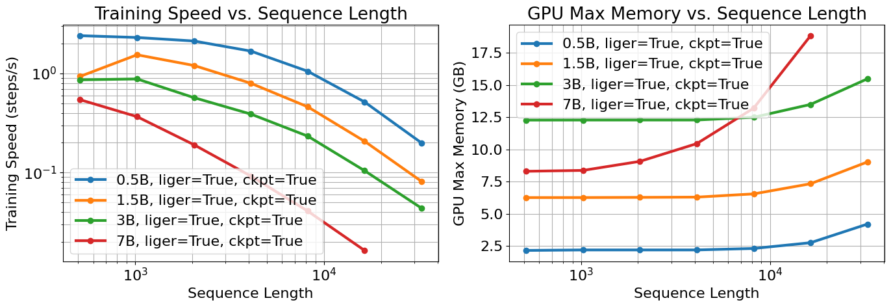

# Iteration 14. Optimize inference

_26-06-2025_

<!---
The work is done using short iterations. Each iteration needs to have a very
clear goal. This allows to gain greater knowledge of the problem on each iteration.

  
Click to expand/collapse this section

--->

## Goal

Is there room for improvement with the current approach if I modify the inference to better explore
the solution space?

## Motivation

On [Iteration 12, solve a few arc tasks](Iteration_12_solve_a_few_arc_tasks.md) I saw very little
exploration of the solution space. I want to try different ideas to see if we can fix the problem
without redesigning the training and the strategy.

## Development

## Results

### Max sequence length

#### Inference

#### Training

If we use liger kernels and gradient checkpoint we can train the 0.5B model in a GPU with 24GB of VRAM
and a sequence length of 32000.

We can train with up to 32k tokens with the 3B model, for the 7B model we can only reach 16k tokens.
Notice how the training speed decreases with the sequence length.

## Conclusion

## Next steps

## TODO

- [ ] What is the max sequence length for training and inference on a GPU with 24GB of VRAM?
- [ ] Better sampling strategy. Could play with temperature, top_k and top_p to create more diverse samples. https://huggingface.co/docs/transformers/v4.52.3/en/main_classes/text_generation#transformers.GenerationConfig.temperature
- [ ] What if I give hints of how to solve the problem int the prompt? Is the model capable on that case?
- [ ] What if I have a multi-turn conversation with the model to improve its own code?
