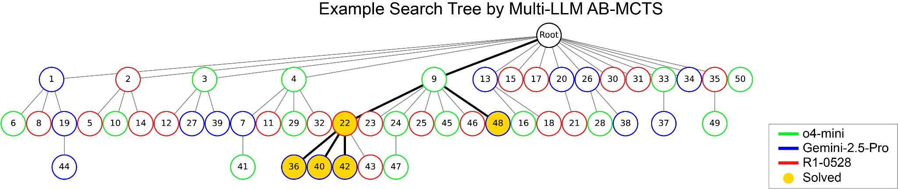

# Iteration 15. The path forward: Search & Learn

_17-06-2025_

<!---
The work is done using short iterations. Each iteration needs to have a very
clear goal. This allows to gain greater knowledge of the problem on each iteration.

  
Click to expand/collapse this section

--->

## Goal

Define the solution I want to implement in the following months.

## Search and Learn

Search and learn are the two mechanisms to adapt to novelty, and I bet that to beat ARC we need both.
Thus my proposal for ARC25 is a system that is able to explore the program space of the solutions and
learn during the exploration.

The core of the system would be an LLM that uses a DSL to write python code to solve the ARC tasks. The LLM
will be used to search solutions for the task, and the model itself will learn to guide the search
process balancing the depth/width dilemma. The generated programs that do not solve the tasks will
be relabeled with hindsight and the model will be trained on those to adjust its prior beliefs and
search more efficiently.

### Search

As a human I know everything that I have tried (at least at a high level summary) when solving a new task.
The search history guides the next steps of the search to avoid repeating previous failures. This was
one of the weaknesses of my previous iterations, where all the generated solutions were independent.

When searching a solution for an ARC task there are 3 high level actions that we can take:

1. Generate a new function
2. Refine an existing function
3. Combine multiple existing functions into a new one

Search can be visualized in a graph like in the [Sakana blogpost](https://sakana.ai/ab-mcts/)

During training we can sample the actions randomly or exhaustively, and if we find a solution we could
label the actions in retrospective. That would allow to train a model to acquire the taste to guide
the search intelligently.

When generating new functions we should give the previous functions as context to encourage generating
novel functions. This could also be trained, with some novelty loss function. Another way to foster diversity
would be to exclude some of the DSL functions in the prompt (because typically we would give the footprint
of the available functions in the DSL)

### Learning

All the predicted functions can be treated as new task, with hindsight relabelling. On previous iterations
I have already seen that on toy tasks this enables broader generalization, and on the [SOAR paper](https://icml.cc/virtual/2025/poster/43499) a small
improvement was measured when using this technique.

## Summary

## Next steps

## TODO

- [ ]
