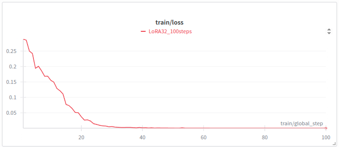
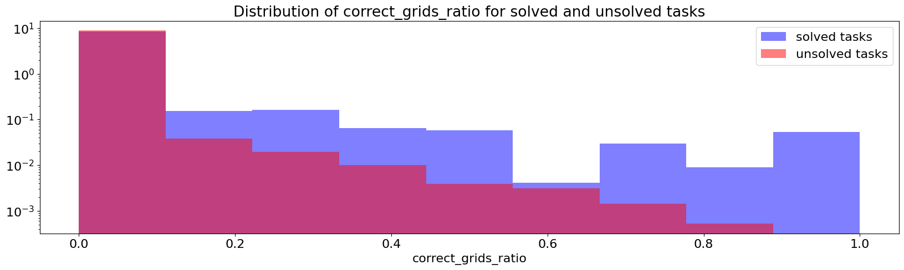
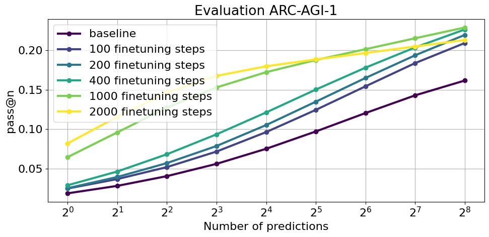
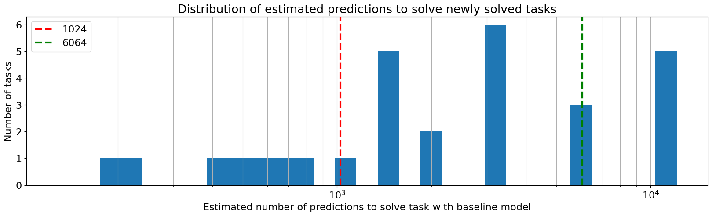

# Iteration 22. Test-time Training with BARC induction model

_25-08-2025_

<!---
The work is done using short iterations. Each iteration needs to have a very
clear goal. This allows to gain greater knowledge of the problem on each iteration.

<details>
  <summary>Click to expand/collapse this section</summary>
</details>
--->

## Goal

Can I improve the results on ARC-AGI-1 evaluation with the BARC induction model using test-time training?

## Motivation

I have the intuition that we need to combine search and learn to be able to solve novel tasks. Using [toy tasks](Iteration_08_improve_HER.md) I probed that a model was able to generalize outside its training distribution by training on hindsight relabeled wrong attempts to solve the task. I need to probe that the same technique is helpful for ARC.

## Development

My initial idea is to take the predictions from the previous iteration and fine-tune the BARC model on those using hindsight relabel. Then I will do inference again and hopefully
I will see improvements.

I believe I should see improvements with just one epoch (train + inference) but that
doing multiple epochs would yield the best results. I'm not going to worry about efficiency on this iteration, I just want to see if the technique works or it doesn't.

### Data generation

The first step is generate the data for training. The fastest way could be to generate
the data directly with the chat template from the BARC model.

### First trainings

```bash
# better work with a single gpu for debugging
export CUDA_VISIBLE_DEVICES=0
export N_GPUS=1
export STEPS=10
export MAXSEQLEN=4096
python scripts/finetuning_hr.py \
--output-dir /mnt/hdd0/Kaggle/arc25/trainings/2025-08-25-hr-trainings/3090-GPUS${N_GPUS}-BARC-${STEPS}steps-${MAXSEQLEN}msl \
--device-map None \
--max-steps ${STEPS} \
--n-gpus ${N_GPUS} \
--per-device-train-batch-size 1 \
--batch-size 32 \
--max-seq-len ${MAXSEQLEN} \
--logging-steps 1 \
--save-steps 1000 \
--lora-r 32 \
--use-dora \
--use-rslora \
--no-resume_from_checkpoint

export N_GPUS=2
export STEPS=1000
export MAXSEQLEN=8192
accelerate launch --num_processes ${N_GPUS} --num_machines 1 --mixed_precision bf16 --multi_gpu  \
scripts/finetuning_hr.py \
--output-dir /mnt/hdd0/Kaggle/arc25/trainings/2025-08-25-hr-trainings/3090-GPUS${N_GPUS}-BARC-${STEPS}steps-${MAXSEQLEN}msl \
--device-map None \
--max-steps ${STEPS} \
--n-gpus ${N_GPUS} \
--per-device-train-batch-size 1 \
--batch-size 32 \
--max-seq-len ${MAXSEQLEN} \
--logging-steps 1 \
--save-steps 100 \
--lora-r 32 \
--use-dora \
--use-rslora
```

I had to solve a bug of my implementation when using gradient checkpointing, and modify the tokenizer
from Llama to add the pad token.

- Around 3s per instance when training with batch size 32 and 4096 max sequence length.
- That reduces to 1.6 seconds when using 2 GPUS, so scaling is nice because GPU usage is almost 100% all the time.
- If I increase the max_seq_len to 8192 the training time per sample increases to 2 seconds, but the memory
  seems to increase just from 13GB to 15GB so there might be room for bigger training sequences.
- Training on 3200 samples would take around 1h40min on my 2x3090 setup. I had to use 4 bit quantization,
  liger kernels and gradient checkpoint to avoid the OOM errors.

#### Data collator

The data collator adds a new labels field to the batch that allows to skip the user text.

```python
print(tokenizer(text))
{'input_ids': tensor([[128000, 128000, 128006,  ...,    198,  74694, 128009]]), 'attention_mask': tensor([[1, 1, 1,  ..., 1, 1, 1]])}
data_collator([tokenizer(text)])
{'input_ids': tensor([[128000, 128000, 128006,  ...,    198,  74694, 128009]]), 'attention_mask': tensor([[1, 1, 1,  ..., 1, 1, 1]]), 'labels': tensor([[ -100,  -100,  -100,  ...,   198, 74694,  -100]])}
```

In this case it is ignoring the end of text token because it is the same as the padding token.
I have solved it by changing the pad token to `<|finetune_right_pad_id|>`.

### Training again in the cluster

#### First steps

I have updated the requirements of the environment, so the environment will have to be regenerated
in the cluster.

```bash
rsync -P /mnt/data/MEGA/TEMP/2025-08-25_evaluation-85640.json calculon01:/mnt/scratch/users/gbarbadillo/arc25/data

export N_GPUS=2
export LEARNING_RATE=1e-4
export MAXSEQLEN=8192
export STEPS=1000; condor_submit train.condor command="
accelerate launch --num_processes ${N_GPUS} --num_machines 1 --mixed_precision bf16 --multi_gpu  \
/mnt/scratch/users/gbarbadillo/arc25/arc25/scripts/finetuning_hr.py \
--train_dataset_path /mnt/scratch/users/gbarbadillo/arc25/data/2025-08-25_evaluation-85640.json \
--model_path /mnt/scratch/users/gbarbadillo/arc25/models/Llama-3.1-ARC-Potpourri-Induction-8B \
--output-dir /mnt/scratch/users/gbarbadillo/arc25/trainings/2025-08-25-hr-trainings/${N_GPUS}xA6000--${STEPS}steps-${MAXSEQLEN}msl-${LEARNING_RATE}lr \
--max-steps ${STEPS} \
--device-map None \
--n-gpus ${N_GPUS} \
--learning-rate ${LEARNING_RATE} \
--per-device-train-batch-size 1 \
--batch-size 32 \
--max-seq-len ${MAXSEQLEN} \
--dataloader_num_workers ${N_GPUS} \
--logging-steps 1 \
--save-steps 100 \
--lora-r 32 \
--use-dora \
--use-rslora" -append request_gpus=${N_GPUS} -append request_cpus=8

condor_submit train.condor command=" 
accelerate launch --num_processes ${N_GPUS} --num_machines 1 --mixed_precision bf16 --multi_gpu  \
/mnt/scratch/users/gbarbadillo/arc25/arc25/scripts/finetuning_hr.py \
--train_dataset_path /mnt/scratch/users/gbarbadillo/arc25/data/2025-08-25_evaluation-85640.json \
--model_path /mnt/scratch/users/gbarbadillo/arc25/models/Llama-3.1-ARC-Potpourri-Induction-8B \
--output-dir /mnt/scratch/users/gbarbadillo/arc25/trainings/2025-08-25-hr-trainings/${N_GPUS}xA6000--${STEPS}steps-${MAXSEQLEN}msl-${LEARNING_RATE}lr-no-dora \
--max-steps ${STEPS} \
--device-map None \
--n-gpus ${N_GPUS} \
--learning-rate ${LEARNING_RATE} \
--per-device-train-batch-size 1 \
--batch-size 32 \
--max-seq-len ${MAXSEQLEN} \
--dataloader_num_workers ${N_GPUS} \
--logging-steps 1 \
--save-steps 100 \
--lora-r 32 \
--no-use-dora \
--use-rslora" -append request_gpus=${N_GPUS} -append request_cpus=8

export N_GPUS=2
export LEARNING_RATE=5e-4
export MAXSEQLEN=8192
export STEPS=1000;
condor_submit train.condor command=" 
accelerate launch --num_processes ${N_GPUS} --num_machines 1 --mixed_precision bf16 --multi_gpu  \
/mnt/scratch/users/gbarbadillo/arc25/arc25/scripts/finetuning_hr.py \
--train_dataset_path /mnt/scratch/users/gbarbadillo/arc25/data/2025-08-25_evaluation-85640.json \
--model_path /mnt/scratch/users/gbarbadillo/arc25/models/Llama-3.1-ARC-Potpourri-Induction-8B \
--output-dir /mnt/scratch/users/gbarbadillo/arc25/trainings/2025-08-25-hr-trainings/${N_GPUS}xA6000--${STEPS}steps-${MAXSEQLEN}msl-${LEARNING_RATE}lr-plain-lora \
--max-steps ${STEPS} \
--device-map None \
--n-gpus ${N_GPUS} \
--learning-rate ${LEARNING_RATE} \
--per-device-train-batch-size 1 \
--batch-size 32 \
--max-seq-len ${MAXSEQLEN} \
--dataloader_num_workers ${N_GPUS} \
--logging-steps 1 \
--save-steps 100 \
--lora-r 32 \
--no-use-dora \
--no-use-rslora" -append request_gpus=${N_GPUS} -append request_cpus=8

rsync -P -r calculon01:/mnt/scratch/users/gbarbadillo/arc25/trainings/2025-08-25-hr-trainings /mnt/data/MEGA/TEMP --exclude wandb/* --exclude *.pt
```

If I remove the gradient checkpointing I get OOM error when using the A6000 GPUs.

Training speed comparison (when using plain LoRA):

- 2xH100: 15.4s/it
- 2xA6000: 40.8s/it
- 2x3090: 46.7s/it

It is possible that we can speedup the H100 training because only 17% of the VRAM memory is being used
when using the same configuration as the other GPUs.

#### Speed tests

```bash
export N_GPUS=1
export LEARNING_RATE=1e-4
export MAXSEQLEN=8192
export STEPS=20;
export BATCH_SIZE=1
condor_submit train.condor command=" 
python \
/mnt/scratch/users/gbarbadillo/arc25/arc25/scripts/finetuning_hr.py \
--train_dataset_path /mnt/scratch/users/gbarbadillo/arc25/data/2025-08-25_evaluation-85640.json \
--model_path /mnt/scratch/users/gbarbadillo/arc25/models/Llama-3.1-ARC-Potpourri-Induction-8B \
--output-dir /mnt/scratch/users/gbarbadillo/arc25/trainings/2025-08-26-speed-tests/${N_GPUS}xA6000-${STEPS}steps-${MAXSEQLEN}msl-${LEARNING_RATE}lr-plain-lora-pdbs${BATCH_SIZE} \
--max-steps ${STEPS} \
--device-map None \
--n-gpus ${N_GPUS} \
--learning-rate ${LEARNING_RATE} \
--per-device-train-batch-size ${BATCH_SIZE} \
--batch-size 32 \
--max-seq-len ${MAXSEQLEN} \
--dataloader_num_workers ${N_GPUS} \
--logging-steps 1 \
--save-steps 100 \
--lora-r 32 \
--no-use-dora \
--use-rslora" -append request_gpus=${N_GPUS} -append request_cpus=8


export N_GPUS=2
export LEARNING_RATE=1e-4
export MAXSEQLEN=8192
export STEPS=20;
condor_submit train.condor command=" 
accelerate launch --num_processes ${N_GPUS} --num_machines 1 --mixed_precision bf16 --multi_gpu  \
/mnt/scratch/users/gbarbadillo/arc25/arc25/scripts/finetuning_hr.py \
--train_dataset_path /mnt/scratch/users/gbarbadillo/arc25/data/2025-08-25_evaluation-85640.json \
--model_path /mnt/scratch/users/gbarbadillo/arc25/models/Llama-3.1-ARC-Potpourri-Induction-8B \
--output-dir /mnt/scratch/users/gbarbadillo/arc25/trainings/2025-08-26-speed-tests/${N_GPUS}xA6000--${STEPS}steps-${MAXSEQLEN}msl-${LEARNING_RATE}lr-plain-lora \
--max-steps ${STEPS} \
--device-map None \
--n-gpus ${N_GPUS} \
--learning-rate ${LEARNING_RATE} \
--per-device-train-batch-size 1 \
--batch-size 32 \
--max-seq-len ${MAXSEQLEN} \
--dataloader_num_workers ${N_GPUS} \
--logging-steps 1 \
--save-steps 100 \
--lora-r 32 \
--no-use-dora \
--use-rslora" -append request_gpus=${N_GPUS} -append request_cpus=8

export N_GPUS=7
export LEARNING_RATE=1e-4
export MAXSEQLEN=8192
export STEPS=20;
condor_submit train.condor command=" 
accelerate launch --num_processes ${N_GPUS} --num_machines 1 --mixed_precision bf16 --multi_gpu  \
/mnt/scratch/users/gbarbadillo/arc25/arc25/scripts/finetuning_hr.py \
--train_dataset_path /mnt/scratch/users/gbarbadillo/arc25/data/2025-08-25_evaluation-85640.json \
--model_path /mnt/scratch/users/gbarbadillo/arc25/models/Llama-3.1-ARC-Potpourri-Induction-8B \
--output-dir /mnt/scratch/users/gbarbadillo/arc25/trainings/2025-08-26-speed-tests/${N_GPUS}xA6000--${STEPS}steps-${MAXSEQLEN}msl-${LEARNING_RATE}lr-plain-lora \
--max-steps ${STEPS} \
--device-map None \
--n-gpus ${N_GPUS} \
--learning-rate ${LEARNING_RATE} \
--per-device-train-batch-size 1 \
--batch-size 56 \
--max-seq-len ${MAXSEQLEN} \
--dataloader_num_workers ${N_GPUS} \
--logging-steps 1 \
--save-steps 100 \
--lora-r 32 \
--no-use-dora \
--use-rslora" -append request_gpus=${N_GPUS} -append request_cpus=14 -append request_memory=80G
```

- 1 GPU: 71.63s/it
- 2 GPUS: 42.74s/it
- 4 GPUs: 26.82s/it
- 7 GPUs: Does not run successfully, probably OOM error but I'm not sure.

2 GPUs seems to be the sweet spot.

| n gpus | per-device-batch-size | batch time (s) | speedup | efficiency |
|--------|-----------------------|----------------|---------|------------|
| 1      | 1                     | 71.6           | 1       | 100.00%    |
| 2      | 1                     | 42.7           | 1.7     | 83.84%     |
| 4      | 1                     | 26.8           | 2.7     | 66.79%     |
| 7      | 1                     | -              | #VALUE! | #VALUE!    |
| 1      | 2                     | 75.2           | 1.0     | 95.21%     |
| 1      | 4                     | OOM            | #VALUE! | #VALUE!    |
| 1      | 8                     | OOM            | #VALUE! | #VALUE!    |

#### Lora rank sweep

```bash
export LORA_RANK=128
export N_GPUS=2
export LEARNING_RATE=1e-4
export MAXSEQLEN=8192
export STEPS=1000
condor_submit train.condor command=" 
accelerate launch --num_processes ${N_GPUS} --num_machines 1 --mixed_precision bf16 --multi_gpu  \
/mnt/scratch/users/gbarbadillo/arc25/arc25/scripts/finetuning_hr.py \
--train_dataset_path /mnt/scratch/users/gbarbadillo/arc25/data/2025-08-25_evaluation-85640.json \
--model_path /mnt/scratch/users/gbarbadillo/arc25/models/Llama-3.1-ARC-Potpourri-Induction-8B \
--output-dir /mnt/scratch/users/gbarbadillo/arc25/trainings/2025-08-26-lora-rank/${N_GPUS}xA6000-${STEPS}steps-${MAXSEQLEN}msl-${LEARNING_RATE}lr-lora${LORA_RANK} \
--max-steps ${STEPS} \
--device-map None \
--n-gpus ${N_GPUS} \
--learning-rate ${LEARNING_RATE} \
--per-device-train-batch-size 1 \
--batch-size 32 \
--max-seq-len ${MAXSEQLEN} \
--dataloader_num_workers ${N_GPUS} \
--logging-steps 1 \
--save-steps 100 \
--lora-r ${LORA_RANK} \
--no-use-dora \
--use-rslora" -append request_gpus=${N_GPUS} -append request_cpus=8

rsync -P -r calculon01:/mnt/scratch/users/gbarbadillo/arc25/trainings/2025-08-26-lora-rank /mnt/data/MEGA/TEMP --exclude *.pt --include checkpoint-*000* --exclude checkpoint* --exclude wandb*
```

#### Influence of the number of training steps

```bash
export LORA_RANK=32
export N_GPUS=2
export LEARNING_RATE=1e-4
export MAXSEQLEN=8192
export STEPS=4000; condor_submit train.condor command=" 
accelerate launch --num_processes ${N_GPUS} --num_machines 1 --mixed_precision bf16 --multi_gpu  \
/mnt/scratch/users/gbarbadillo/arc25/arc25/scripts/finetuning_hr.py \
--max-steps ${STEPS} \
--train_dataset_path /mnt/scratch/users/gbarbadillo/arc25/data/2025-08-25_evaluation-85640.json \
--model_path /mnt/scratch/users/gbarbadillo/arc25/models/Llama-3.1-ARC-Potpourri-Induction-8B \
--output-dir /mnt/scratch/users/gbarbadillo/arc25/trainings/2025-08-27-training-steps/${N_GPUS}xA6000-${STEPS}steps-${MAXSEQLEN}msl-${LEARNING_RATE}lr-lora${LORA_RANK} \
--device-map None \
--n-gpus ${N_GPUS} \
--learning-rate ${LEARNING_RATE} \
--per-device-train-batch-size 1 \
--batch-size 32 \
--max-seq-len ${MAXSEQLEN} \
--dataloader_num_workers ${N_GPUS} \
--logging-steps 1 \
--save-steps 100 \
--no-use-4bit-quantization \
--lora-r ${LORA_RANK} \
--no-use-dora \
--use-rslora" -append request_gpus=${N_GPUS} -append request_cpus=8

export N_GPUS=2
export LEARNING_RATE=1e-5
export MAXSEQLEN=8192
export STEPS=8000; condor_submit train_h100.condor command=" 
accelerate launch --num_processes ${N_GPUS} --num_machines 1 --mixed_precision bf16 --multi_gpu  \
/mnt/scratch/users/gbarbadillo/arc25/arc25/scripts/finetuning_hr.py \
--max-steps ${STEPS} \
--train_dataset_path /mnt/scratch/users/gbarbadillo/arc25/data/2025-08-25_evaluation-85640.json \
--model_path /mnt/scratch/users/gbarbadillo/arc25/models/Llama-3.1-ARC-Potpourri-Induction-8B \
--output-dir /mnt/scratch/users/gbarbadillo/arc25/trainings/2025-08-27-training-steps/${N_GPUS}xH100-${STEPS}steps-${MAXSEQLEN}msl-${LEARNING_RATE}lr-full-finetuning \
--device-map None \
--n-gpus ${N_GPUS} \
--learning-rate ${LEARNING_RATE} \
--per-device-train-batch-size 1 \
--batch-size 32 \
--max-seq-len ${MAXSEQLEN} \
--dataloader_num_workers ${N_GPUS} \
--logging-steps 1 \
--save-steps 500 \
--no-use-4bit-quantization \
--no-use-lora" -append request_gpus=${N_GPUS} -append request_cpus=8
```

#### Train on smaller datasets

```bash
export LORA_RANK=32
export N_GPUS=2
export LEARNING_RATE=1e-4
export MAXSEQLEN=8192
export STEPS=50; condor_submit train.condor command=" 
accelerate launch --num_processes ${N_GPUS} --num_machines 1 --mixed_precision bf16 --multi_gpu  \
/mnt/scratch/users/gbarbadillo/arc25/arc25/scripts/finetuning_hr.py \
--max-steps ${STEPS} \
--train_dataset_path /mnt/scratch/users/gbarbadillo/arc25/data/2025-08-25_evaluation-selected8.json \
--model_path /mnt/scratch/users/gbarbadillo/arc25/models/Llama-3.1-ARC-Potpourri-Induction-8B \
--output-dir /mnt/scratch/users/gbarbadillo/arc25/trainings/2025-08-29-smaller-datasets/${N_GPUS}xA6000-${STEPS}steps-${MAXSEQLEN}msl-${LEARNING_RATE}lr-lora${LORA_RANK} \
--device-map None \
--n-gpus ${N_GPUS} \
--learning-rate ${LEARNING_RATE} \
--per-device-train-batch-size 1 \
--batch-size 32 \
--max-seq-len ${MAXSEQLEN} \
--dataloader_num_workers ${N_GPUS} \
--logging-steps 1 \
--save-steps 100 \
--no-use-4bit-quantization \
--lora-r ${LORA_RANK} \
--no-use-dora \
--use-rslora" -append request_gpus=${N_GPUS} -append request_cpus=8

# change optimizer from paged_adamw_8bit to adamw_torch_fused
# hopefully that will allow to resume from training and doesn't use too much memory
export LORA_RANK=32
export N_GPUS=2
export LEARNING_RATE=1e-4
export MAXSEQLEN=8192
export STEPS=1000; condor_submit train.condor command=" 
accelerate launch --num_processes ${N_GPUS} --num_machines 1 --mixed_precision bf16 --multi_gpu  \
/mnt/scratch/users/gbarbadillo/arc25/arc25/scripts/finetuning_hr.py \
--max-steps ${STEPS} \
--train_dataset_path /mnt/scratch/users/gbarbadillo/arc25/data/2025-08-25_evaluation-selected8.json \
--model_path /mnt/scratch/users/gbarbadillo/arc25/models/Llama-3.1-ARC-Potpourri-Induction-8B \
--output-dir /mnt/scratch/users/gbarbadillo/arc25/trainings/2025-08-29-smaller-datasets/${N_GPUS}xA6000-${STEPS}steps-${MAXSEQLEN}msl-${LEARNING_RATE}lr-lora${LORA_RANK}-adamw-fused \
--device-map None \
--n-gpus ${N_GPUS} \
--learning-rate ${LEARNING_RATE} \
--per-device-train-batch-size 1 \
--batch-size 32 \
--max-seq-len ${MAXSEQLEN} \
--dataloader_num_workers ${N_GPUS} \
--logging-steps 1 \
--save-steps 100 \
--no-use-4bit-quantization \
--optim adamw_torch_fused \
--lora-r ${LORA_RANK} \
--no-use-dora \
--use-rslora" -append request_gpus=${N_GPUS} -append request_cpus=8

export LORA_RANK=32
export N_GPUS=2
export LEARNING_RATE=1e-4
export MAXSEQLEN=8192
export STEPS=200; condor_submit train.condor command=" 
accelerate launch --num_processes ${N_GPUS} --num_machines 1 --mixed_precision bf16 --multi_gpu  \
/mnt/scratch/users/gbarbadillo/arc25/arc25/scripts/finetuning_hr.py \
--max-steps ${STEPS} \
--train_dataset_path /mnt/scratch/users/gbarbadillo/arc25/data/2025-08-25_evaluation-selected8_no-data-augmentation.json \
--model_path /mnt/scratch/users/gbarbadillo/arc25/models/Llama-3.1-ARC-Potpourri-Induction-8B \
--output-dir /mnt/scratch/users/gbarbadillo/arc25/trainings/2025-08-29-smaller-datasets-no-data-augmentation/${N_GPUS}xA6000-${STEPS}steps-${MAXSEQLEN}msl-${LEARNING_RATE}lr-lora${LORA_RANK} \
--device-map None \
--n-gpus ${N_GPUS} \
--learning-rate ${LEARNING_RATE} \
--per-device-train-batch-size 1 \
--batch-size 32 \
--max-seq-len ${MAXSEQLEN} \
--dataloader_num_workers ${N_GPUS} \
--logging-steps 1 \
--save-steps 100 \
--no-use-4bit-quantization \
--lora-r ${LORA_RANK} \
--no-use-dora \
--use-rslora" -append request_gpus=${N_GPUS} -append request_cpus=8


export STEPS=1000; export FOLDER=2025-08-29-smaller-datasets/2xA6000-${STEPS}steps-8192msl-1e-4lr-lora32; condor_submit train_h100.condor command=" 
python /mnt/scratch/users/gbarbadillo/arc25/arc25/scripts/inference_with_BARC.py \
--n-predictions 512 \
--base-model-path /mnt/scratch/users/gbarbadillo/arc25/models/Llama-3.1-ARC-Potpourri-Induction-8B \
--lora-path /mnt/scratch/users/gbarbadillo/arc25/trainings/${FOLDER}/checkpoint-${STEPS} \
--dataset-path /mnt/scratch/users/gbarbadillo/arc25/data/arc-prize-2024/arc-agi_evaluation_challenges.json \
--use-data-augmentation \
--output-folder /mnt/scratch/users/gbarbadillo/arc25/predictions/${FOLDER}/evaluation" -append request_gpus=1 -append request_cpus=4


export STEPS=100; export FOLDER=2025-08-29-smaller-datasets-no-data-augmentation/2xA6000-${STEPS}steps-8192msl-1e-4lr-lora32; condor_submit train_h100.condor command=" 
python /mnt/scratch/users/gbarbadillo/arc25/arc25/scripts/inference_with_BARC.py \
--n-predictions 512 \
--base-model-path /mnt/scratch/users/gbarbadillo/arc25/models/Llama-3.1-ARC-Potpourri-Induction-8B \
--lora-path /mnt/scratch/users/gbarbadillo/arc25/trainings/${FOLDER}/checkpoint-${STEPS} \
--dataset-path /mnt/scratch/users/gbarbadillo/arc25/data/arc-prize-2024/arc-agi_evaluation_challenges.json \
--no-use-data-augmentation \
--output-folder /mnt/scratch/users/gbarbadillo/arc25/predictions/${FOLDER}/evaluation" -append request_gpus=1 -append request_cpus=4
```

### QLoRA is saving the whole model

It seems that when using QLoRA the whole quantized model is saved instead of just the adapter. I might
have to save the adapter manually to avoid moving large files.

```bash
export LORA_RANK=8
export CUDA_VISIBLE_DEVICES=0
export N_GPUS=1
export STEPS=1
export MAXSEQLEN=1024
python scripts/finetuning_hr.py \
--output-dir /mnt/hdd0/Kaggle/arc25/trainings/2025-08-26-qlora-issue/LoRA_${LORA_RANK} \
--device-map None \
--max-steps ${STEPS} \
--n-gpus ${N_GPUS} \
--per-device-train-batch-size 1 \
--batch-size 1 \
--max-seq-len ${MAXSEQLEN} \
--logging-steps 1 \
--save-steps 1000 \
--dataloader_num_workers 1 \
--lora-r ${LORA_RANK} \
--use-dora \
--use-rslora \
--no-use-4bit-quantization \
--no-resume_from_checkpoint

export LORA_RANK=8
export CUDA_VISIBLE_DEVICES=0
export N_GPUS=1
export STEPS=1
export MAXSEQLEN=1024
python scripts/finetuning_hr.py \
--output-dir /mnt/hdd0/Kaggle/arc25/trainings/2025-08-26-qlora-issue/qLoRA_${LORA_RANK} \
--device-map None \
--max-steps ${STEPS} \
--n-gpus ${N_GPUS} \
--per-device-train-batch-size 1 \
--batch-size 1 \
--max-seq-len ${MAXSEQLEN} \
--dataloader_num_workers 1 \
--logging-steps 1 \
--save-steps 1000 \
--lora-r ${LORA_RANK} \
--use-dora \
--use-rslora \
--use-4bit-quantization \
--no-resume_from_checkpoint
```

- The saved adapter weights 4.3GB if I use qLoRA, 2.2 if I use LoRA. The first result makes sense if
it is saving the whole 4bit quantized model. The second result does not make sense.
- Reducing the rank from 32 to 8 did not have any effect on the saved weight.
- Disabling the gradient checkpoint does not have any effect
- If I save the model manually the cause is clear, it is saving the embeddings layer because the size
  is changed when loading the model.

I have solved the issue by reusing the token `<|finetune_right_pad_id|>` that was already inside
the tokenizer instead of creating a new one.

### Check which LoRA versions are compatible with VLLM

I'm going to run very short train with the different configurations and see if they are compatible with VLLM.

```bash
export LORA_RANK=8
export CUDA_VISIBLE_DEVICES=0
export N_GPUS=1
export STEPS=1
export MAXSEQLEN=8192
python scripts/finetuning_hr.py \
--output-dir /mnt/hdd0/Kaggle/arc25/trainings/2025-08-26-lora-compatibility/qLoRA_${LORA_RANK}_dora_rslora \
--device-map None \
--max-steps ${STEPS} \
--n-gpus ${N_GPUS} \
--per-device-train-batch-size 1 \
--batch-size 1 \
--max-seq-len ${MAXSEQLEN} \
--logging-steps 1 \
--save-steps 1000 \
--dataloader_num_workers 1 \
--lora-r ${LORA_RANK} \
--use-dora \
--use-rslora \
--use-4bit-quantization \
--no-resume_from_checkpoint

export LORA_RANK=8
export CUDA_VISIBLE_DEVICES=0
export N_GPUS=1
export STEPS=1
export MAXSEQLEN=8192
python scripts/finetuning_hr.py \
--output-dir /mnt/hdd0/Kaggle/arc25/trainings/2025-08-26-lora-compatibility/qLoRA_${LORA_RANK}_rslora \
--device-map None \
--max-steps ${STEPS} \
--n-gpus ${N_GPUS} \
--per-device-train-batch-size 1 \
--batch-size 1 \
--max-seq-len ${MAXSEQLEN} \
--logging-steps 1 \
--save-steps 1000 \
--dataloader_num_workers 1 \
--lora-r ${LORA_RANK} \
--no-use-dora \
--use-rslora \
--use-4bit-quantization \
--no-resume_from_checkpoint

export LORA_RANK=8
export CUDA_VISIBLE_DEVICES=0
export N_GPUS=1
export STEPS=1
export MAXSEQLEN=8192
python scripts/finetuning_hr.py \
--output-dir /mnt/hdd0/Kaggle/arc25/trainings/2025-08-26-lora-compatibility/qLoRA_${LORA_RANK} \
--device-map None \
--max-steps ${STEPS} \
--n-gpus ${N_GPUS} \
--per-device-train-batch-size 1 \
--batch-size 1 \
--max-seq-len ${MAXSEQLEN} \
--logging-steps 1 \
--save-steps 1000 \
--dataloader_num_workers 1 \
--lora-r ${LORA_RANK} \
--no-use-dora \
--no-use-rslora \
--use-4bit-quantization \
--no-resume_from_checkpoint
```

VLLM supports LoRA and RSLoRA, it does not support DoRA. Moreover I can give models on the fly, it seems that the first time is slower but otherwise speed looks to be the same.

```
sampling_params = SamplingParams(n=800, temperature=1.0, top_p=0.95, max_tokens=10)
Base model: 8000 tokens generated in 4.95 seconds (1614.81 tokens/second)
LoRA model: 8000 tokens generated in 5.78 seconds (1384.20 tokens/second)
RSLoRA model: 8000 tokens generated in 6.01 seconds (1330.54 tokens/second)
LoRA model: 8000 tokens generated in 5.26 seconds (1522.17 tokens/second)
RSLoRA model: 8000 tokens generated in 5.29 seconds (1512.97 tokens/second)
```

It seems that the first time a model is called it is slightly slower. And the LoRA model by itself is slightly slower than the base model. But manageable.

<details>
  <summary>ChatGPT summary of the 3 techniques</summary>

* **LoRA (Low-Rank Adaptation)**
  Freeze base weights $W$ and learn a low-rank update $\Delta W = \frac{\alpha}{r} BA$ with $A \in \mathbb{R}^{r\times d_\text{in}}$, $B \in \mathbb{R}^{d_\text{out}\times r}$. Cheap to train/serve, drop-in for Q/K/V/O and MLPs.

* **rsLoRA (rank-stabilized / root-scaled LoRA)**
  Same idea as LoRA, but changes the scaling (and init) so the update norm is \~invariant w\.r.t. rank (often $\alpha/\sqrt{r}$ instead of $\alpha/r$). More stable across different ranks; same runtime cost as LoRA.

* **DoRA (Weight-Decomposed LoRA)**
  Decomposes a weight into **direction** and **magnitude**; applies a low-rank update to the direction and learns a small per-channel magnitude (scale) too. Tends to boost quality vs plain LoRA, but needs explicit runtime support because of the decomposition step.

</details>

I believe then I should use rsLoRA and don't use DoRA for the following experiments.

### Inference script

```bash
python scripts/inference_with_BARC.py \
--base-model-path /home/gbarbadillo/models/Llama-3.1-ARC-Potpourri-Induction-8B \
--dataset-path /mnt/hdd0/Kaggle/arc25/data/arc-prize-2024/arc-agi_evaluation_challenges.json \
--output-folder /mnt/hdd0/Kaggle/arc25/predictions/2025-08-27_first-finetuning-steps \
--lora-path /mnt/hdd0/MEGA/TEMP/2025-08-26-lora-rank/2xA6000--1000steps-8192msl-1e-4lr-lora32/checkpoint-1000

python scripts/inference_with_BARC.py \
--n-predictions 1024 \
--base-model-path /home/gbarbadillo/models/Llama-3.1-ARC-Potpourri-Induction-8B \
--dataset-path /mnt/hdd0/Kaggle/arc25/data/arc-prize-2024/arc-agi_evaluation_challenges.json \
--output-folder /mnt/hdd0/Kaggle/arc25/predictions/2025-08-28-base-model/evaluation


condor_submit train.condor command=" 
python /mnt/scratch/users/gbarbadillo/arc25/arc25/scripts/inference_with_BARC.py \
--base-model-path /mnt/scratch/users/gbarbadillo/arc25/models/Llama-3.1-ARC-Potpourri-Induction-8B \
--dataset-path /mnt/scratch/users/gbarbadillo/arc25/data/arc-prize-2024/arc-agi_evaluation_challenges.json \
--output-folder /mnt/scratch/users/gbarbadillo/arc25/predictions/2025-08-26-lora-rank/2xA6000--1000steps-8192msl-1e-4lr-lora32 \
--lora-path /mnt/scratch/users/gbarbadillo/arc25/trainings/2025-08-26-lora-rank/2xA6000--1000steps-8192msl-1e-4lr-lora32/checkpoint-1000" -append request_gpus=1 -append request_cpus=4

condor_submit train.condor command=" 
python /mnt/scratch/users/gbarbadillo/arc25/arc25/scripts/inference_with_BARC.py \
--n-predictions 1024 \
--base-model-path /mnt/scratch/users/gbarbadillo/arc25/models/Llama-3.1-ARC-Potpourri-Induction-8B \
--dataset-path /mnt/scratch/users/gbarbadillo/arc25/data/arc-prize-2024/arc-agi_evaluation_challenges.json \
--output-folder /mnt/scratch/users/gbarbadillo/arc25/predictions/2025-08-28-base-model/evaluation" -append request_gpus=1 -append request_cpus=4

condor_submit train_h100.condor command=" 
python /mnt/scratch/users/gbarbadillo/arc25/arc25/scripts/inference_with_BARC.py \
--n-predictions 512 \
--base-model-path /mnt/scratch/users/gbarbadillo/arc25/trainings/2025-08-27-training-steps/2xH100-8000steps-8192msl-1e-5lr-full-finetuning-continue/checkpoint-8000 \
--dataset-path /mnt/scratch/users/gbarbadillo/arc25/data/arc-prize-2024/arc-agi_evaluation_challenges.json \
--output-folder /mnt/scratch/users/gbarbadillo/arc25/predictions/2025-08-27-training-steps/2xH100-8000steps-8192msl-1e-5lr-full-finetuning-continue/evaluation" -append request_gpus=1 -append request_cpus=4

rsync -P -r calculon01:/mnt/scratch/users/gbarbadillo/arc25/predictions /mnt/data/MEGA/TEMP
rsync -P -r /mnt/hdd0/MEGA/TEMP/predictions/* /mnt/hdd0/Kaggle/arc25/predictions
```

### Overfit experiment

```bash
export LORA_RANK=32
export N_GPUS=2
export STEPS=100
export MAXSEQLEN=8192
accelerate launch --num_processes ${N_GPUS} --num_machines 1 --mixed_precision bf16 --multi_gpu  \
scripts/finetuning_hr.py \
--output-dir /mnt/hdd0/Kaggle/arc25/trainings/2025-08-27-overfit/LoRA${LORA_RANK}_${STEPS}steps \
--train-dataset-path /mnt/hdd0/Kaggle/arc25/data/hindsight_relabeled/2025-08-25_evaluation-no-data-augmentation-77.json \
--device-map None \
--max-steps ${STEPS} \
--n-gpus ${N_GPUS} \
--per-device-train-batch-size 1 \
--batch-size 32 \
--max-seq-len ${MAXSEQLEN} \
--logging-steps 1 \
--save-steps 1000 \
--dataloader_num_workers ${N_GPUS} \
--lora-r ${LORA_RANK} \
--no-use-dora \
--use-rslora \
--use-4bit-quantization

python scripts/inference_with_BARC.py \
--base-model-path /home/gbarbadillo/models/Llama-3.1-ARC-Potpourri-Induction-8B \
--dataset-path /mnt/hdd0/Kaggle/arc25/data/arc-prize-2024/arc-agi_evaluation_challenges.json \
--output-folder /mnt/hdd0/Kaggle/arc25/predictions/2025-08-27_overfit \
--lora-path /mnt/hdd0/Kaggle/arc25/trainings/2025-08-27-overfit/LoRA32_100steps/checkpoint-100 \
--no-use-data-augmentation \
--n-predictions 1
```

### Evaluation is not deterministic

I have to investigate the sources of variability.

- The timeout exception is one source of variability. However if properly implemented should not be a problem.
- Another source of variability was that the model was using random functions.
- However the problem is that it seems that the order in which I do the predictions affects the result

After adding more observability it seems that the Color object has been modified.

```
00dbd492 AttributeError type object 'Color' has no attribute 'GREEN'
05a7bcf2 AttributeError type object 'Color' has no attribute 'YELLOW'
```

I have fixed the execution of the code so on each execution the dsl is imported. This solves the problem
that the dsl was being modified by some rogue solution.

### Create a smaller training dataset

Since I have seen that the model is able to overfit to a small dataset, and does not seem to learn
from a huge dataset, I believe we should try training on a smaller selected samples.

### Make code execution more robust to crashes

My current code execution works perfectly most of the time but sometimes it crashes. This is currently
preventing me from evaluating one of the fine-tuned models so I have to fix it. The crash is not
deterministic, if I run the evaluation multiple times the crash does not happen at the same moment.

As far as I understand it seems that I need to use subprocess instead of exec so the code run
on a separate process that won't affect the main process if it crashes.

[Possible solution proposed by GPT5-thinking](https://chatgpt.com/share/68b587ab-2f08-8012-94a5-f1e7cb790c91)

I have to implement tests for the current function, then verify that the same tests run on the new one.

## Results

### Speed tests

| GPU     | n GPUs | 4bit quantization | batch time (s) |
|---------|--------|-------------------|----------------|
| RTX3090 | 2      | TRUE              | 46.7           |
| A6000   | 1      | TRUE              | 71.6           |
| A6000   | 2      | TRUE              | 41.5           |
| A6000   | 4      | TRUE              | 26.8           |
| A6000   | 2      | FALSE             | 28             |
| H100    | 2      | TRUE              | 15.4           |
| H100    | 2      | FALSE             | 9.2            |

In the cluster is better to use the models unquantized since the GPUs have enough memory and it is
much faster.

With the H100 I'm able to fully finetune the model and that takes around 11.5s per batch of 32 samples (slightly slower than LoRA).

### Verify that I can overfit to the training dataset

I'm going to create a dataset with just the tasks that were solved without data augmentation and finetune the model on those. I should see the loss dropping fast because the training samples should be a few, and on inference the effect should be very visible.

The model was trained with 77 samples (19.25% of the evaluation set). The training loss clearly shows
that the model is learning and the evaluation also shows a clear difference, although it does not
solve all the training samples.



| dataset              | experiment      | n_preds | valid code | valid outputs | unique outputs | pixel similarity | correct grids | train_pass_rate | train_pass@n | pass_rate | pass@n |
|----------------------|-----------------|---------|------------|---------------|----------------|------------------|---------------|-----------------|--------------|-----------|--------|
| evaluation-arg-agi-1 | baseline        | 8       | 99.47%     | 77.81%        | 71.28%         | 57.48%           | 2.82%         | 1.74%           | 5.75%        | 1.70%     | 5.50%  |
| evaluation-arg-agi-1 | overfited model | 8       | 100.00%    | 75.20%        | 49.80%         | 63.40%           | 13.30%        | 12.60%          | 16.00%       | 12.60%    | 16.00% |

This validates that using a small dataset the model is able to overfit to it.

https://wandb.ai/guillermobarbadillo/2025-08-27-overfit

### LoRA rank

First trainings do not show any effect on the training metrics when changing the LoRA rank. Maybe I should
train for longer?

https://wandb.ai/guillermobarbadillo/2025-08-26-lora-rank

### Training steps

Let's fix the lora rank to 32 and use different number of training steps.

https://wandb.ai/guillermobarbadillo/2025-08-27-training-steps

Training for longer is giving better results at least in training metrics. This result suggest
that I'm using a too big dataset for this experiment (I used around 480 predictions from each task).

### The right metrics




This plots show the distribution of scores for the unique solutions for all the ARC-AGI-1 evaluation set.
This is evidence that the pixel score is not a good guiding metric, in fact it seems that tasks that
weren't solved have higher scores.
In the other hand we can see a clear separation between the two groups when inspecting the correct grids
ratio. Since the beginning we see that solved tasks have higher scores.

This has sense because ARC tasks are all or nothing, the metric used in the competition is binary.
For each grid we need all the pixels to be correct. Thus simply measuring how many pixels are correct
is not a good metric.

Thus when selecting samples for training or when doing reinforcement learning we should use the correct
grid ratio.

### Training on smaller datasets

I have created datasets with just 8 task variations (compared to previous experiments with more than 400). Using a batch size of 32 it would take on average 100 steps to see the whole dataset.


The plot shows that for this dataset of 8 predictions per task the optimal finetuning steps is 1000. Training
for longer seems to overfit and does not generalize well. The best finetuned model was able to solve 29.25%
of the evaluation tasks compared to 22.25% from the baseline. It's quite a nice improvement considering
that we have done a single iteration of search and learn, we could do many more.

| dataset    | training steps | n_preds | valid code | valid outputs | unique outputs | pixel similarity | correct grids | train_pass_rate | train_pass@n | pass_rate | pass@n     |
|------------|----------------|---------|------------|---------------|----------------|------------------|---------------|-----------------|--------------|-----------|------------|
| evaluation | baseline (0)   | 480     | 100.00%    | 71.15%        | 43.93%         | 56.57%           | 2.94%         | 2.03%           | 23.00%       | 2.00%     | 22.25%     |
| evaluation | 20             | 512     | 100.00%    | 75.31%        | 45.52%         | 57.90%           | 3.60%         | 2.39%           | 24.75%       | 2.36%     | 23.75%     |
| evaluation | 50             | 512     | 100.00%    | 75.40%        | 45.83%         | 57.90%           | 3.45%         | 2.30%           | 26.75%       | 2.27%     | 25.00%     |
| evaluation | 100            | 512     | 100.00%    | 76.02%        | 46.12%         | 58.53%           | 3.63%         | 2.42%           | 26.50%       | 2.38%     | 25.75%     |
| evaluation | 200            | 512     | 100.00%    | 78.08%        | **46.67%**     | 59.41%           | 4.06%         | 2.71%           | 26.00%       | 2.64%     | 25.25%     |
| evaluation | 400            | 512     | 100.00%    | 77.93%        | 44.89%         | 60.80%           | 4.89%         | 3.27%           | 29.25%       | 3.12%     | 28.00%     |
| evaluation | 1000           | 512     | 100.00%    | 80.40%        | 42.54%         | 62.88%           | 6.00%         | 3.65%           | **31.00%**   | 3.39%     | **29.25%** |
| evaluation | 2000           | 512     | 100.00%    | **82.53%**    | 40.19%         | **64.22%**       | **6.82%**     | **3.91%**       | 28.00%       | **3.60%** | 27.00%     |

<details>
  <summary>Click to see the same results without data augmentation</summary>



</details>

### Are the improvements legit?

Let's describe the experiment that we have just done:

1. Make ~512 predictions with the base BARC model for the 400 evaluation tasks from ARC-AGI-1
2. Select 8 unique predictions that have the highest correct grid score
3. Finetune the BARC model on those predictions for 1000 steps, using hindsight relabeling
4. Make 512 predictions with the finetuned model

That increased the solved tasks from 22.25% to 29.25%.

However we could criticise that the finetuned model has done 1024 predictions in total, and that it saw
already solved tasks during its training. To check if this concerns are real I have made more than 6k
predictions with the base model. That way I could better characterize the difficulty of each task for the
base model, that is simply the pass rate for each task.

This is what I have found:

- 117 tasks were solved by the finetuned model, from those 88 were already solved by the base model and
  were using for training. That is 22% of the tasks, so almost all the solved tasks by the base model (22.25%)
  were solved again by the finetuned model.
- We are interested in the remaining 29 tasks that were newly solved.



The fine-tuned model using TTT was able to solve tasks that on average require more than 1024 predictions to be solved (72% of the newly solved tasks). In fact 17% of the tasks were not solved after doing more than 6000 predictions, they are shown in the plot as requiring more than 10k predictions per task, but that is simply an estimate to represent them.

Thus I believe that we can say that test-time training increased the inference efficiency of the model, in some tasks by more than 10 times.

## Conclusion

Now I have evidence that test-time training using hindsight relabelling can boost the accuracy of a model
that uses code to solve ARC tasks. This is a huge deal. Starting from a model that solved 22.25% of the evaluation tasks with ~500 predictions we were able to finetune a model that solved 29.25% of the tasks with the same inference budget. For some of the solved tasks the inference efficiency was increased more than 10 times.

Other learnings:

- Pixel accuracy does not seem to be a good metric, is better to check how many grids are completely correct.
- Changing some parameters of the training such as the save steps does not allow to continue training afterwards.
- I have seen errors when trying to resume the training. They might be caused by the optimizer being `paged_adamw_8bit` but I'm not sure. I will be using `adamw_torch_fused` from now on.

## Next steps

- Do multiple iterations of search and learn
- There is a bug in the estimation of the solve rate probability that overestimates it.

## TODO

- [ ] Prepare the training data.
  - [x] Small toy dataset
  - [x] With and without data augmentation
  - [ ] With and without solved tasks
- [x] Which LoRA parameters are compatible with VLLM? rsLoRA is compatible, DoRA isn't
- [x] Fix issue with qlora model saving the complete model
- [x] Train the model on the cluster
- [x] Verify that I can overfit on a small dataset
- [ ] Script for inference
  - [x] With support for LoRA
  - [x] Add tests for data augmentation
  - [ ] Think if moving the prompt has sense
  - [ ] Including evaluation of the predictions, otherwise I have to do it on my computer.
  - [x] Try the script on the cluster
  - [x] There might be a problem with `os.environ['CUDA_VISIBLE_DEVICES'] = str(get_least_used_gpu_index())` on the cluster or on my computer. Probably it should only do changes if the variable is not set.
- [ ] Find best training hyperparameters (learning rate, batch size, lora rank, training steps)
  - [x] Lora rank
  - [x] Training steps
  - [ ] Learning rate/batch size
- [x] Check training data: the order should be random
- [x] Evaluation is not deterministic. Investigate the source of variability.
- [x] Select a small number of samples per training
  - [x] Can I unify the evaluation script
  - [x] How to select the samples?
  - [x] Train and evaluate
- [x] Error when trying to evaluate a lot of predictions
  - [ ] What is the best and safest way to execute a lot of code in parallel?
  - [ ] Subprocess could be the way
  - [ ] Or maybe there is some way to parallelize that is safe to crashes
  - [ ] Save execution results to disk so I can repeat evaluations faster
- [x] Evaluate experiments and close iteration
  - [x] Full fine-tuned model
  - [x] Models trained on small data
