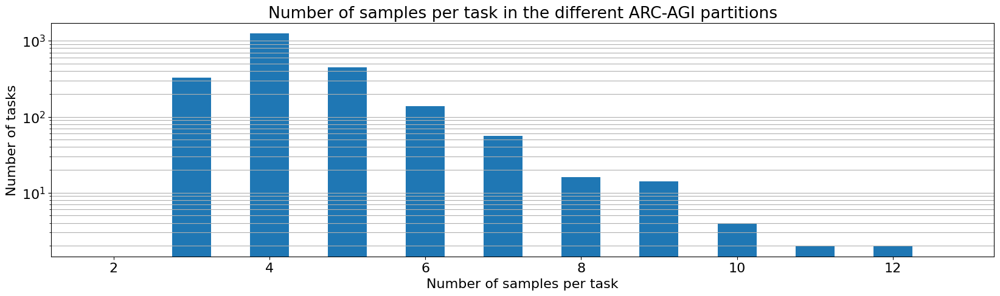
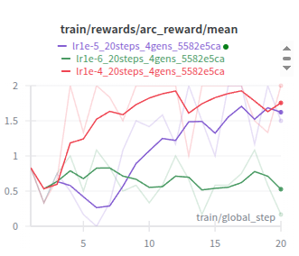

# Iteration 2x. Using RL to improve BARC induction model

_11-09-2025_

<!---
The work is done using short iterations. Each iteration needs to have a very
clear goal. This allows to gain greater knowledge of the problem on each iteration.

<details>
  <summary>Click to expand/collapse this section</summary>
</details>
--->

## Goal

Can I improve the BARC induction model using reinforcement learning?

## Motivation

I have read the [RL guide](https://docs.unsloth.ai/basics/reinforcement-learning-rl-guide) from unsloth
and they say that 300 samples are enough to see an improvement in the model. Probably I will need much
more compute for ARC but I would like to try.

The BARC induction model seems to have non-zero probability of solving the ARC-AGI-1 tasks, RL is
the way to increase that probability.


Ideas for the reward function:

- +1 if the model generates code
- +1 if the model generates running code
- Finally sum the ratio of correct grids. I believe that pixel accuracy is not a good metric, but I could try it also. I have the feeling that ARC is an all or nothing dataset, and pixel accuracy might lead to local optimums instead of leading to the global maximum.

On a first step I could try with a single training task. Then I could move to use all the training tasks.
I would measure the improvement on the training and the evaluation dataset. Finally if the technique
is helpful, I would move to using the synthetic dataset in a following iteration.

An additional motivation is that I have found that I would be able to make 512 predictions at maximum
for task on the Kaggle submission. That would solve just 22% of the ARC-AGI-1 evaluation
tasks. I need a model with a higher pass rate. RL is the way to get that.

## Development

### Thoughts

- As far as I know, the best setup is to use some GPUs for inference and others for training. First
  experiments on my PC will use one 3090 for inference and another for training.
- The trickier part of the configuration is that we need reward signal to be able to learn. I will
  start by using the training tasks from ARC-AGI-1 that have a mean pass rate of 12%. [Source](Iteration_21_fix_bug_with_data.md#accuracy-on-the-different-datasets)
  That is around 1 out of 8 runs. Thus I could be doing 8 or 16 predictions per task and that should
  work. On the evaluation set the pass rate falls to ~2%, requiring to do 64 or 128 predictions per
  task to have some signal. So let's start with the train set and measure if that translates to
  improvements on the model.
- I need to implement a reward function that executes the code generated by the model

### Tutorials

- [Implementing GRPO in TRL](https://huggingface.co/learn/llm-course/en/chapter12/4)

> The group size should be chosen based on your computational resources and the complexity of your task. For simple tasks, smaller groups (4-8) may be sufficient, while more complex reasoning tasks might benefit from larger groups (8-16).

This is very likely related to the probability of solving the task correctly, or at least to have
differences in the reward between the prompts.

- [Official documentation](https://huggingface.co/docs/trl/main/en/grpo_trainer)
- [TRL VLLM server](https://huggingface.co/docs/trl/en/vllm_integration)

Examples of reward functions:

- https://huggingface.co/learn/llm-course/en/chapter12/6?fw=pt#defining-reward-functions

#### Launching the server

```bash
# one gpu
export CUDA_VISIBLE_DEVICES=0; trl vllm-serve --max_model_len 12000 --model /home/gbarbadillo/models/Llama-3.1-ARC-Potpourri-Induction-8B
# multiple gpus
export CUDA_VISIBLE_DEVICES=0,1; trl vllm-serve --max_model_len 12000 --model /home/gbarbadillo/models/Llama-3.1-ARC-Potpourri-Induction-8B --data-parallel-size 2
```

### Modify pad token in the tokenizer configuration

Simply replace the following line on `Llama-3.1-ARC-Potpourri-Induction-8B/tokenizer_config.json`:

```bash
sed -i 's/"pad_token": "<|eot_id|>"/"pad_token": "<|finetune_right_pad_id|>"/' file.json

- "pad_token": "<|eot_id|>",
+ "pad_token": "<|finetune_right_pad_id|>",
```

### Max sequence length

I have studied all the datasets and the longest prompt is always 8635 tokens, corresponding to
tasks with 4 train samples with inputs and outputs of 30x30, and a test sample with the same input
shape.

Thus if I don't want to generate more than 2000 tokens, the max sequence length would be 10635 tokens.

### Kaggle scoring error

- [Valid submission](https://www.kaggle.com/code/ironbar/the-architects-baseline-with-4-gpus/output?scriptVersionId=230202814)
- [Invalid submission](https://www.kaggle.com/code/ironbar/search-and-learn/output?scriptVersionId=261813255)

```bash
python scripts/validate_submission.py --submission-path /mnt/hdd0/Kaggle/arc25/data/arc-prize-2024/sample_submission.json --dataset-path /mnt/hdd0/Kaggle/arc25/data/arc-prize-2024/arc-agi_test_challenges.json

python scripts/validate_submission.py --submission-path /mnt/hdd0/Kaggle/arc25/submissions/evaluation_2025_invalid_submission.json --dataset-path /mnt/hdd0/Kaggle/arc25/data/arc-prize-2025/arc-agi_evaluation_challenges.json

python scripts/validate_submission.py --submission-path /mnt/hdd0/Kaggle/arc25/submissions/test_2025_invalid_submission.json --dataset-path /mnt/hdd0/Kaggle/arc25/data/arc-prize-2025/arc-agi_test_challenges.json
```

### Inference to measure the improvement

```bash
python scripts/inference_with_BARC.py \
--dataset-path /mnt/hdd0/Kaggle/arc25/data/arc-prize-2024/arc-agi_training_challenges.json \
--output-folder /mnt/hdd0/Kaggle/arc25/predictions2025-09-15-debug-grpo/lr1e-5_small-dataset_80epochs_16gens_continue/training \
--lora-path /mnt/hdd0/Kaggle/arc25/trainings/2025-09-15-debug-grpo/lr1e-5_small-dataset_80epochs_16gens_continue/checkpoint-5360 \
--n-predictions 128

python scripts/inference_with_BARC.py \
--dataset-path /mnt/hdd0/Kaggle/arc25/data/arc-prize-2024/arc-agi_evaluation_challenges.json \
--output-folder /mnt/hdd0/Kaggle/arc25/predictions2025-09-15-debug-grpo/lr1e-5_small-dataset_80epochs_16gens_continue/evaluation \
--lora-path /mnt/hdd0/Kaggle/arc25/trainings/2025-09-15-debug-grpo/lr1e-5_small-dataset_80epochs_16gens_continue/checkpoint-5360 \
--n-predictions 128
```

### Number of samples per task



The task with the maximum number of grids is 12. However there are only around ~20 tasks with more than 8 samples per task.

### Reward design

The north start metric is the correct grids, pixel score is use as a tiebreaker.
When code is not parsed reward is -1, and code that creates valids gets a reward of 1 vs code that does not.

Reward scheme:

```
-1: code not parsed
 0: code parsed but does not produce valid results
 1: code produces valid results but accuracy is 0
 1 + 8*correct_grids + pixel_score: code produces valid results with accuracy, [1, 9]
```

Reward is always in range [-1, 10]

## Results

### Reward is not improving on first experiments

<https://wandb.ai/guillermobarbadillo/2025-09-14-debug-grpo>

On a first step I'm training on a single task to see if the reward improves over training.


Sadly reward doesn't seem to change. Maybe I'm using a too small learning rate. Let's use a
constant with warmup schedule and try different learning rates.

What could be explaining that the reward is not improving (model not learning):

- Learning rate might be too small.
- Maybe unsloth does not work well when using server model. However I have tried without a server and got OOM error.
- Data augmentation could be making the problem harder
- Maybe the reward is not good enough
- I might have to wait for longer
- Maybe the model needs more capacity, I could increase the LoRA size.
- Some parameter might be hurting, such as `completion_only_loss=True,`

TODO: I'm going to use a very high learning rate to try to destroy the policy.
However it did not have any effect.

Then I have tried using trl without unsloth. Then I have noticed problems in the server, it does not
seem to support LoRA. My hypothesis is that unsloth was not trying to modify the weights.

TODO: play with the smallest possible task so I can check if it works:
1. Unsloth without server
2. TRL with server

Solution: It seems that unsloth does not support the trl server, and wasn't update the server. I have
been able to train on one of the smallest task with unsloth and without server and it is clearly learning
because if I use a small learning rate the average reward stays flat, but if I use a proper learning
rate raises. I can see that with just 20 training steps, because I'm using the same task and no
data augmentation for this experiment.



### Local experiments with ~70 shortest training tasks

https://wandb.ai/guillermobarbadillo/2025-09-15-debug-grpo?nw=nwuserguillermobarbadillo

- A learning rate of 2e-5 is too high, 1e-5 seems to work but not sure if it's optimal.

### Cluster experiments with the whole ARC-AGI-1 training set

https://wandb.ai/guillermobarbadillo/2025-09-19-rl-first-steps?nw=nwuserguillermobarbadillo

- After more than 30 hours of training I don't see a clear improvement in the reward.
- Let's do experiments with a single prompt per step, increase LoRA capacity to 32, 32 generations per prompt and try also decreasing the learning rate.

## Conclusion

## Next steps

## TODO

- [x] How to pass the responses to the reward function? It seems that the data should be provided as a field in the dictionary
- [x] If I understand correctly each step a single problem is seen
- [x] Should I modify the tokenizer directly in the model to avoid problems?
- [ ] 24GB of VRAM is not enough to do RL training with the sequence lengths of ARC -> Need to go to H100
  - [x] Update environment
  - [x] Update tokenizer conf
  - [x] Create RL training script
    - [x] ~~Generator for the prompts~~ Not necessary, dataset is small
    - [x] Add verbose option to code evaluation
    - [xz] More smooth reward, combine test and train
- [ ] Training experiments
  - [ ] How many epochs does the model need to learn all the tasks?
  - [ ] What is the configuration that better uses the hardware
  - [ ] Best learning rate
  - [ ] How much the model improves after training?
- [x] What is the max prompt length for all the datasets available? -> 8635
- [ ] GPU usage is not efficient with server mode: https://huggingface.co/blog/vllm-colocate
- [x] Kaggle scoring error
  - [x] Create validate submission script
  - [ ] Add tests for create submission
  - [x] Check problems on existing submission
  - [x] Change priority to dataset (there might be missing tasks)
  - [x] Maybe I'm using numpy instead of float?
  - [x] https://www.kaggle.com/code/ironbar/validate-arc25-submission?scriptVersionId=262170501
  - [ ] First sucessful submission. https://www.kaggle.com/code/ironbar/search-and-learn?scriptVersionId=262195260
  - [ ] I suspect the problem is there were missing tasks. Can I simulate that?
    - [ ] -> Lower gpu_memory and see what happens.
    - [ ] Better adjustment of model hyperparameters
- [ ] Train with the new reward and verify that is able to learn
- [x] Not sure if completion_only_loss is working, check what happens with collator on new trl versions
  - [x] https://github.com/huggingface/trl/issues/3827
  - [x] As far as I can see it was removed on version 0.20 and we should use `completion_only_loss=True,` on `SFTConfig`
  - [x] https://www.kaggle.com/code/ironbar/completion-only-loss-investigation
  - [x] Verify that it works by comparing these two runs:
    - [x] https://wandb.ai/guillermobarbadillo/2025-09-18-search-and-learn/runs/27f8199j
    - [x] https://wandb.ai/guillermobarbadillo/2025-09-18-search-and-learn/runs/vacaozda?nw=nwuserguillermobarbadillo
    - [x] Verified that there is a clear difference in loss values
    - [x] Should I also use it on RL, if it works I guess so. IT DOES NOT WORK WITH RL, requires input_ids in the dataset
