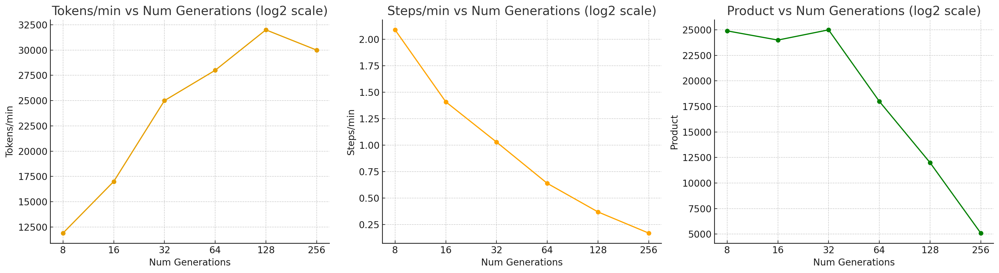
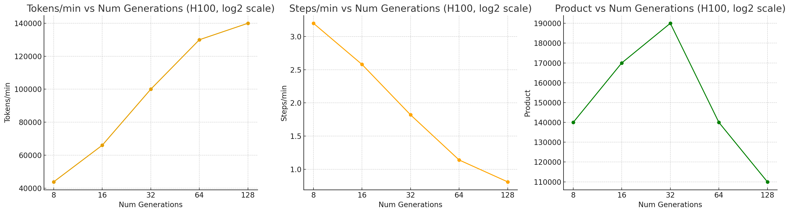
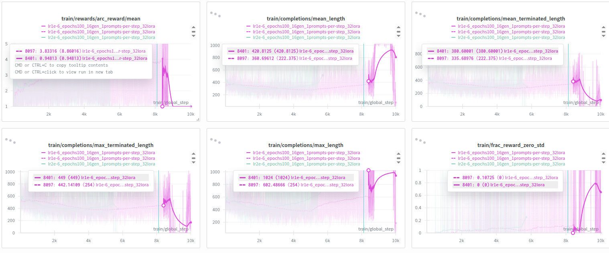
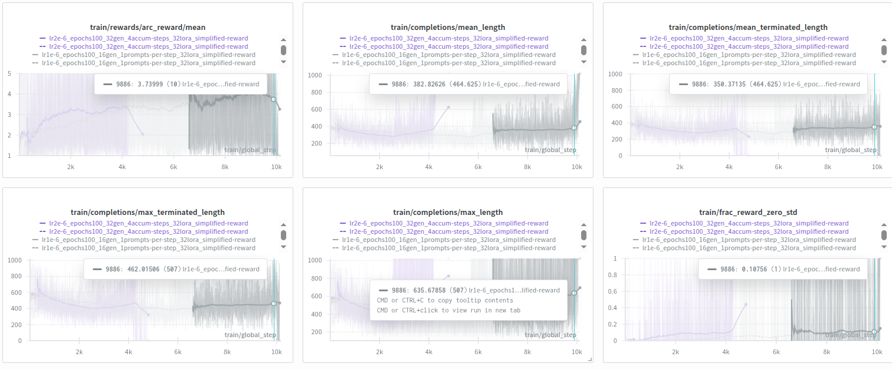

# Iteration 2x. Using RL to improve BARC induction model

_11-09-2025_

<!---
The work is done using short iterations. Each iteration needs to have a very
clear goal. This allows to gain greater knowledge of the problem on each iteration.

<details>
  <summary>Click to expand/collapse this section</summary>
</details>
--->

## Goal

Can I improve the BARC induction model using reinforcement learning?

## Motivation

I have read the [RL guide](https://docs.unsloth.ai/basics/reinforcement-learning-rl-guide) from unsloth
and they say that 300 samples are enough to see an improvement in the model. Probably I will need much
more compute for ARC but I would like to try.

The BARC induction model seems to have non-zero probability of solving the ARC-AGI-1 tasks, RL is
the way to increase that probability.


Ideas for the reward function:

- +1 if the model generates code
- +1 if the model generates running code
- Finally sum the ratio of correct grids. I believe that pixel accuracy is not a good metric, but I could try it also. I have the feeling that ARC is an all or nothing dataset, and pixel accuracy might lead to local optimums instead of leading to the global maximum.

On a first step I could try with a single training task. Then I could move to use all the training tasks.
I would measure the improvement on the training and the evaluation dataset. Finally if the technique
is helpful, I would move to using the synthetic dataset in a following iteration.

An additional motivation is that I have found that I would be able to make 512 predictions at maximum
for task on the Kaggle submission. That would solve just 22% of the ARC-AGI-1 evaluation
tasks. I need a model with a higher pass rate. RL is the way to get that.

## Development

### Thoughts

- As far as I know, the best setup is to use some GPUs for inference and others for training. First
  experiments on my PC will use one 3090 for inference and another for training.
- The trickier part of the configuration is that we need reward signal to be able to learn. I will
  start by using the training tasks from ARC-AGI-1 that have a mean pass rate of 12%. [Source](Iteration_21_fix_bug_with_data.md#accuracy-on-the-different-datasets)
  That is around 1 out of 8 runs. Thus I could be doing 8 or 16 predictions per task and that should
  work. On the evaluation set the pass rate falls to ~2%, requiring to do 64 or 128 predictions per
  task to have some signal. So let's start with the train set and measure if that translates to
  improvements on the model.
- I need to implement a reward function that executes the code generated by the model

### Tutorials

- [Implementing GRPO in TRL](https://huggingface.co/learn/llm-course/en/chapter12/4)

> The group size should be chosen based on your computational resources and the complexity of your task. For simple tasks, smaller groups (4-8) may be sufficient, while more complex reasoning tasks might benefit from larger groups (8-16).

This is very likely related to the probability of solving the task correctly, or at least to have
differences in the reward between the prompts.

- [Official documentation](https://huggingface.co/docs/trl/main/en/grpo_trainer)
- [TRL VLLM server](https://huggingface.co/docs/trl/en/vllm_integration)

Examples of reward functions:

- https://huggingface.co/learn/llm-course/en/chapter12/6?fw=pt#defining-reward-functions

#### Launching the server

```bash
# one gpu
export CUDA_VISIBLE_DEVICES=0; trl vllm-serve --max_model_len 12000 --model /home/gbarbadillo/models/Llama-3.1-ARC-Potpourri-Induction-8B
# multiple gpus
export CUDA_VISIBLE_DEVICES=0,1; trl vllm-serve --max_model_len 12000 --model /home/gbarbadillo/models/Llama-3.1-ARC-Potpourri-Induction-8B --data-parallel-size 2
```

### Modify pad token in the tokenizer configuration

Simply replace the following line on `Llama-3.1-ARC-Potpourri-Induction-8B/tokenizer_config.json`:

```bash
sed -i 's/"pad_token": "<|eot_id|>"/"pad_token": "<|finetune_right_pad_id|>"/' file.json

- "pad_token": "<|eot_id|>",
+ "pad_token": "<|finetune_right_pad_id|>",
```

### Max sequence length

I have studied all the datasets and the longest prompt is always 8635 tokens, corresponding to
tasks with 4 train samples with inputs and outputs of 30x30, and a test sample with the same input
shape.

Thus if I don't want to generate more than 2000 tokens, the max sequence length would be 10635 tokens.

### Kaggle scoring error

- [Valid submission](https://www.kaggle.com/code/ironbar/the-architects-baseline-with-4-gpus/output?scriptVersionId=230202814)
- [Invalid submission](https://www.kaggle.com/code/ironbar/search-and-learn/output?scriptVersionId=261813255)

```bash
python scripts/validate_submission.py --submission-path /mnt/hdd0/Kaggle/arc25/data/arc-prize-2024/sample_submission.json --dataset-path /mnt/hdd0/Kaggle/arc25/data/arc-prize-2024/arc-agi_test_challenges.json

python scripts/validate_submission.py --submission-path /mnt/hdd0/Kaggle/arc25/submissions/evaluation_2025_invalid_submission.json --dataset-path /mnt/hdd0/Kaggle/arc25/data/arc-prize-2025/arc-agi_evaluation_challenges.json

python scripts/validate_submission.py --submission-path /mnt/hdd0/Kaggle/arc25/submissions/test_2025_invalid_submission.json --dataset-path /mnt/hdd0/Kaggle/arc25/data/arc-prize-2025/arc-agi_test_challenges.json
```

### Inference to measure the improvement

```bash
python scripts/inference_with_BARC.py \
--dataset-path /mnt/hdd0/Kaggle/arc25/data/arc-prize-2024/arc-agi_training_challenges.json \
--output-folder /mnt/hdd0/Kaggle/arc25/predictions2025-09-15-debug-grpo/lr1e-5_small-dataset_80epochs_16gens_continue/training \
--lora-path /mnt/hdd0/Kaggle/arc25/trainings/2025-09-15-debug-grpo/lr1e-5_small-dataset_80epochs_16gens_continue/checkpoint-5360 \
--n-predictions 128

python scripts/inference_with_BARC.py \
--dataset-path /mnt/hdd0/Kaggle/arc25/data/arc-prize-2024/arc-agi_evaluation_challenges.json \
--output-folder /mnt/hdd0/Kaggle/arc25/predictions2025-09-15-debug-grpo/lr1e-5_small-dataset_80epochs_16gens_continue/evaluation \
--lora-path /mnt/hdd0/Kaggle/arc25/trainings/2025-09-15-debug-grpo/lr1e-5_small-dataset_80epochs_16gens_continue/checkpoint-5360 \
--n-predictions 128
```

### Number of samples per task


The task with the maximum number of grids is 12. However there are only around ~20 tasks with more than 8 samples per task.

### Reward design

The north start metric is the correct grids, pixel score is use as a tiebreaker.
When code is not parsed reward is -1, and code that creates valids gets a reward of 1 vs code that does not.

Reward scheme:

```
-1: code not parsed
 0: code parsed but does not produce valid results
 1: code produces valid results but accuracy is 0
 1 + 8*correct_grids + pixel_score: code produces valid results with accuracy, [1, 9]
```

Reward is always in range [-1, 10]

### Experiments

#### Local

##### First steps

```bash
python scripts/rl_code_finetuning.py --learning-rate 4e-6 --epochs 80 --warmup-ratio 0.01 --gpu-memory-utilization 0.7 --num-generations 24 --lora-r 32 --output-dir /mnt/hdd0/Kaggle/arc25/trainings/2025-09-15-debug-grpo/lr4e-6_80epochs_24gen_32lora_new-reward

python scripts/rl_code_finetuning.py --learning-rate 1e-5 --epochs 80 --warmup-ratio 0.01 --gpu-memory-utilization 0.7 --num-generations 16 --lora-r 32 --output-dir /mnt/hdd0/Kaggle/arc25/trainings/2025-09-15-debug-grpo/lr1e-5_80epochs_16gen_4prompts-per-step_32lora_new-reward --training-prompts-per-step 4

python scripts/rl_code_finetuning.py --learning-rate 4e-5 --epochs 80 --warmup-ratio 0.01 --gpu-memory-utilization 0.68 --num-generations 16 --lora-r 16 --output-dir /mnt/hdd0/Kaggle/arc25/trainings/2025-09-15-debug-grpo/lr4e-5_80epochs_16gen_4prompts-per-step_16lora_new-reward --training-prompts-per-step 4

# I have updated the script to use a single task per step, maybe I should do a single prompt...
python scripts/rl_code_finetuning.py --learning-rate 4e-5 --epochs 80 --warmup-ratio 0.01 --gpu-memory-utilization 0.68 --num-generations 16 --lora-r 16 --output-dir /mnt/hdd0/Kaggle/arc25/trainings/2025-09-15-debug-grpo/lr4e-5_80epochs_16gen_4prompts-per-step_16lora_prompt-fix --training-prompts-per-step 4

python scripts/rl_code_finetuning.py --learning-rate 2e-5 --epochs 80 --warmup-ratio 0.01 --gpu-memory-utilization 0.67 --num-generations 16 --lora-r 16 --output-dir /mnt/hdd0/Kaggle/arc25/trainings/2025-09-15-debug-grpo/lr2e-5_80epochs_16gen_4prompts-per-step_16lora_prompt-fix-v2 --training-prompts-per-step 4
```

##### Speed test

Let's compare the speed when using gradient accumulation steps. I believe inference shoudl be faster

```bash
export EPOCHS=1
export NUM_GENERATIONS=8; export ACCUM_STEPS=1;  python scripts/rl_code_finetuning.py \
--learning-rate 2e-5 --epochs ${EPOCHS} --warmup-ratio 0.01 --gpu-memory-utilization 0.67 \
--num-generations ${NUM_GENERATIONS} --lora-r 16 --gradient-accumulation-steps ${ACCUM_STEPS} \
--output-dir /mnt/hdd0/Kaggle/arc25/trainings/2025-09-27-rl-speed-test/lr2e-5_${EPOCHS}epochs_${NUM_GENERATIONS}gen_${ACCUM_STEPS}accum-steps_16lora_RTX3090

export NUM_GENERATIONS=16; export ACCUM_STEPS=2; python scripts/rl_code_finetuning.py \
--learning-rate 2e-5 --epochs ${EPOCHS} --warmup-ratio 0.01 --gpu-memory-utilization 0.70 \
--num-generations ${NUM_GENERATIONS} --lora-r 16 --gradient-accumulation-steps ${ACCUM_STEPS} \
--output-dir /mnt/hdd0/Kaggle/arc25/trainings/2025-09-27-rl-speed-test/lr2e-5_${EPOCHS}epochs_${NUM_GENERATIONS}gen_${ACCUM_STEPS}accum-steps_16lora_RTX3090

export NUM_GENERATIONS=32; export ACCUM_STEPS=4; python scripts/rl_code_finetuning.py \
--learning-rate 2e-5 --epochs ${EPOCHS} --warmup-ratio 0.01 --gpu-memory-utilization 0.70 \
--num-generations ${NUM_GENERATIONS} --lora-r 16 --gradient-accumulation-steps ${ACCUM_STEPS} \
--output-dir /mnt/hdd0/Kaggle/arc25/trainings/2025-09-27-rl-speed-test/lr2e-5_${EPOCHS}epochs_${NUM_GENERATIONS}gen_${ACCUM_STEPS}accum-steps_16lora_RTX3090

export NUM_GENERATIONS=64; export ACCUM_STEPS=8; python scripts/rl_code_finetuning.py \
--learning-rate 2e-5 --epochs ${EPOCHS} --warmup-ratio 0.01 --gpu-memory-utilization 0.70 \
--num-generations ${NUM_GENERATIONS} --lora-r 16 --gradient-accumulation-steps ${ACCUM_STEPS} \
--output-dir /mnt/hdd0/Kaggle/arc25/trainings/2025-09-27-rl-speed-test/lr2e-5_${EPOCHS}epochs_${NUM_GENERATIONS}gen_${ACCUM_STEPS}accum-steps_16lora_RTX3090

export NUM_GENERATIONS=128; export ACCUM_STEPS=16; python scripts/rl_code_finetuning.py \
--learning-rate 2e-5 --epochs ${EPOCHS} --warmup-ratio 0.01 --gpu-memory-utilization 0.70 \
--num-generations ${NUM_GENERATIONS} --lora-r 16 --gradient-accumulation-steps ${ACCUM_STEPS} \
--output-dir /mnt/hdd0/Kaggle/arc25/trainings/2025-09-27-rl-speed-test/lr2e-5_${EPOCHS}epochs_${NUM_GENERATIONS}gen_${ACCUM_STEPS}accum-steps_16lora_RTX3090

export NUM_GENERATIONS=256; export ACCUM_STEPS=32; python scripts/rl_code_finetuning.py \
--learning-rate 2e-5 --epochs ${EPOCHS} --warmup-ratio 0.01 --gpu-memory-utilization 0.70 \
--num-generations ${NUM_GENERATIONS} --lora-r 16 --gradient-accumulation-steps ${ACCUM_STEPS} \
--output-dir /mnt/hdd0/Kaggle/arc25/trainings/2025-09-27-rl-speed-test/lr2e-5_${EPOCHS}epochs_${NUM_GENERATIONS}gen_${ACCUM_STEPS}accum-steps_16lora_RTX3090

export EPOCHS=1
export NUM_GENERATIONS=16; export ACCUM_STEPS=1;  python scripts/rl_code_finetuning.py \
--learning-rate 2e-5 --epochs ${EPOCHS} --warmup-ratio 0.01 --gpu-memory-utilization 0.67 \
--num-generations ${NUM_GENERATIONS} --lora-r 16 --gradient-accumulation-steps ${ACCUM_STEPS} \
--output-dir /mnt/hdd0/Kaggle/arc25/trainings/2025-09-27-rl-speed-test/lr2e-5_${EPOCHS}epochs_${NUM_GENERATIONS}gen_${ACCUM_STEPS}accum-steps_16lora_RTX3090
```

##### Scale rewards

Try scale_rewards='batch', https://huggingface.co/docs/trl/main/en/grpo_trainer#trl.GRPOConfig, this migth reduce the frac_std_reward_zero

```bash
export EPOCHS=1
export NUM_GENERATIONS=8; export ACCUM_STEPS=2;  python scripts/rl_code_finetuning.py \
--learning-rate 2e-5 --epochs ${EPOCHS} --warmup-ratio 0.01 --gpu-memory-utilization 0.70 \
--num-generations ${NUM_GENERATIONS} --lora-r 16 --gradient-accumulation-steps ${ACCUM_STEPS} \
--output-dir /mnt/hdd0/Kaggle/arc25/trainings/2025-09-28-rl-scale-rewards/lr2e-5_${EPOCHS}epochs_${NUM_GENERATIONS}gen_${ACCUM_STEPS}accum-steps_16lora_baseline

export EPOCHS=1
export NUM_GENERATIONS=8; export ACCUM_STEPS=2;  python scripts/rl_code_finetuning.py \
--learning-rate 2e-5 --epochs ${EPOCHS} --warmup-ratio 0.01 --gpu-memory-utilization 0.70 \
--num-generations ${NUM_GENERATIONS} --lora-r 16 --gradient-accumulation-steps ${ACCUM_STEPS} \
--scale-rewards batch \
--output-dir /mnt/hdd0/Kaggle/arc25/trainings/2025-09-28-rl-scale-rewards/lr2e-5_${EPOCHS}epochs_${NUM_GENERATIONS}gen_${ACCUM_STEPS}accum-steps_16lora_batch

export EPOCHS=1
export NUM_GENERATIONS=8; export ACCUM_STEPS=4;  python scripts/rl_code_finetuning.py \
--learning-rate 2e-5 --epochs ${EPOCHS} --warmup-ratio 0.01 --gpu-memory-utilization 0.70 \
--num-generations ${NUM_GENERATIONS} --lora-r 16 --gradient-accumulation-steps ${ACCUM_STEPS} \
--scale-rewards group \
--output-dir /mnt/hdd0/Kaggle/arc25/trainings/2025-09-28-rl-scale-rewards/lr2e-5_${EPOCHS}epochs_${NUM_GENERATIONS}gen_${ACCUM_STEPS}accum-steps_16lora_group

export EPOCHS=1
export NUM_GENERATIONS=8; export ACCUM_STEPS=4;  python scripts/rl_code_finetuning.py \
--learning-rate 2e-5 --epochs ${EPOCHS} --warmup-ratio 0.01 --gpu-memory-utilization 0.70 \
--num-generations ${NUM_GENERATIONS} --lora-r 16 --gradient-accumulation-steps ${ACCUM_STEPS} \
--scale-rewards batch \
--output-dir /mnt/hdd0/Kaggle/arc25/trainings/2025-09-28-rl-scale-rewards/lr2e-5_${EPOCHS}epochs_${NUM_GENERATIONS}gen_${ACCUM_STEPS}accum-steps_16lora_batch
```

#### Cluster

##### Speed test

Let's compare the speed when using gradient accumulation steps. I believe inference shoudl be faster

```bash
export EPOCHS=1
export FOLDER=2025-09-27-rl-speed-test
export LEARNING_RATE=1e-6
export N_CPUS=20
export LORA_R=32
export NUM_GENERATIONS=8; export ACUM_STEPS=1; condor_submit train.condor command=" 
python /mnt/scratch/users/gbarbadillo/arc25/arc25/scripts/rl_code_finetuning.py \
--num-generations ${NUM_GENERATIONS} \
--gradient-accumulation-steps ${ACUM_STEPS} \
--lora_r ${LORA_R} \
--epochs ${EPOCHS} \
--gpu_memory_utilization 0.3 \
--warmup-ratio 0.01 \
--max-seq-length 9700 \
--max-completion-length 1024 \
--learning-rate ${LEARNING_RATE} \
--n-jobs ${N_CPUS} \
--model-path /mnt/scratch/users/gbarbadillo/arc25/models/Llama-3.1-ARC-Potpourri-Induction-8B \
--dataset-path /mnt/scratch/users/gbarbadillo/arc25/data/arc-prize-2024/arc-agi_training_challenges.json \
--output-dir /mnt/scratch/users/gbarbadillo/arc25/trainings/${FOLDER}/lr${LEARNING_RATE}_epochs${EPOCHS}_${NUM_GENERATIONS}gen_${ACUM_STEPS}accum-steps_${LORA_R}lora_H100" -append request_gpus=1 -append request_cpus=${N_CPUS} -append request_memory=50G --append 'requirements = (TARGET.Machine == "calculon21.das-nano.com")'

export NUM_GENERATIONS=512; export ACUM_STEPS=64; condor_submit train.condor command=" 
python /mnt/scratch/users/gbarbadillo/arc25/arc25/scripts/rl_code_finetuning.py \
--num-generations ${NUM_GENERATIONS} \
--gradient-accumulation-steps ${ACUM_STEPS} \
--lora_r ${LORA_R} \
--epochs ${EPOCHS} \
--gpu_memory_utilization 0.3 \
--warmup-ratio 0.01 \
--max-seq-length 9700 \
--max-completion-length 1024 \
--learning-rate ${LEARNING_RATE} \
--n-jobs ${N_CPUS} \
--model-path /mnt/scratch/users/gbarbadillo/arc25/models/Llama-3.1-ARC-Potpourri-Induction-8B \
--dataset-path /mnt/scratch/users/gbarbadillo/arc25/data/arc-prize-2024/arc-agi_training_challenges.json \
--output-dir /mnt/scratch/users/gbarbadillo/arc25/trainings/${FOLDER}/lr${LEARNING_RATE}_epochs${EPOCHS}_${NUM_GENERATIONS}gen_${ACUM_STEPS}accum-steps_${LORA_R}lora_H100" -append request_gpus=1 -append request_cpus=${N_CPUS} -append request_memory=50G --append 'requirements = (TARGET.Machine == "calculon21.das-nano.com")'

```

##### Trainings

```bash
export FOLDER=2025-09-19-rl-first-steps
export LEARNING_RATE=1e-6
export NUM_GENERATIONS=16
export PROMPTS_PER_STEP=1
export N_CPUS=20
export LORA_R=32
export EPOCHS=100; condor_submit train.condor command=" 
python /mnt/scratch/users/gbarbadillo/arc25/arc25/scripts/rl_code_finetuning.py \
--gpu_memory_utilization 0.3 \
--lora_r ${LORA_R} \
--warmup-ratio 0.01 \
--num-generations ${NUM_GENERATIONS} \
--epochs ${EPOCHS} \
--max-seq-length 9700 \
--max-completion-length 1024 \
--learning-rate ${LEARNING_RATE} \
--gradient-accumulation-steps ${PROMPTS_PER_STEP} \
--n-jobs ${N_CPUS} \
--model-path /mnt/scratch/users/gbarbadillo/arc25/models/Llama-3.1-ARC-Potpourri-Induction-8B \
--dataset-path /mnt/scratch/users/gbarbadillo/arc25/data/arc-prize-2024/arc-agi_training_challenges.json \
--output-dir /mnt/scratch/users/gbarbadillo/arc25/trainings/${FOLDER}/lr${LEARNING_RATE}_epochs${EPOCHS}_${NUM_GENERATIONS}gen_${PROMPTS_PER_STEP}prompts-per-step_${LORA_R}lora_simplified-reward" -append request_gpus=1 -append request_cpus=${N_CPUS} -append request_memory=200G --append 'requirements = (TARGET.Machine == "calculon21.das-nano.com")'
237770.0 # OOM when using 128GB of RAM
237843.0 # CUDA error: an illegal memory access was encountered
237995.0 # at step 10117 it is collapsing

export FOLDER=2025-09-19-rl-first-steps
export LEARNING_RATE=2e-6
export NUM_GENERATIONS=32
export ACUM_STEPS=4
export N_CPUS=20
export LORA_R=32
export EPOCHS=100; condor_submit train.condor command=" 
python /mnt/scratch/users/gbarbadillo/arc25/arc25/scripts/rl_code_finetuning.py \
--num-generations ${NUM_GENERATIONS} \
--gradient-accumulation-steps ${ACUM_STEPS} \
--learning-rate ${LEARNING_RATE} \
--lora_r ${LORA_R} \
--gpu_memory_utilization 0.3 \
--warmup-ratio 0.01 \
--epochs ${EPOCHS} \
--max-seq-length 9700 \
--max-completion-length 1024 \
--n-jobs ${N_CPUS} \
--model-path /mnt/scratch/users/gbarbadillo/arc25/models/Llama-3.1-ARC-Potpourri-Induction-8B \
--dataset-path /mnt/scratch/users/gbarbadillo/arc25/data/arc-prize-2024/arc-agi_training_challenges.json \
--output-dir /mnt/scratch/users/gbarbadillo/arc25/trainings/${FOLDER}/lr${LEARNING_RATE}_epochs${EPOCHS}_${NUM_GENERATIONS}gen_${ACUM_STEPS}accum-steps_${LORA_R}lora_simplified-reward" -append request_gpus=1 -append request_cpus=${N_CPUS} -append request_memory=90G --append 'requirements = (TARGET.Machine == "calculon21.das-nano.com")'
237996.0 # OOM with 54GB of RAM, relaunched with 128GB
# Training has collapsed after 4k steps, but there were signs after step 2400

# first training with scale rewards
export FOLDER=2025-09-19-rl-first-steps
export LEARNING_RATE=2e-6
export NUM_GENERATIONS=64
export ACUM_STEPS=8
export N_CPUS=20
export LORA_R=32
export EPOCHS=100; condor_submit train.condor command=" 
python /mnt/scratch/users/gbarbadillo/arc25/arc25/scripts/rl_code_finetuning.py \
--num-generations ${NUM_GENERATIONS} \
--gradient-accumulation-steps ${ACUM_STEPS} \
--learning-rate ${LEARNING_RATE} \
--lora_r ${LORA_R} \
--epochs ${EPOCHS} \
--scale-rewards batch \
--gpu_memory_utilization 0.3 \
--warmup-ratio 0.01 \
--max-seq-length 9700 \
--max-completion-length 1024 \
--n-jobs ${N_CPUS} \
--model-path /mnt/scratch/users/gbarbadillo/arc25/models/Llama-3.1-ARC-Potpourri-Induction-8B \
--dataset-path /mnt/scratch/users/gbarbadillo/arc25/data/arc-prize-2024/arc-agi_training_challenges.json \
--output-dir /mnt/scratch/users/gbarbadillo/arc25/trainings/${FOLDER}/lr${LEARNING_RATE}_epochs${EPOCHS}_${NUM_GENERATIONS}gen_${ACUM_STEPS}accum-steps_${LORA_R}lora_simplified-reward" -append request_gpus=1 -append request_cpus=${N_CPUS} -append request_memory=90G --append 'requirements = (TARGET.Machine == "calculon21.das-nano.com")'


# Experiments to avoid training collapse
mkdir trainings/2025-09-19-rl-first-steps/lr2e-6_epochs100_32gen_4accum-steps_32lora_simplified-reward_repetition-penalty-1.2
cp -r trainings/2025-09-19-rl-first-steps/lr2e-6_epochs100_32gen_4accum-steps_32lora_simplified-reward/checkpoint-2400 trainings/2025-09-19-rl-first-steps/lr2e-6_epochs100_32gen_4accum-steps_32lora_simplified-reward_repetition-penalty-1.2
mkdir trainings/2025-09-19-rl-first-steps/lr2e-6_epochs100_32gen_4accum-steps_32lora_simplified-reward_unmasked-truncated-completions
cp -r trainings/2025-09-19-rl-first-steps/lr2e-6_epochs100_32gen_4accum-steps_32lora_simplified-reward/checkpoint-2400 trainings/2025-09-19-rl-first-steps/lr2e-6_epochs100_32gen_4accum-steps_32lora_simplified-reward_unmasked-truncated-completions

export FOLDER=2025-09-19-rl-first-steps
export LEARNING_RATE=2e-6
export NUM_GENERATIONS=32
export ACUM_STEPS=4
export N_CPUS=20
export LORA_R=32
export REPETITION_PENALTY=1.2
export EPOCHS=100; condor_submit train.condor command=" 
python /mnt/scratch/users/gbarbadillo/arc25/arc25/scripts/rl_code_finetuning.py \
--num-generations ${NUM_GENERATIONS} \
--gradient-accumulation-steps ${ACUM_STEPS} \
--learning-rate ${LEARNING_RATE} \
--lora_r ${LORA_R} \
--repetition-penalty ${REPETITION_PENALTY} \
--epochs ${EPOCHS} \
--scale-rewards batch \
--gpu_memory_utilization 0.3 \
--warmup-ratio 0.01 \
--max-seq-length 9700 \
--max-completion-length 1024 \
--n-jobs ${N_CPUS} \
--model-path /mnt/scratch/users/gbarbadillo/arc25/models/Llama-3.1-ARC-Potpourri-Induction-8B \
--dataset-path /mnt/scratch/users/gbarbadillo/arc25/data/arc-prize-2024/arc-agi_training_challenges.json \
--output-dir /mnt/scratch/users/gbarbadillo/arc25/trainings/${FOLDER}/lr${LEARNING_RATE}_epochs${EPOCHS}_${NUM_GENERATIONS}gen_${ACUM_STEPS}accum-steps_${LORA_R}lora_simplified-reward_repetition-penalty-${REPETITION_PENALTY}" -append request_gpus=1 -append request_cpus=${N_CPUS} -append request_memory=128G --append 'requirements = (TARGET.Machine == "calculon21.das-nano.com")'
# 238016.0, penalty seems to be too high, collapses with weird text

export FOLDER=2025-09-19-rl-first-steps
export LEARNING_RATE=2e-6
export NUM_GENERATIONS=32
export ACUM_STEPS=4
export N_CPUS=20
export LORA_R=32
export EPOCHS=100; condor_submit train.condor command=" 
python /mnt/scratch/users/gbarbadillo/arc25/arc25/scripts/rl_code_finetuning.py \
--num-generations ${NUM_GENERATIONS} \
--gradient-accumulation-steps ${ACUM_STEPS} \
--learning-rate ${LEARNING_RATE} \
--lora_r ${LORA_R} \
--epochs ${EPOCHS} \
--no-mask-truncated-completions \
--scale-rewards batch \
--gpu_memory_utilization 0.3 \
--warmup-ratio 0.01 \
--max-seq-length 9700 \
--max-completion-length 1024 \
--n-jobs ${N_CPUS} \
--model-path /mnt/scratch/users/gbarbadillo/arc25/models/Llama-3.1-ARC-Potpourri-Induction-8B \
--dataset-path /mnt/scratch/users/gbarbadillo/arc25/data/arc-prize-2024/arc-agi_training_challenges.json \
--output-dir /mnt/scratch/users/gbarbadillo/arc25/trainings/${FOLDER}/lr${LEARNING_RATE}_epochs${EPOCHS}_${NUM_GENERATIONS}gen_${ACUM_STEPS}accum-steps_${LORA_R}lora_simplified-reward_unmasked-truncated-completions" -append request_gpus=1 -append request_cpus=${N_CPUS} -append request_memory=128G --append 'requirements = (TARGET.Machine == "calculon21.das-nano.com")'
# 238017.0

export REPETITION_PENALTY=1.1
mkdir trainings/2025-09-19-rl-first-steps/lr2e-6_epochs100_32gen_4accum-steps_32lora_simplified-reward_repetition-penalty-${REPETITION_PENALTY}
cp -r trainings/2025-09-19-rl-first-steps/lr2e-6_epochs100_32gen_4accum-steps_32lora_simplified-reward/checkpoint-2400 trainings/2025-09-19-rl-first-steps/lr2e-6_epochs100_32gen_4accum-steps_32lora_simplified-reward_repetition-penalty-${REPETITION_PENALTY}
export FOLDER=2025-09-19-rl-first-steps
export LEARNING_RATE=2e-6
export NUM_GENERATIONS=32
export ACUM_STEPS=4
export N_CPUS=20
export LORA_R=32
export EPOCHS=100; condor_submit train.condor command=" 
python /mnt/scratch/users/gbarbadillo/arc25/arc25/scripts/rl_code_finetuning.py \
--num-generations ${NUM_GENERATIONS} \
--gradient-accumulation-steps ${ACUM_STEPS} \
--learning-rate ${LEARNING_RATE} \
--lora_r ${LORA_R} \
--repetition-penalty ${REPETITION_PENALTY} \
--epochs ${EPOCHS} \
--scale-rewards batch \
--gpu_memory_utilization 0.3 \
--warmup-ratio 0.01 \
--max-seq-length 9700 \
--max-completion-length 1024 \
--n-jobs ${N_CPUS} \
--model-path /mnt/scratch/users/gbarbadillo/arc25/models/Llama-3.1-ARC-Potpourri-Induction-8B \
--dataset-path /mnt/scratch/users/gbarbadillo/arc25/data/arc-prize-2024/arc-agi_training_challenges.json \
--output-dir /mnt/scratch/users/gbarbadillo/arc25/trainings/${FOLDER}/lr${LEARNING_RATE}_epochs${EPOCHS}_${NUM_GENERATIONS}gen_${ACUM_STEPS}accum-steps_${LORA_R}lora_simplified-reward_repetition-penalty-${REPETITION_PENALTY}" -append request_gpus=1 -append request_cpus=${N_CPUS} -append request_memory=128G --append 'requirements = (TARGET.Machine == "calculon21.das-nano.com")'
# 238138., penalty seems to be too high, collapses with weird text

export REPETITION_PENALTY=1.05
mkdir trainings/2025-09-19-rl-first-steps/lr2e-6_epochs100_32gen_4accum-steps_32lora_simplified-reward_repetition-penalty-${REPETITION_PENALTY}
cp -r trainings/2025-09-19-rl-first-steps/lr2e-6_epochs100_32gen_4accum-steps_32lora_simplified-reward/checkpoint-2400 trainings/2025-09-19-rl-first-steps/lr2e-6_epochs100_32gen_4accum-steps_32lora_simplified-reward_repetition-penalty-${REPETITION_PENALTY}
export FOLDER=2025-09-19-rl-first-steps
export LEARNING_RATE=2e-6
export NUM_GENERATIONS=32
export ACUM_STEPS=4
export N_CPUS=20
export LORA_R=32
export EPOCHS=100; condor_submit train.condor command=" 
python /mnt/scratch/users/gbarbadillo/arc25/arc25/scripts/rl_code_finetuning.py \
--num-generations ${NUM_GENERATIONS} \
--gradient-accumulation-steps ${ACUM_STEPS} \
--learning-rate ${LEARNING_RATE} \
--lora_r ${LORA_R} \
--repetition-penalty ${REPETITION_PENALTY} \
--epochs ${EPOCHS} \
--scale-rewards batch \
--gpu_memory_utilization 0.3 \
--warmup-ratio 0.01 \
--max-seq-length 9700 \
--max-completion-length 1024 \
--n-jobs ${N_CPUS} \
--model-path /mnt/scratch/users/gbarbadillo/arc25/models/Llama-3.1-ARC-Potpourri-Induction-8B \
--dataset-path /mnt/scratch/users/gbarbadillo/arc25/data/arc-prize-2024/arc-agi_training_challenges.json \
--output-dir /mnt/scratch/users/gbarbadillo/arc25/trainings/${FOLDER}/lr${LEARNING_RATE}_epochs${EPOCHS}_${NUM_GENERATIONS}gen_${ACUM_STEPS}accum-steps_${LORA_R}lora_simplified-reward_repetition-penalty-${REPETITION_PENALTY}" -append request_gpus=1 -append request_cpus=${N_CPUS} -append request_memory=128G --append 'requirements = (TARGET.Machine == "calculon21.das-nano.com")'
# 238182., collapses but on a weird way


export REPETITION_PENALTY=1.02
mkdir trainings/2025-09-19-rl-first-steps/lr2e-6_epochs100_32gen_4accum-steps_32lora_simplified-reward_repetition-penalty-${REPETITION_PENALTY}
cp -r trainings/2025-09-19-rl-first-steps/lr2e-6_epochs100_32gen_4accum-steps_32lora_simplified-reward/checkpoint-2400 trainings/2025-09-19-rl-first-steps/lr2e-6_epochs100_32gen_4accum-steps_32lora_simplified-reward_repetition-penalty-${REPETITION_PENALTY}
export FOLDER=2025-09-19-rl-first-steps
export LEARNING_RATE=2e-6
export NUM_GENERATIONS=32
export ACUM_STEPS=4
export N_CPUS=20
export LORA_R=32
export EPOCHS=100; condor_submit train.condor command=" 
python /mnt/scratch/users/gbarbadillo/arc25/arc25/scripts/rl_code_finetuning.py \
--num-generations ${NUM_GENERATIONS} \
--gradient-accumulation-steps ${ACUM_STEPS} \
--learning-rate ${LEARNING_RATE} \
--lora_r ${LORA_R} \
--repetition-penalty ${REPETITION_PENALTY} \
--epochs ${EPOCHS} \
--scale-rewards batch \
--gpu_memory_utilization 0.3 \
--warmup-ratio 0.01 \
--max-seq-length 9700 \
--max-completion-length 1024 \
--n-jobs ${N_CPUS} \
--model-path /mnt/scratch/users/gbarbadillo/arc25/models/Llama-3.1-ARC-Potpourri-Induction-8B \
--dataset-path /mnt/scratch/users/gbarbadillo/arc25/data/arc-prize-2024/arc-agi_training_challenges.json \
--output-dir /mnt/scratch/users/gbarbadillo/arc25/trainings/${FOLDER}/lr${LEARNING_RATE}_epochs${EPOCHS}_${NUM_GENERATIONS}gen_${ACUM_STEPS}accum-steps_${LORA_R}lora_simplified-reward_repetition-penalty-${REPETITION_PENALTY}" -append request_gpus=1 -append request_cpus=${N_CPUS} -append request_memory=128G --append 'requirements = (TARGET.Machine == "calculon21.das-nano.com")'
# 239015.0

export REPETITION_PENALTY=1.01
mkdir trainings/2025-09-19-rl-first-steps/lr2e-6_epochs100_32gen_4accum-steps_32lora_simplified-reward_repetition-penalty-${REPETITION_PENALTY}
cp -r trainings/2025-09-19-rl-first-steps/lr2e-6_epochs100_32gen_4accum-steps_32lora_simplified-reward/checkpoint-2400 trainings/2025-09-19-rl-first-steps/lr2e-6_epochs100_32gen_4accum-steps_32lora_simplified-reward_repetition-penalty-${REPETITION_PENALTY}
export FOLDER=2025-09-19-rl-first-steps
export LEARNING_RATE=2e-6
export NUM_GENERATIONS=32
export ACUM_STEPS=4
export N_CPUS=20
export LORA_R=32
export EPOCHS=100; condor_submit train.condor command=" 
python /mnt/scratch/users/gbarbadillo/arc25/arc25/scripts/rl_code_finetuning.py \
--num-generations ${NUM_GENERATIONS} \
--gradient-accumulation-steps ${ACUM_STEPS} \
--learning-rate ${LEARNING_RATE} \
--lora_r ${LORA_R} \
--repetition-penalty ${REPETITION_PENALTY} \
--epochs ${EPOCHS} \
--scale-rewards batch \
--gpu_memory_utilization 0.3 \
--warmup-ratio 0.01 \
--max-seq-length 9700 \
--max-completion-length 1024 \
--n-jobs ${N_CPUS} \
--model-path /mnt/scratch/users/gbarbadillo/arc25/models/Llama-3.1-ARC-Potpourri-Induction-8B \
--dataset-path /mnt/scratch/users/gbarbadillo/arc25/data/arc-prize-2024/arc-agi_training_challenges.json \
--output-dir /mnt/scratch/users/gbarbadillo/arc25/trainings/${FOLDER}/lr${LEARNING_RATE}_epochs${EPOCHS}_${NUM_GENERATIONS}gen_${ACUM_STEPS}accum-steps_${LORA_R}lora_simplified-reward_repetition-penalty-${REPETITION_PENALTY}" -append request_gpus=1 -append request_cpus=${N_CPUS} -append request_memory=128G --append 'requirements = (TARGET.Machine == "calculon21.das-nano.com")'
# 239013.0

## Start from zero
export REPETITION_PENALTY=1.05
export FOLDER=2025-09-19-rl-first-steps
export LEARNING_RATE=1e-6
export NUM_GENERATIONS=16
export ACUM_STEPS=2
export N_CPUS=20
export LORA_R=32
export EPOCHS=100
export EXPERIMENT_NAME=lr${LEARNING_RATE}_epochs${EPOCHS}_${NUM_GENERATIONS}gen_${ACUM_STEPS}accum-steps_${LORA_R}lora_repetition-penalty-${REPETITION_PENALTY}_masked-truncate
condor_submit train.condor command=" 
python /mnt/scratch/users/gbarbadillo/arc25/arc25/scripts/rl_code_finetuning.py \
--num-generations ${NUM_GENERATIONS} \
--gradient-accumulation-steps ${ACUM_STEPS} \
--learning-rate ${LEARNING_RATE} \
--lora_r ${LORA_R} \
--repetition-penalty ${REPETITION_PENALTY} \
--epochs ${EPOCHS} \
--mask-truncated-completions \
--scale-rewards batch \
--gpu_memory_utilization 0.3 \
--warmup-ratio 0.01 \
--max-seq-length 9700 \
--max-completion-length 1024 \
--n-jobs ${N_CPUS} \
--model-path /mnt/scratch/users/gbarbadillo/arc25/models/Llama-3.1-ARC-Potpourri-Induction-8B \
--dataset-path /mnt/scratch/users/gbarbadillo/arc25/data/arc-prize-2024/arc-agi_training_challenges.json \
--output-dir /mnt/scratch/users/gbarbadillo/arc25/trainings/${FOLDER}/${EXPERIMENT_NAME}" -append request_gpus=1 -append request_cpus=${N_CPUS} -append request_memory=128G --append 'requirements = (TARGET.Machine == "calculon21.das-nano.com")'
240688.0

export REPETITION_PENALTY=1.05
export FOLDER=2025-09-19-rl-first-steps
export LEARNING_RATE=1e-6
export NUM_GENERATIONS=16
export ACUM_STEPS=2
export N_CPUS=20
export LORA_R=32
export EPOCHS=100
export EXPERIMENT_NAME=lr${LEARNING_RATE}_epochs${EPOCHS}_${NUM_GENERATIONS}gen_${ACUM_STEPS}accum-steps_${LORA_R}lora_repetition-penalty-${REPETITION_PENALTY}_unmasked-truncate
condor_submit train.condor command=" 
python /mnt/scratch/users/gbarbadillo/arc25/arc25/scripts/rl_code_finetuning.py \
--num-generations ${NUM_GENERATIONS} \
--gradient-accumulation-steps ${ACUM_STEPS} \
--learning-rate ${LEARNING_RATE} \
--lora_r ${LORA_R} \
--repetition-penalty ${REPETITION_PENALTY} \
--epochs ${EPOCHS} \
--no-mask-truncated-completions \
--scale-rewards batch \
--gpu_memory_utilization 0.3 \
--warmup-ratio 0.01 \
--max-seq-length 9700 \
--max-completion-length 1024 \
--n-jobs ${N_CPUS} \
--model-path /mnt/scratch/users/gbarbadillo/arc25/models/Llama-3.1-ARC-Potpourri-Induction-8B \
--dataset-path /mnt/scratch/users/gbarbadillo/arc25/data/arc-prize-2024/arc-agi_training_challenges.json \
--output-dir /mnt/scratch/users/gbarbadillo/arc25/trainings/${FOLDER}/${EXPERIMENT_NAME}" -append request_gpus=1 -append request_cpus=${N_CPUS} -append request_memory=128G --append 'requirements = (TARGET.Machine == "calculon21.das-nano.com")'
240689.0
```

### Training collapse

https://wandb.ai/guillermobarbadillo/2025-09-19-rl-first-steps/runs/9lvckhn0/logs

<details>
  <summary>Click to expand/collapse this section</summary>


```
2025-09-25 12:56:23 ```python
2025-09-25 12:56:23 from common import *
2025-09-25 12:56:23 
2025-09-25 12:56:23 import pattern detection as pattern
2025-09-25 12:56:23 from the input, you will see a vertical sequence of alternating patterns of alternating patterns in a pattern of alternating patterns in a vertical sequence of alternating patterns in a 3x3 pattern. The pattern of a pattern is a pattern of alternating patterns in a 3x3 pattern.
2025-09-25 12:56:23 
2025-09-25 12:56:23 ```patterns in a 3x1 vertical pattern. The pattern of a pattern is a pattern of alternating patterns in a vertical sequence of alternating patterns in a 3x1 pattern in a 3x1 pattern in a 3x1 pattern. The pattern of a pattern in a 3x1 pattern in a 3x1 pattern in a 3x1 pattern in a 1 pattern in a 1 pattern in a pattern in a 1 pattern in a pattern in a pattern in a pattern in a pattern in a pattern in a pattern in a pattern in a pattern in a pattern in a pattern in a pattern in a pattern in a pattern in a pattern in a pattern in a pattern in a pattern in a pattern in a pattern in a pattern in a pattern in a pattern in a pattern in a vertical pattern in a pattern in a pattern in a pattern in a pattern in a pattern in a pattern in a pattern in a pattern in a pattern in a pattern in a pattern in a pattern in a pattern in a pattern in a pattern in a pattern in a pattern in a pattern in a pattern in a pattern in a pattern in a pattern in a pattern in a pattern in a pattern in a pattern in a pattern in a pattern in a pattern in a pattern in a pattern in a pattern in a pattern in a pattern in a pattern in a pattern in a pattern in a pattern in a pattern in a pattern in a pattern in a pattern in a pattern in a pattern in a pattern in a pattern in a pattern in a pattern in a pattern in a pattern in a pattern in a pattern in a pattern in a pattern in a pattern in a pattern in a pattern in a1 pattern in a pattern in a pattern in a pattern in a pattern in a pattern in a pattern in a pattern in a pattern in a pattern in a pattern in a pattern in a pattern in a pattern in a pattern in a pattern in a pattern in a pattern in a pattern in a pattern in a pattern in a pattern in a pattern in a pattern in a pattern in a pattern in a pattern in a pattern in a pattern in a pattern in a pattern in a pattern in a pattern in a pattern in a pattern in a pattern in a pattern in a pattern in a pattern in a pattern in a pattern in a pattern in a pattern in a pattern in a pattern in a pattern in a pattern in a pattern in a pattern in a vertical pattern in a pattern in a pattern in a pattern in a pattern in a pattern in a pattern in a pattern in a pattern in a pattern in a pattern in a pattern in a pattern in a a pattern in a pattern in a pattern in a pattern in a pattern in a pattern in a pattern in a pattern in a pattern in a pattern in a pattern in a pattern in a pattern in a pattern in a pattern in a pattern in a pattern in a pattern in a pattern in a pattern in a pattern in a pattern in a pattern in a pattern in a pattern in a vertical pattern in a pattern in a pattern in a pattern in a pattern in a pattern in a pattern in a pattern in a pattern in a pattern in a pattern in a pattern in a pattern in a pattern in a pattern in a vertical pattern in a pattern in a pattern in a pattern in a pattern in a pattern in a pattern in a pattern in a pattern in a pattern in a pattern in a pattern in a vertical pattern in a pattern in a pattern in a pattern in a pattern in a pattern in a pattern in a pattern in a pattern in a pattern in a pattern in a pattern in a pattern in a pattern in a pattern in a pattern in a pattern in a pattern in a pattern in a pattern in a pattern in a pattern in a pattern in a pattern in a pattern in a pattern in a pattern in a pattern in a pattern in a pattern in a pattern in a pattern in a pattern in a pattern in a pattern in a pattern in a pattern in a pattern in a pattern in a pattern in a pattern in a vertical pattern in a pattern in a pattern in a pattern in a pattern in a pattern in a pattern in a pattern in a pattern in a pattern in a pattern in a pattern in a pattern in a pattern in a pattern in a pattern in a pattern in a pattern in a pattern in a pattern in a pattern in a pattern in a pattern in a pattern in a pattern in a pattern in a pattern in a pattern in a pattern in a pattern in a pattern in a pattern in a pattern in a pattern in a pattern in a pattern in a pattern in a vertical pattern in a pattern in a pattern in a pattern in a pattern in a pattern in a pattern in a pattern in a pattern in a pattern in
2025-09-25 12:56:23 2025-09-25 14:56:23,927 - arc25.logging - INFO - wrapper - Executed arc_reward in 0.0321 seconds
```

In this case we would be able to parse python code, so it won't get a reward of -1 but a reward of 0.

</details>

I'm going to update the reward to don't make distinctions between code not parsed an unvalid output.
That might prevent training collapsing. Other option would be to use some penalty over repeated text.
And other option would be to use unfinished responses for training that would get reward 0.

I have already done a few experiments with the simplified reward and collapse still happens.

### Evaluation

```bash
python scripts/inference_with_BARC.py \
--dataset-path /mnt/hdd0/Kaggle/arc25/data/arc-prize-2024/arc-agi_evaluation_challenges.json \
--output-folder /mnt/hdd0/Kaggle/arc25/predictions/2025-09-19-rl-first-steps/lr1e-6_epochs100_16gen_1prompts-per-step_32lora/evaluation \
--lora-path /mnt/hdd0/MEGA/TEMP/trainings/2025-09-19-rl-first-steps/lr1e-6_epochs100_16gen_1prompts-per-step_32lora/checkpoint-8400 \
--n-predictions 240
```

## Results

### Reward is not improving on first experiments

<https://wandb.ai/guillermobarbadillo/2025-09-14-debug-grpo>

On a first step I'm training on a single task to see if the reward improves over training.


Sadly reward doesn't seem to change. Maybe I'm using a too small learning rate. Let's use a
constant with warmup schedule and try different learning rates.

What could be explaining that the reward is not improving (model not learning):

- Learning rate might be too small.
- Maybe unsloth does not work well when using server model. However I have tried without a server and got OOM error.
- Data augmentation could be making the problem harder
- Maybe the reward is not good enough
- I might have to wait for longer
- Maybe the model needs more capacity, I could increase the LoRA size.
- Some parameter might be hurting, such as `completion_only_loss=True,`

TODO: I'm going to use a very high learning rate to try to destroy the policy.
However it did not have any effect.

Then I have tried using trl without unsloth. Then I have noticed problems in the server, it does not
seem to support LoRA. My hypothesis is that unsloth was not trying to modify the weights.

TODO: play with the smallest possible task so I can check if it works:
1. Unsloth without server
2. TRL with server

Solution: It seems that unsloth does not support the trl server, and wasn't update the server. I have
been able to train on one of the smallest task with unsloth and without server and it is clearly learning
because if I use a small learning rate the average reward stays flat, but if I use a proper learning
rate raises. I can see that with just 20 training steps, because I'm using the same task and no
data augmentation for this experiment.


### Local experiments with ~70 shortest training tasks

https://wandb.ai/guillermobarbadillo/2025-09-15-debug-grpo?nw=nwuserguillermobarbadillo

- A learning rate of 2e-5 is too high, 1e-5 seems to work but not sure if it's optimal.
- Cannot use more than 16 generations per prompt because it gives OOM error
- Cannot use Lora 32 because it also gives OOM
- I have been able to train with gradient accumulation, training is slower but seems to be more stable. I had
  to repeat the prompt n times for each gradient accumulation step.
- It seems that 40 epochs might be a good training duration (check graph below). Training for 40 epochs
  improves the reward over training just for 10 epochs, but training for longer did not brought better results.


### Cluster experiments with the whole ARC-AGI-1 training set

https://wandb.ai/guillermobarbadillo/2025-09-19-rl-first-steps?nw=nwuserguillermobarbadillo

- After more than 30 hours of training I don't see a clear improvement in the reward.
- Let's do experiments with a single prompt per step, increase LoRA capacity to 32, 32 generations per prompt and try also decreasing the learning rate.
- Jobs that do 32 generations per prompt have huge spikes in RAM use, more than 200GB that result on condor stopping the jobs. (235635., 235638.).
  Normal jobs only seem to require 7GB. But when trying to lower the RAM requirements I got problems, so I had to use 128GB at minimum.
- I don't know why, but some trainings collapse and suddenly start doing long predictions. I'm working to understand and solve the problem.
  Otherwise I cannot train for long with the whole training set.

### Evaluation of first model trained with RL on all training tasks

| dataset     | experiment   | n_preds | valid code  | valid outputs | unique outputs | train_pixel_score | train_correct_grids | train_pass_rate | train_is_correct | test_pixel_score | test_correct_grids | test_pass_rate | test_is_correct | is_correct |
|-------------|--------------|---------|-------------|---------------|----------------|-------------------|---------------------|-----------------|------------------|------------------|--------------------|----------------|-----------------|------------|
| evaluation  | baseline     | 480     | **100.00%** | 70.87%        | **43.82%**     | 41.30%            | 2.07%               | 1.34%           | 22.50%           | 40.21%           | 1.71%              | 1.68%          | 28.50%          | 22.25%     |
| evaluation  | RL all tasks | 480     | 96.17%      | **81.92%**    | 35.98%         | **56.24%**        | **6.76%**           | **4.60%**       | **27.75%**       | **54.93%**       | **5.90%**          | **5.82%**      | **35.25%**      | **27.00%** |

The model trained with RL is best in all metrics except valid code and unique outputs. It improves
the pass@n rate from 22.25% to 27%.

It is possible that by improving the reward and training for longer results could improve even more.
This model was trained for 8400 steps, so that is around 20 epochs for 400 training tasks.

| dataset  | experiment   | n_preds | valid code | valid outputs | unique outputs | train_pixel_score | train_correct_grids | train_pass_rate | train_is_correct | test_pixel_score | test_correct_grids | test_pass_rate | test_is_correct | is_correct |
|----------|--------------|---------|------------|---------------|----------------|-------------------|---------------------|-----------------|------------------|------------------|--------------------|----------------|-----------------|------------|
| training | baseline     | 240     | **100.0%** | 76.4%         | **41.1%**      | 48.1%             | 11.8%               | 10.1%           | 61.8%            | 47.1%            | 11.1%              | 11.0%          | 66.8%           | 61.5%      |
| training | RL all tasks | 240     | 97.9%      | **89.9%**     | 29.4%          | **67.9%**         | **28.8%**           | **24.9%**       | **64.8%**        | **66.9%**        | **27.4%**          | **27.1%**      | **70.5%**       | **64.3%**  |

On the training set there are improvements, but they are small. Either I need to train for longer or some tasks are not solvable.

### Speed tests

https://wandb.ai/guillermobarbadillo/2025-09-27-rl-speed-test

#### 3090 (training on 67 smallest training tasks)



- Using a bigger number of generations per step results on more efficient generation until 128, then it plateaus.
- In the other side a bigger number of generations results on slower training speed
- For the 3090 32 generations per step might be the sweet spot
- I have verified that the number of gradient accumulation steps does not affect too much to the metrics. We should try to use a batch size as big as possible but the effect is not big.

#### H100 (traininig on all training tasks)



Similar conclusions for H100.

### Training collapse

When training for long on all the ARC-AGI-1 training samples I have observed that the reward collapses.

First trainings for more than 5k steps (more than 12 epochs) show the same problem. 



The model starts to make longer predictions that fill all the output tokens, it repeats the same text over and over.
After seeing this I thought the problem could be the reward function, that was making a distinction between
being able to parse or not being able to parse the code. Thus it might be favoring bad code sometimes if it could be parsed.

However simplifying the reward did not solve the problem. The metrics show the same problem:



I have tried different configurations of repetition penalty and unmasking the truncated completions to see if I could continue a training without collapsing without much success. Sometimes I could prevent collapse but
at the cost of not improving the reward.


TODO: Maybe I have to train from zero
TODO: Maybe I have to lower the learning rate


## Conclusion

## Next steps

- If RL is proven to work, next step is scale the training by using more GPUs and more data (BARC)

## TODO

- [x] How to pass the responses to the reward function? It seems that the data should be provided as a field in the dictionary
- [x] If I understand correctly each step a single problem is seen
- [x] Should I modify the tokenizer directly in the model to avoid problems?
- [ ] 24GB of VRAM is not enough to do RL training with the sequence lengths of ARC -> Need to go to H100
  - [x] Update environment
  - [x] Update tokenizer conf
  - [x] Create RL training script
    - [x] ~~Generator for the prompts~~ Not necessary, dataset is small
    - [x] Add verbose option to code evaluation
    - [xz] More smooth reward, combine test and train
- [x] What is the max prompt length for all the datasets available? -> 8635
- [x] GPU usage is not efficient with server mode: https://huggingface.co/blog/vllm-colocate
- [x] Kaggle scoring error
  - [x] Create validate submission script
  - [ ] Add tests for create submission
  - [x] Check problems on existing submission
  - [x] Change priority to dataset (there might be missing tasks)
  - [x] Maybe I'm using numpy instead of float?
  - [x] https://www.kaggle.com/code/ironbar/validate-arc25-submission?scriptVersionId=262170501
  - [x] First sucessful submission. https://www.kaggle.com/code/ironbar/search-and-learn?scriptVersionId=262195260
  - [x] I suspect the problem is there were missing tasks. Can I simulate that?
    - [ ] -> Lower gpu_memory and see what happens.
    - [ ] Better adjustment of model hyperparameters
- [x] Train with the new reward and verify that is able to learn
- [x] Not sure if completion_only_loss is working, check what happens with collator on new trl versions
  - [x] https://github.com/huggingface/trl/issues/3827
  - [x] As far as I can see it was removed on version 0.20 and we should use `completion_only_loss=True,` on `SFTConfig`
  - [x] https://www.kaggle.com/code/ironbar/completion-only-loss-investigation
  - [x] Verify that it works by comparing these two runs:
    - [x] https://wandb.ai/guillermobarbadillo/2025-09-18-search-and-learn/runs/27f8199j
    - [x] https://wandb.ai/guillermobarbadillo/2025-09-18-search-and-learn/runs/vacaozda?nw=nwuserguillermobarbadillo
    - [x] Verified that there is a clear difference in loss values
    - [x] Should I also use it on RL, if it works I guess so. IT DOES NOT WORK WITH RL, requires input_ids in the dataset
- [x] It seems that on my current implementation using more than 1 prompt per step does not work. Maybe
  I have missunderstood the implementation and I have to use the same prompt for the step.
  - It seems that if a single prompt is used on each step the reward improves: https://wandb.ai/guillermobarbadillo/2025-09-15-debug-grpo/runs/f7r56ln8  
- [x] Evaluate: /mnt/scratch/users/gbarbadillo/arc25/trainings/2025-09-19-rl-first-steps/lr1e-6_epochs100_16gen_1prompts-per-step_32lora/checkpoint-8400
- [ ] Should I use some repetition penalty when training?
  - [x] After simplifying the reward the training still collapses: 237995.0
  - [x] Does using a bigger group size helps to prevent collapse? No
  - [ ] Launched experiment with repetition penalty 1.2
  - [ ] Launched experiment without masking truncated completions
- [x] More advanced reward
  - When all the rewards are equal, the loss is 0. And the model does not learn. However I would like
  the model to still learn when all the responses are correct. In that case I could break the ties
  using the length of the response. Use ockham's razor to keep responses as short as possible.
  - However I'm not sure if that makes sense. Wouldn't be better to use a bigger number of predictions
  so there is one failing one and the model can learn the true goal?
- [x] Longer trainings with simplified reward to see if collapse happens
- [x] Document local experiments
- [x] There seems to be a problem with the gradient accumulation steps on this experiment: https://wandb.ai/guillermobarbadillo/2025-09-19-rl-first-steps/runs/jle1n3oa/overview
- [x] Try scale_rewards='batch', https://huggingface.co/docs/trl/main/en/grpo_trainer#trl.GRPOConfig, this migth reduce the frac_std_reward_zero
- [ ] Update reward information with the best one
- [x] Training experiments
  - [x] How many epochs does the model need to learn all the tasks?
  - [x] What is the configuration that better uses the hardware. 32 generations per step
  - [ ] Best learning rate
  - [ ] How much the model improves after training?
- [x] MultiGPU training. Doing it on a different iteration
- [ ] Analyze disk space used by trainings
