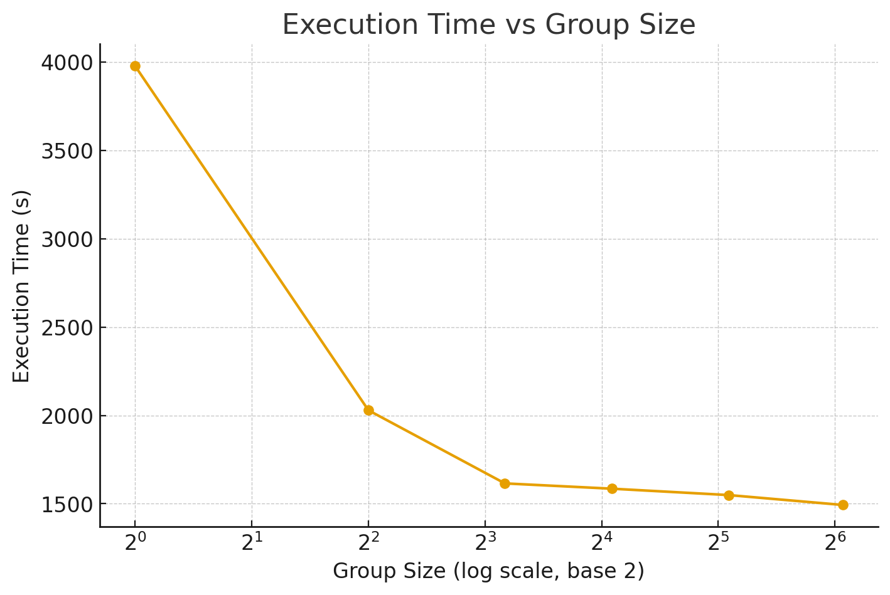

# Iteration 27. Improve search and learn

_start date_

<!---
The work is done using short iterations. Each iteration needs to have a very
clear goal. This allows to gain greater knowledge of the problem on each iteration.

<details>
  <summary>Click to expand/collapse this section</summary>
</details>
--->

## Goal

We already know that search and learn works. Can we make it faster and better?

## Motivation

## Development

### Speed analysis of all the parts

The goal is to measure where the execution time is going so I can have more information to design improvements

- Probably the easiest way to do it is to use the logs from Kaggle.
- I can also use the logs from the cluster experiments

The work has been done in the notebook `notebooks/013_analyze_kaggle_runtime.ipynb`.

### Local experiments with group sizes

```bash
export GROUP_SIZE=1
python scripts/search_and_learn_with_unsloth.py \
--dataset-path /mnt/hdd0/Kaggle/arc25/data/arc-prize-2024/small_arc-agi_training_challenges.json \
--output-dir /mnt/hdd0/Kaggle/arc25/trainings/2025-09-24-debug-grouped-tasks/group-size-${GROUP_SIZE} \
--task-group-size ${GROUP_SIZE} \
--max-epochs 3 \
--initial-predictions 8 \
--predictions-per-epoch 8
# 3978s

export GROUP_SIZE=67
python scripts/search_and_learn_with_unsloth.py \
--dataset-path /mnt/hdd0/Kaggle/arc25/data/arc-prize-2024/small_arc-agi_training_challenges.json \
--output-dir /mnt/hdd0/Kaggle/arc25/trainings/2025-09-24-debug-grouped-tasks/group-size-${GROUP_SIZE} \
--task-group-size ${GROUP_SIZE} \
--max-epochs 3 \
--initial-predictions 8 \
--predictions-per-epoch 8
# 1493s

export GROUP_SIZE=34
python scripts/search_and_learn_with_unsloth.py \
--dataset-path /mnt/hdd0/Kaggle/arc25/data/arc-prize-2024/small_arc-agi_training_challenges.json \
--output-dir /mnt/hdd0/Kaggle/arc25/trainings/2025-09-24-debug-grouped-tasks/group-size-${GROUP_SIZE} \
--task-group-size ${GROUP_SIZE} \
--max-epochs 3 \
--initial-predictions 8 \
--predictions-per-epoch 8
# 1549s

export GROUP_SIZE=17
python scripts/search_and_learn_with_unsloth.py \
--dataset-path /mnt/hdd0/Kaggle/arc25/data/arc-prize-2024/small_arc-agi_training_challenges.json \
--output-dir /mnt/hdd0/Kaggle/arc25/trainings/2025-09-24-debug-grouped-tasks/group-size-${GROUP_SIZE} \
--task-group-size ${GROUP_SIZE} \
--max-epochs 3 \
--initial-predictions 8 \
--predictions-per-epoch 8
# 1585s

export GROUP_SIZE=9
python scripts/search_and_learn_with_unsloth.py \
--dataset-path /mnt/hdd0/Kaggle/arc25/data/arc-prize-2024/small_arc-agi_training_challenges.json \
--output-dir /mnt/hdd0/Kaggle/arc25/trainings/2025-09-24-debug-grouped-tasks/group-size-${GROUP_SIZE} \
--task-group-size ${GROUP_SIZE} \
--max-epochs 3 \
--initial-predictions 8 \
--predictions-per-epoch 8
# 1615s

export GROUP_SIZE=4
python scripts/search_and_learn_with_unsloth.py \
--dataset-path /mnt/hdd0/Kaggle/arc25/data/arc-prize-2024/small_arc-agi_training_challenges.json \
--output-dir /mnt/hdd0/Kaggle/arc25/trainings/2025-09-24-debug-grouped-tasks/group-size-${GROUP_SIZE} \
--task-group-size ${GROUP_SIZE} \
--max-epochs 3 \
--initial-predictions 8 \
--predictions-per-epoch 8
# 2029s

python scripts/search_and_learn_with_unsloth.py \
--dataset-path /mnt/hdd0/Kaggle/arc25/data/arc-prize-2024/small_arc-agi_training_challenges.json \
--output-dir /mnt/hdd0/Kaggle/arc25/trainings/2025-09-24-debug-grouped-tasks/no-learning \
--max-epochs 0 \
--initial-predictions 32
# 566s
```



By grouping the tasks we can a speedup of around 2.5x

### Cluster experiments with 128 predictions

The goal of this experimentation is to find the best compromise between the number of predictions per
epoch and the group size. Ideally I will do one prediction per epoch and do not group the tasks, but
we have to make a compromise because of the current hardware. Once I find a good configuration we
could make experiments with 512 predictions and compare against the previous iteration.

```bash
export FOLDER=2025-09-24-search-and-learn
export INITIAL_PREDICTIONS=32
export EPOCHS=3
export PREDICTIONS_PER_EPOCH=32
export GROUP_SIZE=10
export LEARNING_RATE=1e-5; condor_submit train.condor command=" 
python /mnt/scratch/users/gbarbadillo/arc25/arc25/scripts/search_and_learn_with_unsloth.py \
--task-group-size ${GROUP_SIZE} \
--initial-predictions ${INITIAL_PREDICTIONS} \
--predictions-per-epoch ${PREDICTIONS_PER_EPOCH} \
--learning-rate ${LEARNING_RATE} \
--max-epochs ${EPOCHS} \
--gpu_memory_utilization 0.5 \
--model-path /mnt/scratch/users/gbarbadillo/arc25/models/Llama-3.1-ARC-Potpourri-Induction-8B \
--dataset-path /mnt/scratch/users/gbarbadillo/arc25/data/arc-prize-2024/arc-agi_evaluation_challenges.json \
--output-dir /mnt/scratch/users/gbarbadillo/arc25/trainings/${FOLDER}/${INITIAL_PREDICTIONS}i_${EPOCHS}x${PREDICTIONS_PER_EPOCH}_lr${LEARNING_RATE}_${GROUP_SIZE}-group-size" -append request_gpus=1 -append request_cpus=6 -append request_memory=32G --append 'requirements = (TARGET.Machine == "calculon19.das-nano.com")'
237498.

export FOLDER=2025-09-24-search-and-learn
export INITIAL_PREDICTIONS=16
export EPOCHS=7
export PREDICTIONS_PER_EPOCH=16
export GROUP_SIZE=10
export LEARNING_RATE=1e-5; condor_submit train.condor command=" 
python /mnt/scratch/users/gbarbadillo/arc25/arc25/scripts/search_and_learn_with_unsloth.py \
--task-group-size ${GROUP_SIZE} \
--initial-predictions ${INITIAL_PREDICTIONS} \
--predictions-per-epoch ${PREDICTIONS_PER_EPOCH} \
--learning-rate ${LEARNING_RATE} \
--max-epochs ${EPOCHS} \
--gpu_memory_utilization 0.5 \
--model-path /mnt/scratch/users/gbarbadillo/arc25/models/Llama-3.1-ARC-Potpourri-Induction-8B \
--dataset-path /mnt/scratch/users/gbarbadillo/arc25/data/arc-prize-2024/arc-agi_evaluation_challenges.json \
--output-dir /mnt/scratch/users/gbarbadillo/arc25/trainings/${FOLDER}/${INITIAL_PREDICTIONS}i_${EPOCHS}x${PREDICTIONS_PER_EPOCH}_lr${LEARNING_RATE}_${GROUP_SIZE}-group-size" -append request_gpus=1 -append request_cpus=6 -append request_memory=32G --append 'requirements = (TARGET.Machine == "calculon19.das-nano.com")'
237499.

export FOLDER=2025-09-24-search-and-learn
export INITIAL_PREDICTIONS=8
export EPOCHS=15
export PREDICTIONS_PER_EPOCH=8
export GROUP_SIZE=10
export LEARNING_RATE=1e-5; condor_submit train.condor command=" 
python /mnt/scratch/users/gbarbadillo/arc25/arc25/scripts/search_and_learn_with_unsloth.py \
--task-group-size ${GROUP_SIZE} \
--initial-predictions ${INITIAL_PREDICTIONS} \
--predictions-per-epoch ${PREDICTIONS_PER_EPOCH} \
--learning-rate ${LEARNING_RATE} \
--max-epochs ${EPOCHS} \
--gpu_memory_utilization 0.5 \
--model-path /mnt/scratch/users/gbarbadillo/arc25/models/Llama-3.1-ARC-Potpourri-Induction-8B \
--dataset-path /mnt/scratch/users/gbarbadillo/arc25/data/arc-prize-2024/arc-agi_evaluation_challenges.json \
--output-dir /mnt/scratch/users/gbarbadillo/arc25/trainings/${FOLDER}/${INITIAL_PREDICTIONS}i_${EPOCHS}x${PREDICTIONS_PER_EPOCH}_lr${LEARNING_RATE}_${GROUP_SIZE}-group-size" -append request_gpus=1 -append request_cpus=6 -append request_memory=32G --append 'requirements = (TARGET.Machine == "calculon19.das-nano.com")'
237500.

export FOLDER=2025-09-24-search-and-learn
export INITIAL_PREDICTIONS=8
export EPOCHS=15
export PREDICTIONS_PER_EPOCH=8
export GROUP_SIZE=20
export LEARNING_RATE=1e-5; condor_submit train.condor command=" 
python /mnt/scratch/users/gbarbadillo/arc25/arc25/scripts/search_and_learn_with_unsloth.py \
--task-group-size ${GROUP_SIZE} \
--initial-predictions ${INITIAL_PREDICTIONS} \
--predictions-per-epoch ${PREDICTIONS_PER_EPOCH} \
--learning-rate ${LEARNING_RATE} \
--max-epochs ${EPOCHS} \
--gpu_memory_utilization 0.5 \
--model-path /mnt/scratch/users/gbarbadillo/arc25/models/Llama-3.1-ARC-Potpourri-Induction-8B \
--dataset-path /mnt/scratch/users/gbarbadillo/arc25/data/arc-prize-2024/arc-agi_evaluation_challenges.json \
--output-dir /mnt/scratch/users/gbarbadillo/arc25/trainings/${FOLDER}/${INITIAL_PREDICTIONS}i_${EPOCHS}x${PREDICTIONS_PER_EPOCH}_lr${LEARNING_RATE}_${GROUP_SIZE}-group-size" -append request_gpus=1 -append request_cpus=6 -append request_memory=32G --append 'requirements = (TARGET.Machine == "calculon19.das-nano.com")'
237501.

export FOLDER=2025-09-24-search-and-learn
export INITIAL_PREDICTIONS=16
export EPOCHS=7
export PREDICTIONS_PER_EPOCH=16
export GROUP_SIZE=5
export LEARNING_RATE=1e-5; condor_submit train.condor command=" 
python /mnt/scratch/users/gbarbadillo/arc25/arc25/scripts/search_and_learn_with_unsloth.py \
--task-group-size ${GROUP_SIZE} \
--initial-predictions ${INITIAL_PREDICTIONS} \
--predictions-per-epoch ${PREDICTIONS_PER_EPOCH} \
--learning-rate ${LEARNING_RATE} \
--max-epochs ${EPOCHS} \
--gpu_memory_utilization 0.5 \
--model-path /mnt/scratch/users/gbarbadillo/arc25/models/Llama-3.1-ARC-Potpourri-Induction-8B \
--dataset-path /mnt/scratch/users/gbarbadillo/arc25/data/arc-prize-2024/arc-agi_evaluation_challenges.json \
--output-dir /mnt/scratch/users/gbarbadillo/arc25/trainings/${FOLDER}/${INITIAL_PREDICTIONS}i_${EPOCHS}x${PREDICTIONS_PER_EPOCH}_lr${LEARNING_RATE}_${GROUP_SIZE}-group-size" -append request_gpus=1 -append request_cpus=6 -append request_memory=32G --append 'requirements = (TARGET.Machine == "calculon19.das-nano.com")'
237502.

export FOLDER=2025-09-24-search-and-learn
export INITIAL_PREDICTIONS=8
export EPOCHS=15
export PREDICTIONS_PER_EPOCH=8
export GROUP_SIZE=5
export LEARNING_RATE=1e-5; condor_submit train.condor command=" 
python /mnt/scratch/users/gbarbadillo/arc25/arc25/scripts/search_and_learn_with_unsloth.py \
--task-group-size ${GROUP_SIZE} \
--initial-predictions ${INITIAL_PREDICTIONS} \
--predictions-per-epoch ${PREDICTIONS_PER_EPOCH} \
--learning-rate ${LEARNING_RATE} \
--max-epochs ${EPOCHS} \
--gpu_memory_utilization 0.5 \
--model-path /mnt/scratch/users/gbarbadillo/arc25/models/Llama-3.1-ARC-Potpourri-Induction-8B \
--dataset-path /mnt/scratch/users/gbarbadillo/arc25/data/arc-prize-2024/arc-agi_evaluation_challenges.json \
--output-dir /mnt/scratch/users/gbarbadillo/arc25/trainings/${FOLDER}/${INITIAL_PREDICTIONS}i_${EPOCHS}x${PREDICTIONS_PER_EPOCH}_lr${LEARNING_RATE}_${GROUP_SIZE}-group-size" -append request_gpus=1 -append request_cpus=6 -append request_memory=32G --append 'requirements = (TARGET.Machine == "calculon19.das-nano.com")'
237849.

export FOLDER=2025-09-24-search-and-learn
export INITIAL_PREDICTIONS=8
export EPOCHS=15
export PREDICTIONS_PER_EPOCH=8
export GROUP_SIZE=3
export LEARNING_RATE=1e-5; condor_submit train.condor command=" 
python /mnt/scratch/users/gbarbadillo/arc25/arc25/scripts/search_and_learn_with_unsloth.py \
--task-group-size ${GROUP_SIZE} \
--initial-predictions ${INITIAL_PREDICTIONS} \
--predictions-per-epoch ${PREDICTIONS_PER_EPOCH} \
--learning-rate ${LEARNING_RATE} \
--max-epochs ${EPOCHS} \
--gpu_memory_utilization 0.5 \
--model-path /mnt/scratch/users/gbarbadillo/arc25/models/Llama-3.1-ARC-Potpourri-Induction-8B \
--dataset-path /mnt/scratch/users/gbarbadillo/arc25/data/arc-prize-2024/arc-agi_evaluation_challenges.json \
--output-dir /mnt/scratch/users/gbarbadillo/arc25/trainings/${FOLDER}/${INITIAL_PREDICTIONS}i_${EPOCHS}x${PREDICTIONS_PER_EPOCH}_lr${LEARNING_RATE}_${GROUP_SIZE}-group-size" -append request_gpus=1 -append request_cpus=6 -append request_memory=32G --append 'requirements = (TARGET.Machine == "calculon19.das-nano.com")'
237850.

export FOLDER=2025-09-24-search-and-learn
export INITIAL_PREDICTIONS=8
export EPOCHS=15
export PREDICTIONS_PER_EPOCH=8
export GROUP_SIZE=40
export LEARNING_RATE=1e-5; condor_submit train.condor command=" 
python /mnt/scratch/users/gbarbadillo/arc25/arc25/scripts/search_and_learn_with_unsloth.py \
--task-group-size ${GROUP_SIZE} \
--initial-predictions ${INITIAL_PREDICTIONS} \
--predictions-per-epoch ${PREDICTIONS_PER_EPOCH} \
--learning-rate ${LEARNING_RATE} \
--max-epochs ${EPOCHS} \
--gpu_memory_utilization 0.5 \
--model-path /mnt/scratch/users/gbarbadillo/arc25/models/Llama-3.1-ARC-Potpourri-Induction-8B \
--dataset-path /mnt/scratch/users/gbarbadillo/arc25/data/arc-prize-2024/arc-agi_evaluation_challenges.json \
--output-dir /mnt/scratch/users/gbarbadillo/arc25/trainings/${FOLDER}/${INITIAL_PREDICTIONS}i_${EPOCHS}x${PREDICTIONS_PER_EPOCH}_lr${LEARNING_RATE}_${GROUP_SIZE}-group-size" -append request_gpus=1 -append request_cpus=6 -append request_memory=32G --append 'requirements = (TARGET.Machine == "calculon19.das-nano.com")'
237851.

export FOLDER=2025-09-24-search-and-learn
export INITIAL_PREDICTIONS=16
export EPOCHS=7
export PREDICTIONS_PER_EPOCH=16
export GROUP_SIZE=20
export LEARNING_RATE=1e-5; condor_submit train.condor command=" 
python /mnt/scratch/users/gbarbadillo/arc25/arc25/scripts/search_and_learn_with_unsloth.py \
--task-group-size ${GROUP_SIZE} \
--initial-predictions ${INITIAL_PREDICTIONS} \
--predictions-per-epoch ${PREDICTIONS_PER_EPOCH} \
--learning-rate ${LEARNING_RATE} \
--max-epochs ${EPOCHS} \
--gpu_memory_utilization 0.5 \
--model-path /mnt/scratch/users/gbarbadillo/arc25/models/Llama-3.1-ARC-Potpourri-Induction-8B \
--dataset-path /mnt/scratch/users/gbarbadillo/arc25/data/arc-prize-2024/arc-agi_evaluation_challenges.json \
--output-dir /mnt/scratch/users/gbarbadillo/arc25/trainings/${FOLDER}/${INITIAL_PREDICTIONS}i_${EPOCHS}x${PREDICTIONS_PER_EPOCH}_lr${LEARNING_RATE}_${GROUP_SIZE}-group-size" -append request_gpus=1 -append request_cpus=6 -append request_memory=32G --append 'requirements = (TARGET.Machine == "calculon19.das-nano.com")'

export FOLDER=2025-09-24-search-and-learn
export INITIAL_PREDICTIONS=32
export EPOCHS=3
export PREDICTIONS_PER_EPOCH=32
export GROUP_SIZE=20
export LEARNING_RATE=1e-5; condor_submit train.condor command=" 
python /mnt/scratch/users/gbarbadillo/arc25/arc25/scripts/search_and_learn_with_unsloth.py \
--task-group-size ${GROUP_SIZE} \
--initial-predictions ${INITIAL_PREDICTIONS} \
--predictions-per-epoch ${PREDICTIONS_PER_EPOCH} \
--learning-rate ${LEARNING_RATE} \
--max-epochs ${EPOCHS} \
--gpu_memory_utilization 0.5 \
--model-path /mnt/scratch/users/gbarbadillo/arc25/models/Llama-3.1-ARC-Potpourri-Induction-8B \
--dataset-path /mnt/scratch/users/gbarbadillo/arc25/data/arc-prize-2024/arc-agi_evaluation_challenges.json \
--output-dir /mnt/scratch/users/gbarbadillo/arc25/trainings/${FOLDER}/${INITIAL_PREDICTIONS}i_${EPOCHS}x${PREDICTIONS_PER_EPOCH}_lr${LEARNING_RATE}_${GROUP_SIZE}-group-size" -append request_gpus=1 -append request_cpus=6 -append request_memory=32G --append 'requirements = (TARGET.Machine == "calculon19.das-nano.com")'
237933.

export FOLDER=2025-09-24-search-and-learn
export INITIAL_PREDICTIONS=32
export EPOCHS=3
export PREDICTIONS_PER_EPOCH=32
export GROUP_SIZE=40
export LEARNING_RATE=1e-5; condor_submit train.condor command=" 
python /mnt/scratch/users/gbarbadillo/arc25/arc25/scripts/search_and_learn_with_unsloth.py \
--task-group-size ${GROUP_SIZE} \
--initial-predictions ${INITIAL_PREDICTIONS} \
--predictions-per-epoch ${PREDICTIONS_PER_EPOCH} \
--learning-rate ${LEARNING_RATE} \
--max-epochs ${EPOCHS} \
--gpu_memory_utilization 0.5 \
--model-path /mnt/scratch/users/gbarbadillo/arc25/models/Llama-3.1-ARC-Potpourri-Induction-8B \
--dataset-path /mnt/scratch/users/gbarbadillo/arc25/data/arc-prize-2024/arc-agi_evaluation_challenges.json \
--output-dir /mnt/scratch/users/gbarbadillo/arc25/trainings/${FOLDER}/${INITIAL_PREDICTIONS}i_${EPOCHS}x${PREDICTIONS_PER_EPOCH}_lr${LEARNING_RATE}_${GROUP_SIZE}-group-size" -append request_gpus=1 -append request_cpus=6 -append request_memory=32G --append 'requirements = (TARGET.Machine == "calculon19.das-nano.com")'
237934.

export FOLDER=2025-09-24-search-and-learn
export INITIAL_PREDICTIONS=16
export EPOCHS=7
export PREDICTIONS_PER_EPOCH=16
export GROUP_SIZE=40
export LEARNING_RATE=1e-5; condor_submit train.condor command=" 
python /mnt/scratch/users/gbarbadillo/arc25/arc25/scripts/search_and_learn_with_unsloth.py \
--task-group-size ${GROUP_SIZE} \
--initial-predictions ${INITIAL_PREDICTIONS} \
--predictions-per-epoch ${PREDICTIONS_PER_EPOCH} \
--learning-rate ${LEARNING_RATE} \
--max-epochs ${EPOCHS} \
--gpu_memory_utilization 0.5 \
--model-path /mnt/scratch/users/gbarbadillo/arc25/models/Llama-3.1-ARC-Potpourri-Induction-8B \
--dataset-path /mnt/scratch/users/gbarbadillo/arc25/data/arc-prize-2024/arc-agi_evaluation_challenges.json \
--output-dir /mnt/scratch/users/gbarbadillo/arc25/trainings/${FOLDER}/${INITIAL_PREDICTIONS}i_${EPOCHS}x${PREDICTIONS_PER_EPOCH}_lr${LEARNING_RATE}_${GROUP_SIZE}-group-size" -append request_gpus=1 -append request_cpus=6 -append request_memory=32G --append 'requirements = (TARGET.Machine == "calculon19.das-nano.com")'
237975.

export FOLDER=2025-09-24-search-and-learn
export INITIAL_PREDICTIONS=8
export EPOCHS=15
export PREDICTIONS_PER_EPOCH=8
export GROUP_SIZE=80
export LEARNING_RATE=1e-5; condor_submit train.condor command=" 
python /mnt/scratch/users/gbarbadillo/arc25/arc25/scripts/search_and_learn_with_unsloth.py \
--task-group-size ${GROUP_SIZE} \
--initial-predictions ${INITIAL_PREDICTIONS} \
--predictions-per-epoch ${PREDICTIONS_PER_EPOCH} \
--learning-rate ${LEARNING_RATE} \
--max-epochs ${EPOCHS} \
--gpu_memory_utilization 0.5 \
--model-path /mnt/scratch/users/gbarbadillo/arc25/models/Llama-3.1-ARC-Potpourri-Induction-8B \
--dataset-path /mnt/scratch/users/gbarbadillo/arc25/data/arc-prize-2024/arc-agi_evaluation_challenges.json \
--output-dir /mnt/scratch/users/gbarbadillo/arc25/trainings/${FOLDER}/${INITIAL_PREDICTIONS}i_${EPOCHS}x${PREDICTIONS_PER_EPOCH}_lr${LEARNING_RATE}_${GROUP_SIZE}-group-size" -append request_gpus=1 -append request_cpus=6 -append request_memory=32G --append 'requirements = (TARGET.Machine == "calculon19.das-nano.com")'
237976.

export FOLDER=2025-09-24-search-and-learn
export INITIAL_PREDICTIONS=16
export EPOCHS=7
export PREDICTIONS_PER_EPOCH=16
export GROUP_SIZE=80
export LEARNING_RATE=1e-5; condor_submit train.condor command=" 
python /mnt/scratch/users/gbarbadillo/arc25/arc25/scripts/search_and_learn_with_unsloth.py \
--task-group-size ${GROUP_SIZE} \
--initial-predictions ${INITIAL_PREDICTIONS} \
--predictions-per-epoch ${PREDICTIONS_PER_EPOCH} \
--learning-rate ${LEARNING_RATE} \
--max-epochs ${EPOCHS} \
--gpu_memory_utilization 0.5 \
--model-path /mnt/scratch/users/gbarbadillo/arc25/models/Llama-3.1-ARC-Potpourri-Induction-8B \
--dataset-path /mnt/scratch/users/gbarbadillo/arc25/data/arc-prize-2024/arc-agi_evaluation_challenges.json \
--output-dir /mnt/scratch/users/gbarbadillo/arc25/trainings/${FOLDER}/${INITIAL_PREDICTIONS}i_${EPOCHS}x${PREDICTIONS_PER_EPOCH}_lr${LEARNING_RATE}_${GROUP_SIZE}-group-size" -append request_gpus=1 -append request_cpus=6 -append request_memory=32G --append 'requirements = (TARGET.Machine == "calculon19.das-nano.com")'
237977.

export FOLDER=2025-09-24-search-and-learn
export INITIAL_PREDICTIONS=32
export EPOCHS=3
export PREDICTIONS_PER_EPOCH=32
export GROUP_SIZE=80
export LEARNING_RATE=1e-5; condor_submit train.condor command=" 
python /mnt/scratch/users/gbarbadillo/arc25/arc25/scripts/search_and_learn_with_unsloth.py \
--task-group-size ${GROUP_SIZE} \
--initial-predictions ${INITIAL_PREDICTIONS} \
--predictions-per-epoch ${PREDICTIONS_PER_EPOCH} \
--learning-rate ${LEARNING_RATE} \
--max-epochs ${EPOCHS} \
--gpu_memory_utilization 0.5 \
--model-path /mnt/scratch/users/gbarbadillo/arc25/models/Llama-3.1-ARC-Potpourri-Induction-8B \
--dataset-path /mnt/scratch/users/gbarbadillo/arc25/data/arc-prize-2024/arc-agi_evaluation_challenges.json \
--output-dir /mnt/scratch/users/gbarbadillo/arc25/trainings/${FOLDER}/${INITIAL_PREDICTIONS}i_${EPOCHS}x${PREDICTIONS_PER_EPOCH}_lr${LEARNING_RATE}_${GROUP_SIZE}-group-size" -append request_gpus=1 -append request_cpus=6 -append request_memory=32G --append 'requirements = (TARGET.Machine == "calculon19.das-nano.com")'
237978.

export FOLDER=2025-09-24-search-and-learn
export INITIAL_PREDICTIONS=32
export EPOCHS=3
export PREDICTIONS_PER_EPOCH=32
export GROUP_SIZE=5
export LEARNING_RATE=1e-5; condor_submit train.condor command=" 
python /mnt/scratch/users/gbarbadillo/arc25/arc25/scripts/search_and_learn_with_unsloth.py \
--task-group-size ${GROUP_SIZE} \
--initial-predictions ${INITIAL_PREDICTIONS} \
--predictions-per-epoch ${PREDICTIONS_PER_EPOCH} \
--learning-rate ${LEARNING_RATE} \
--max-epochs ${EPOCHS} \
--gpu_memory_utilization 0.5 \
--model-path /mnt/scratch/users/gbarbadillo/arc25/models/Llama-3.1-ARC-Potpourri-Induction-8B \
--dataset-path /mnt/scratch/users/gbarbadillo/arc25/data/arc-prize-2024/arc-agi_evaluation_challenges.json \
--output-dir /mnt/scratch/users/gbarbadillo/arc25/trainings/${FOLDER}/${INITIAL_PREDICTIONS}i_${EPOCHS}x${PREDICTIONS_PER_EPOCH}_lr${LEARNING_RATE}_${GROUP_SIZE}-group-size" -append request_gpus=1 -append request_cpus=6 -append request_memory=32G --append 'requirements = (TARGET.Machine == "calculon19.das-nano.com")'
237998.
```

### Cluster experiments with 512 predictions

```bash
export FOLDER=2025-09-28-search-and-learn
export INITIAL_PREDICTIONS=32
export EPOCHS=15
export PREDICTIONS_PER_EPOCH=32
export GROUP_SIZE=5
export LEARNING_RATE=1e-5; condor_submit train.condor command=" 
python /mnt/scratch/users/gbarbadillo/arc25/arc25/scripts/search_and_learn_with_unsloth.py \
--task-group-size ${GROUP_SIZE} \
--initial-predictions ${INITIAL_PREDICTIONS} \
--predictions-per-epoch ${PREDICTIONS_PER_EPOCH} \
--learning-rate ${LEARNING_RATE} \
--max-epochs ${EPOCHS} \
--gpu_memory_utilization 0.5 \
--model-path /mnt/scratch/users/gbarbadillo/arc25/models/Llama-3.1-ARC-Potpourri-Induction-8B \
--dataset-path /mnt/scratch/users/gbarbadillo/arc25/data/arc-prize-2024/arc-agi_evaluation_challenges.json \
--output-dir /mnt/scratch/users/gbarbadillo/arc25/trainings/${FOLDER}/${INITIAL_PREDICTIONS}i_${EPOCHS}x${PREDICTIONS_PER_EPOCH}_lr${LEARNING_RATE}_${GROUP_SIZE}-group-size" -append request_gpus=1 -append request_cpus=6 -append request_memory=48G --append 'requirements = (TARGET.Machine == "calculon19.das-nano.com")'
238003.-238007.

export FOLDER=2025-09-28-search-and-learn
export INITIAL_PREDICTIONS=8
export EPOCHS=63
export PREDICTIONS_PER_EPOCH=8
export GROUP_SIZE=30
export LEARNING_RATE=2e-6; condor_submit train.condor command=" 
python /mnt/scratch/users/gbarbadillo/arc25/arc25/scripts/search_and_learn_with_unsloth.py \
--task-group-size ${GROUP_SIZE} \
--initial-predictions ${INITIAL_PREDICTIONS} \
--predictions-per-epoch ${PREDICTIONS_PER_EPOCH} \
--learning-rate ${LEARNING_RATE} \
--max-epochs ${EPOCHS} \
--gpu_memory_utilization 0.5 \
--model-path /mnt/scratch/users/gbarbadillo/arc25/models/Llama-3.1-ARC-Potpourri-Induction-8B \
--dataset-path /mnt/scratch/users/gbarbadillo/arc25/data/arc-prize-2024/arc-agi_evaluation_challenges.json \
--output-dir /mnt/scratch/users/gbarbadillo/arc25/trainings/${FOLDER}/${INITIAL_PREDICTIONS}i_${EPOCHS}x${PREDICTIONS_PER_EPOCH}_lr${LEARNING_RATE}_${GROUP_SIZE}-group-size" -append request_gpus=1 -append request_cpus=6 -append request_memory=48G --append 'requirements = (TARGET.Machine == "calculon19.das-nano.com")'
238008.-238011.

export FOLDER=2025-09-28-search-and-learn
export INITIAL_PREDICTIONS=16
export EPOCHS=32
export PREDICTIONS_PER_EPOCH=16
export GROUP_SIZE=20
export LEARNING_RATE=1e-5; condor_submit train.condor command=" 
python /mnt/scratch/users/gbarbadillo/arc25/arc25/scripts/search_and_learn_with_unsloth.py \
--task-group-size ${GROUP_SIZE} \
--initial-predictions ${INITIAL_PREDICTIONS} \
--predictions-per-epoch ${PREDICTIONS_PER_EPOCH} \
--learning-rate ${LEARNING_RATE} \
--max-epochs ${EPOCHS} \
--gpu_memory_utilization 0.5 \
--model-path /mnt/scratch/users/gbarbadillo/arc25/models/Llama-3.1-ARC-Potpourri-Induction-8B \
--dataset-path /mnt/scratch/users/gbarbadillo/arc25/data/arc-prize-2024/arc-agi_evaluation_challenges.json \
--output-dir /mnt/scratch/users/gbarbadillo/arc25/trainings/${FOLDER}/${INITIAL_PREDICTIONS}i_${EPOCHS}x${PREDICTIONS_PER_EPOCH}_lr${LEARNING_RATE}_${GROUP_SIZE}-group-size" -append request_gpus=1 -append request_cpus=6 -append request_memory=48G --append 'requirements = (TARGET.Machine == "calculon19.das-nano.com")'
```

## Results

### Inference is not efficient for a small number of predictions

| initial predictions | epochs | predictions per epoch | total predictions | search time (h) | predictions/hour | learn time (h) | training steps | training steps/hour |
|---------------------|--------|-----------------------|-------------------|-----------------|------------------|----------------|----------------|---------------------|
| 512                 | 0      | 0                     | 512               | 5.12            | 100.0            | 0              | 0              | -                   |
| 128                 | 1      | 128                   | 256               | 2.98            | 85.9             | 2.66           | 128            | 48.1                |
| 64                  | 3      | 64                    | 256               | 4.2             | 61.0             | 4.08           | 192            | 47.1                |
| 32                  | 2      | 32                    | 96                | 2.26            | 42.5             | 1.36           | 64             | 47.1                |

The table shows how the inference efficiency decreases if we use a smaller number of predictions per epoch.
In the other hand training is not affected by using a smaller number of training steps.

If we group the predictions of different tasks, we should see improvements in speed.

### Speedup due to grouping tasks


By grouping the tasks we can get a speedup of around 2.5x (considering the full execution time, not just inference). These are the results of local and small experiments.
It is possible that we could achieve an even higher speedup with bigger experiments.

### Searching the best configuration for inference

The table below shows the runtime for experiments with a budget of 128 predictions.


It is clear how using a smaller group size or smaller number of predictions per epoch leads
to bigger runtimes.

Now I'm going to experiment with a budget of 512 predictions. I'm going to try these configurations:

- 32 predictions per epoch, group size 5
- 16 predictions per epoch, group size 20
- 8 predictions per epoch, group size 30

For each configuration I should try different learning rates.

## Conclusion

## Next steps

## TODO

- [ ] Maybe I should discard the idea of tuning for each task independently if the data shows that it is too inefficient
  - [x] Edit the script to support grouping tasks
  - [ ] Compare speed of grouping vs no grouping. Create a table to show the effect of group size and number of predictions per epoch
  - [ ] Experiments to verify that improvement is also get when grouping
- [ ] This implementation is still not efficient for H100.
  - https://wandb.ai/guillermobarbadillo/2025-09-18-search-and-learn/runs/nmzebmh1?nw=nwuserguillermobarbadillo
- [ ] Once a good configuration has been found scale to 512 predictions and compare against previous results
- [ ] Optimize learning rate and group size
- [ ] Try to reduce computation cost by filtering the training data
  - [ ] Start by training on half of the samples
  - [ ] Remove duplicates
  - [ ] Explore a policy of keeping the best and more diverse solutions
- [ ] Experiments on Kaggle to find a good configuration to submit. https://docs.google.com/spreadsheets/d/1NmmCZA7gPOyoBypwvpw_JhYdjcvqNFHibX_WahwTHIM/edit?gid=0#gid=0&range=F857