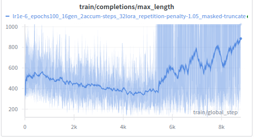
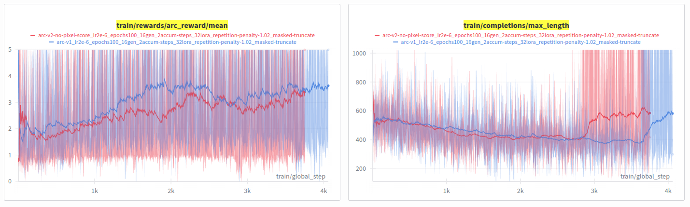
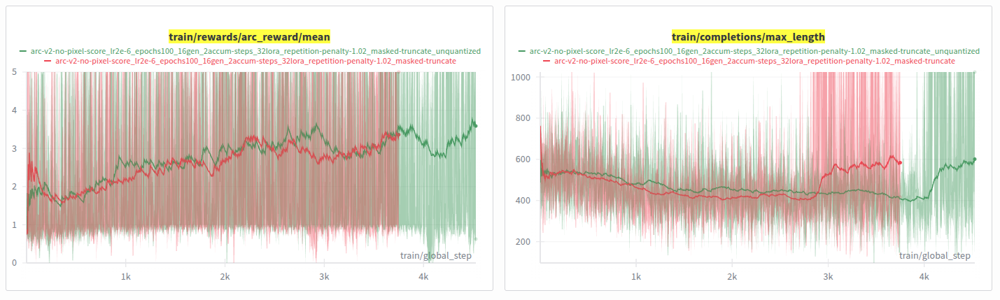

# Iteration 30. Solve RL Collapse

_05-10-2025_

<!---
The work is done using short iterations. Each iteration needs to have a very
clear goal. This allows to gain greater knowledge of the problem on each iteration.

<details>
  <summary>Click to expand/collapse this section</summary>
</details>
--->

## Goal

I need to solve RL collapse issues so I can train for longer and get a more powerful base model.

## Motivation

I have already seen improvements in model capabilities after training with RL on [iteration 24](Iteration_24_RL_BARC.md),
but when training for longer the reward collapsed.

I need to understand the problem and fix it so I can train for longer on more data.

## Development

### Thoughts about the collapse problem

I have seen different kinds of collapse: long predictions and gibberish prediction.

#### Long predictions

I don't understand why, but the model starts doing long predictions after 5k steps of training. Predictions are being truncated because the max completion length is 1024.



On the first experiments I was masking the truncated completions, furthermore they should probably get a reward of 0

#### Gibberish prediction

When I started using repetition penalty to avoid long predictions (because I saw predictions with lots of repetitions) I also saw the model doing gibberish predictions.

### Cluster experiments

```bash
## Start from zero
export REPETITION_PENALTY=1.05
export FOLDER=2025-09-19-rl-first-steps
export LEARNING_RATE=1e-6
export NUM_GENERATIONS=16
export ACUM_STEPS=2
export N_CPUS=20
export LORA_R=32
export EPOCHS=100
export EXPERIMENT_NAME=lr${LEARNING_RATE}_epochs${EPOCHS}_${NUM_GENERATIONS}gen_${ACUM_STEPS}accum-steps_${LORA_R}lora_repetition-penalty-${REPETITION_PENALTY}_masked-truncate
condor_submit train.condor command=" 
python /mnt/scratch/users/gbarbadillo/arc25/arc25/scripts/rl_code_finetuning.py \
--num-generations ${NUM_GENERATIONS} \
--gradient-accumulation-steps ${ACUM_STEPS} \
--learning-rate ${LEARNING_RATE} \
--lora_r ${LORA_R} \
--repetition-penalty ${REPETITION_PENALTY} \
--epochs ${EPOCHS} \
--mask-truncated-completions \
--scale-rewards batch \
--gpu_memory_utilization 0.3 \
--warmup-ratio 0.01 \
--max-seq-length 9700 \
--max-completion-length 1024 \
--n-jobs ${N_CPUS} \
--model-path /mnt/scratch/users/gbarbadillo/arc25/models/Llama-3.1-ARC-Potpourri-Induction-8B \
--dataset-path /mnt/scratch/users/gbarbadillo/arc25/data/arc-prize-2024/arc-agi_training_challenges.json \
--output-dir /mnt/scratch/users/gbarbadillo/arc25/trainings/${FOLDER}/${EXPERIMENT_NAME}" -append request_gpus=1 -append request_cpus=${N_CPUS} -append request_memory=128G --append 'requirements = (TARGET.Machine == "calculon21.das-nano.com")'
240688.0

export REPETITION_PENALTY=1.05
export FOLDER=2025-09-19-rl-first-steps
export LEARNING_RATE=1e-6
export NUM_GENERATIONS=16
export ACUM_STEPS=2
export N_CPUS=20
export LORA_R=32
export EPOCHS=100
export EXPERIMENT_NAME=lr${LEARNING_RATE}_epochs${EPOCHS}_${NUM_GENERATIONS}gen_${ACUM_STEPS}accum-steps_${LORA_R}lora_repetition-penalty-${REPETITION_PENALTY}_unmasked-truncate
condor_submit train.condor command=" 
python /mnt/scratch/users/gbarbadillo/arc25/arc25/scripts/rl_code_finetuning.py \
--num-generations ${NUM_GENERATIONS} \
--gradient-accumulation-steps ${ACUM_STEPS} \
--learning-rate ${LEARNING_RATE} \
--lora_r ${LORA_R} \
--repetition-penalty ${REPETITION_PENALTY} \
--epochs ${EPOCHS} \
--no-mask-truncated-completions \
--scale-rewards batch \
--gpu_memory_utilization 0.3 \
--warmup-ratio 0.01 \
--max-seq-length 9700 \
--max-completion-length 1024 \
--n-jobs ${N_CPUS} \
--model-path /mnt/scratch/users/gbarbadillo/arc25/models/Llama-3.1-ARC-Potpourri-Induction-8B \
--dataset-path /mnt/scratch/users/gbarbadillo/arc25/data/arc-prize-2024/arc-agi_training_challenges.json \
--output-dir /mnt/scratch/users/gbarbadillo/arc25/trainings/${FOLDER}/${EXPERIMENT_NAME}" -append request_gpus=1 -append request_cpus=${N_CPUS} -append request_memory=128G --append 'requirements = (TARGET.Machine == "calculon21.das-nano.com")'
240689.0

## New experiments after updating the logs and adding new reward
# Going to increase the learning rate to try to force collapse
export REPETITION_PENALTY=1.02
export FOLDER=2025-10-05-rl-study-collapse
export LEARNING_RATE=2e-6
export NUM_GENERATIONS=16
export ACUM_STEPS=2
export N_CPUS=20
export LORA_R=32
export EPOCHS=100
export REWARD_NAME=arc-v1
export EXPERIMENT_NAME=${REWARD_NAME}_lr${LEARNING_RATE}_epochs${EPOCHS}_${NUM_GENERATIONS}gen_${ACUM_STEPS}accum-steps_${LORA_R}lora_repetition-penalty-${REPETITION_PENALTY}_masked-truncate
condor_submit train.condor command=" 
python /mnt/scratch/users/gbarbadillo/arc25/arc25/scripts/rl_code_finetuning.py \
--reward-name ${REWARD_NAME} \
--num-generations ${NUM_GENERATIONS} \
--gradient-accumulation-steps ${ACUM_STEPS} \
--learning-rate ${LEARNING_RATE} \
--lora_r ${LORA_R} \
--repetition-penalty ${REPETITION_PENALTY} \
--epochs ${EPOCHS} \
--mask-truncated-completions \
--scale-rewards batch \
--gpu_memory_utilization 0.3 \
--warmup-ratio 0.01 \
--max-seq-length 9700 \
--max-completion-length 1024 \
--n-jobs ${N_CPUS} \
--model-path /mnt/scratch/users/gbarbadillo/arc25/models/Llama-3.1-ARC-Potpourri-Induction-8B \
--dataset-path /mnt/scratch/users/gbarbadillo/arc25/data/arc-prize-2024/arc-agi_training_challenges.json \
--output-dir /mnt/scratch/users/gbarbadillo/arc25/trainings/${FOLDER}/${EXPERIMENT_NAME}" -append request_gpus=1 -append request_cpus=${N_CPUS} -append request_memory=128G --append 'requirements = (TARGET.Machine == "calculon21.das-nano.com")'
# 240875.0

export REPETITION_PENALTY=1.02
export FOLDER=2025-10-05-rl-study-collapse
export LEARNING_RATE=2e-6
export NUM_GENERATIONS=16
export ACUM_STEPS=2
export N_CPUS=20
export LORA_R=32
export EPOCHS=100
export REWARD_NAME=arc-v2-no-pixel-score
export EXPERIMENT_NAME=${REWARD_NAME}_lr${LEARNING_RATE}_epochs${EPOCHS}_${NUM_GENERATIONS}gen_${ACUM_STEPS}accum-steps_${LORA_R}lora_repetition-penalty-${REPETITION_PENALTY}_masked-truncate
condor_submit train.condor command=" 
python /mnt/scratch/users/gbarbadillo/arc25/arc25/scripts/rl_code_finetuning.py \
--reward-name ${REWARD_NAME} \
--num-generations ${NUM_GENERATIONS} \
--gradient-accumulation-steps ${ACUM_STEPS} \
--learning-rate ${LEARNING_RATE} \
--lora_r ${LORA_R} \
--repetition-penalty ${REPETITION_PENALTY} \
--epochs ${EPOCHS} \
--mask-truncated-completions \
--scale-rewards batch \
--gpu_memory_utilization 0.3 \
--warmup-ratio 0.01 \
--max-seq-length 9700 \
--max-completion-length 1024 \
--n-jobs ${N_CPUS} \
--model-path /mnt/scratch/users/gbarbadillo/arc25/models/Llama-3.1-ARC-Potpourri-Induction-8B \
--dataset-path /mnt/scratch/users/gbarbadillo/arc25/data/arc-prize-2024/arc-agi_training_challenges.json \
--output-dir /mnt/scratch/users/gbarbadillo/arc25/trainings/${FOLDER}/${EXPERIMENT_NAME}" -append request_gpus=1 -append request_cpus=${N_CPUS} -append request_memory=128G --append 'requirements = (TARGET.Machine == "calculon21.das-nano.com")'
# 240874.0

# try without 4-bit quantization
export REPETITION_PENALTY=1.02
export FOLDER=2025-10-05-rl-study-collapse
export LEARNING_RATE=2e-6
export NUM_GENERATIONS=16
export ACUM_STEPS=2
export N_CPUS=20
export LORA_R=32
export EPOCHS=100
export REWARD_NAME=arc-v2-no-pixel-score
export EXPERIMENT_NAME=${REWARD_NAME}_lr${LEARNING_RATE}_epochs${EPOCHS}_${NUM_GENERATIONS}gen_${ACUM_STEPS}accum-steps_${LORA_R}lora_repetition-penalty-${REPETITION_PENALTY}_masked-truncate_unquantized
condor_submit train.condor command=" 
python /mnt/scratch/users/gbarbadillo/arc25/arc25/scripts/rl_code_finetuning.py \
--no-load-in-4bit \
--reward-name ${REWARD_NAME} \
--num-generations ${NUM_GENERATIONS} \
--gradient-accumulation-steps ${ACUM_STEPS} \
--learning-rate ${LEARNING_RATE} \
--lora_r ${LORA_R} \
--repetition-penalty ${REPETITION_PENALTY} \
--epochs ${EPOCHS} \
--mask-truncated-completions \
--scale-rewards batch \
--gpu_memory_utilization 0.3 \
--warmup-ratio 0.01 \
--max-seq-length 9700 \
--max-completion-length 1024 \
--n-jobs ${N_CPUS} \
--model-path /mnt/scratch/users/gbarbadillo/arc25/models/Llama-3.1-ARC-Potpourri-Induction-8B \
--dataset-path /mnt/scratch/users/gbarbadillo/arc25/data/arc-prize-2024/arc-agi_training_challenges.json \
--output-dir /mnt/scratch/users/gbarbadillo/arc25/trainings/${FOLDER}/${EXPERIMENT_NAME}" -append request_gpus=1 -append request_cpus=${N_CPUS} -append request_memory=128G --append 'requirements = (TARGET.Machine == "calculon21.das-nano.com")'
# 241165.

# Increase KL
export BETA=0.002
export REPETITION_PENALTY=1.02
export FOLDER=2025-10-05-rl-study-collapse
export LEARNING_RATE=2e-6
export NUM_GENERATIONS=16
export ACUM_STEPS=2
export N_CPUS=20
export LORA_R=32
export EPOCHS=100
export REWARD_NAME=arc-v2-no-pixel-score
export EXPERIMENT_NAME=${REWARD_NAME}_lr${LEARNING_RATE}_epochs${EPOCHS}_${NUM_GENERATIONS}gen_${ACUM_STEPS}accum-steps_${LORA_R}lora_repetition-penalty-${REPETITION_PENALTY}_masked-truncate_unquantized_beta${BETA}
condor_submit train.condor command=" 
python /mnt/scratch/users/gbarbadillo/arc25/arc25/scripts/rl_code_finetuning.py \
--beta ${BETA} \
--no-load-in-4bit \
--reward-name ${REWARD_NAME} \
--num-generations ${NUM_GENERATIONS} \
--gradient-accumulation-steps ${ACUM_STEPS} \
--learning-rate ${LEARNING_RATE} \
--lora_r ${LORA_R} \
--repetition-penalty ${REPETITION_PENALTY} \
--epochs ${EPOCHS} \
--mask-truncated-completions \
--scale-rewards batch \
--gpu_memory_utilization 0.3 \
--warmup-ratio 0.01 \
--max-seq-length 9700 \
--max-completion-length 1024 \
--n-jobs ${N_CPUS} \
--model-path /mnt/scratch/users/gbarbadillo/arc25/models/Llama-3.1-ARC-Potpourri-Induction-8B \
--dataset-path /mnt/scratch/users/gbarbadillo/arc25/data/arc-prize-2024/arc-agi_training_challenges.json \
--output-dir /mnt/scratch/users/gbarbadillo/arc25/trainings/${FOLDER}/${EXPERIMENT_NAME}" -append request_gpus=1 -append request_cpus=${N_CPUS} -append request_memory=128G --append 'requirements = (TARGET.Machine == "calculon21.das-nano.com")'
# 241166.

export BETA=0.004
export REPETITION_PENALTY=1.02
export FOLDER=2025-10-05-rl-study-collapse
export LEARNING_RATE=2e-6
export NUM_GENERATIONS=16
export ACUM_STEPS=2
export N_CPUS=20
export LORA_R=32
export EPOCHS=100
export REWARD_NAME=arc-v2-no-pixel-score
export EXPERIMENT_NAME=${REWARD_NAME}_lr${LEARNING_RATE}_epochs${EPOCHS}_${NUM_GENERATIONS}gen_${ACUM_STEPS}accum-steps_${LORA_R}lora_repetition-penalty-${REPETITION_PENALTY}_masked-truncate_unquantized_beta${BETA}
condor_submit train.condor command=" 
python /mnt/scratch/users/gbarbadillo/arc25/arc25/scripts/rl_code_finetuning.py \
--beta ${BETA} \
--no-load-in-4bit \
--reward-name ${REWARD_NAME} \
--num-generations ${NUM_GENERATIONS} \
--gradient-accumulation-steps ${ACUM_STEPS} \
--learning-rate ${LEARNING_RATE} \
--lora_r ${LORA_R} \
--repetition-penalty ${REPETITION_PENALTY} \
--epochs ${EPOCHS} \
--mask-truncated-completions \
--scale-rewards batch \
--gpu_memory_utilization 0.3 \
--warmup-ratio 0.01 \
--max-seq-length 9700 \
--max-completion-length 1024 \
--n-jobs ${N_CPUS} \
--model-path /mnt/scratch/users/gbarbadillo/arc25/models/Llama-3.1-ARC-Potpourri-Induction-8B \
--dataset-path /mnt/scratch/users/gbarbadillo/arc25/data/arc-prize-2024/arc-agi_training_challenges.json \
--output-dir /mnt/scratch/users/gbarbadillo/arc25/trainings/${FOLDER}/${EXPERIMENT_NAME}" -append request_gpus=1 -append request_cpus=${N_CPUS} -append request_memory=128G --append 'requirements = (TARGET.Machine == "calculon21.das-nano.com")'
# 241399.0

export BETA=0.01
export REPETITION_PENALTY=1.02
export FOLDER=2025-10-05-rl-study-collapse
export LEARNING_RATE=2e-6
export NUM_GENERATIONS=16
export ACUM_STEPS=2
export N_CPUS=20
export LORA_R=32
export EPOCHS=100
export REWARD_NAME=arc-v2-no-pixel-score
export EXPERIMENT_NAME=${REWARD_NAME}_lr${LEARNING_RATE}_epochs${EPOCHS}_${NUM_GENERATIONS}gen_${ACUM_STEPS}accum-steps_${LORA_R}lora_repetition-penalty-${REPETITION_PENALTY}_masked-truncate_unquantized_beta${BETA}
condor_submit train.condor command=" 
python /mnt/scratch/users/gbarbadillo/arc25/arc25/scripts/rl_code_finetuning.py \
--beta ${BETA} \
--no-load-in-4bit \
--reward-name ${REWARD_NAME} \
--num-generations ${NUM_GENERATIONS} \
--gradient-accumulation-steps ${ACUM_STEPS} \
--learning-rate ${LEARNING_RATE} \
--lora_r ${LORA_R} \
--repetition-penalty ${REPETITION_PENALTY} \
--epochs ${EPOCHS} \
--mask-truncated-completions \
--scale-rewards batch \
--gpu_memory_utilization 0.3 \
--warmup-ratio 0.01 \
--max-seq-length 9700 \
--max-completion-length 1024 \
--n-jobs ${N_CPUS} \
--model-path /mnt/scratch/users/gbarbadillo/arc25/models/Llama-3.1-ARC-Potpourri-Induction-8B \
--dataset-path /mnt/scratch/users/gbarbadillo/arc25/data/arc-prize-2024/arc-agi_training_challenges.json \
--output-dir /mnt/scratch/users/gbarbadillo/arc25/trainings/${FOLDER}/${EXPERIMENT_NAME}" -append request_gpus=1 -append request_cpus=${N_CPUS} -append request_memory=128G --append 'requirements = (TARGET.Machine == "calculon21.das-nano.com")'
# 241400.0
```

### How to log more metrics about the rewards

If I have access to the trainer, I could simply add metrics to the object `_metrics`.

```python
# /home/gbarbadillo/miniconda3/envs/arc25/lib/python3.10/site-packages/trl/trainer/grpo_trainer.py
prediction_step(
_prepare_inputs
_generate_and_score_completions
self._metrics[mode]["reward"].append(mean_grouped_rewards.mean().item())
        self._metrics[mode]["reward_std"].append(std_rewards.mean().item())
        self._metrics[mode]["frac_reward_zero_std"].append(is_std_zero.float().mean().item())

log(
metrics = {key: sum(val) / len(val) for key, val in self._metrics[mode].items()}  # average the metrics
```

```bash
# baseline
export EPOCHS=1
export NUM_GENERATIONS=8
export ACCUM_STEPS=2
python scripts/rl_code_finetuning.py \
--learning-rate 1e-5 \
--epochs ${EPOCHS} \
--warmup-ratio 0.01 \
--max-seq-length 1536 \
--max-completion-length 512 \
--gpu-memory-utilization 0.70 \
--num-generations ${NUM_GENERATIONS} \
--lora-r 16 \
--gradient-accumulation-steps ${ACCUM_STEPS} \
--dataset-path /mnt/hdd0/Kaggle/arc25/data/arc-prize-2024/small-10_arc-agi_training_challenges.json \
--output-dir /mnt/hdd0/Kaggle/arc25/trainings/2025-10-06-debug-reward-logging/baseline-1GPU-${EPOCHS}epochs
```

## Results

### Training collapse

When training for long on all the ARC-AGI-1 training samples I have observed that the reward collapses.

First trainings for more than 5k steps (more than 12 epochs) show the same problem. 


The model starts to make longer predictions that fill all the output tokens, it repeats the same text over and over.
After seeing this I thought the problem could be the reward function, that was making a distinction between
being able to parse or not being able to parse the code. Thus it might be favoring bad code sometimes if it could be parsed.

However simplifying the reward did not solve the problem. The metrics show the same problem:


#### Repetition penalty and unmasked truncated completions

I have tried different configurations of repetition penalty and unmasking the truncated completions to see if I could continue a training without collapsing without much success. Sometimes I could prevent collapse but
at the cost of not improving the reward.


Training from zero with repetition penalty or unmasked truncated completions did not avoid the problem:


#### Simplify the reward



Simplifying the reward did not solve the problem, we see the same behaviour with the two reward implementations.

However after analyzing the truncated prompts I don't see repetitions of the same ngrams, I see giberish. It seems that
the model is making a prediction, fails on some token and then derails and forgets what its doing.

#### Use unquantized model



Using unquantized model does not solve the problem, but training is much faster, twice as fast.

#### Increase the KL penalty (beta)

The model does not have that behaviour of repeating ngrams at the start of the training. Maybe increasing
the KL penalty can avoid that behaviour to arise.

TODO:

## Conclusion

## Next steps

## TODO

- [x] I need more information to diagnose the problem
  - [x] I should log the prompt if it reaches the maximum completion length. That way I could see the first times that the model is doing that.
  - [x] Max reward might be a better metric that mean reward
  - [x] Log rewards of truncated completions
- [x] Maybe using the pixel score as a reward was a bad idea. It might reward the wrong thing
  - [x] Allow to choose different rewards when training
  - [x] Try training without pixel score reward
- [x] Analyze logs of failed training, and document experiments training from zero
- [x] Is the new reward helpful?
- [ ] Are the new metrics helpful to understand the problem?
- [ ] Maybe I have to use a longer max sequence length?
  - [ ] Analyze truncate errors
- [ ] Actions to solve RL collapse
  - [x] Log ngram repetition and unique tokens
  - [x] Avoid model quantization. Not sure if will solve the problem but it's training way faster, more than x2.
  - [ ] Add or increase the KL penalty
  - [ ] Lower the learning rate, and/or do gradient clipping. . I'm already doing `max_grad_norm=0.1,`.
  - [ ] `frequency_penalty` can be a better option than `repetition_penalty`, `generation_kwargs=dict(frequency_penalty=1.1)`
  - [ ] Using the information from ngram repetition metrics, add a reward penalty to ngram repetition. (VLLM does not have a ngram-repetion-penalty)
- [ ] Is it enough with rank=1 for RL? https://thinkingmachines.ai/blog/lora/